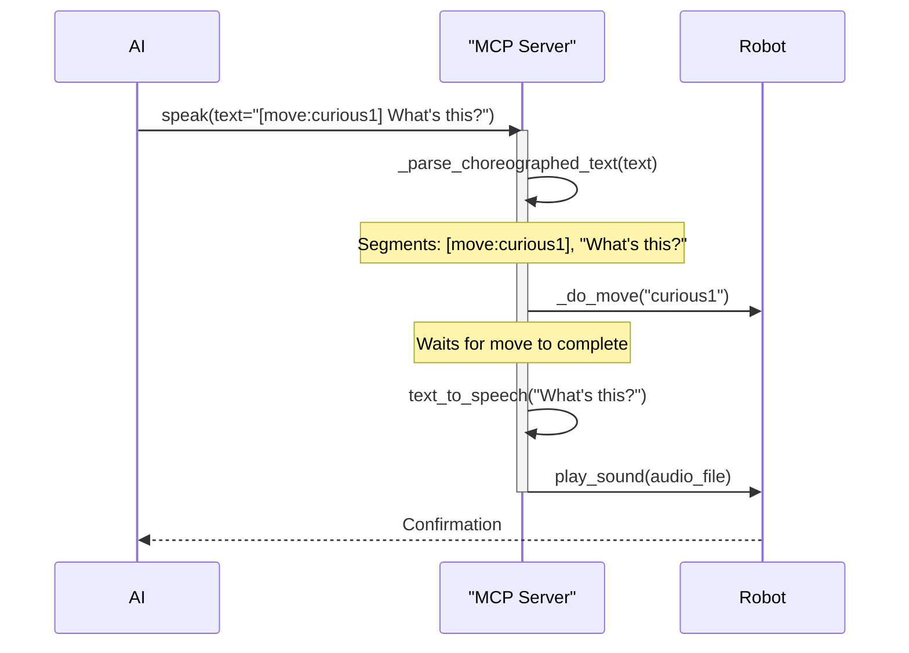
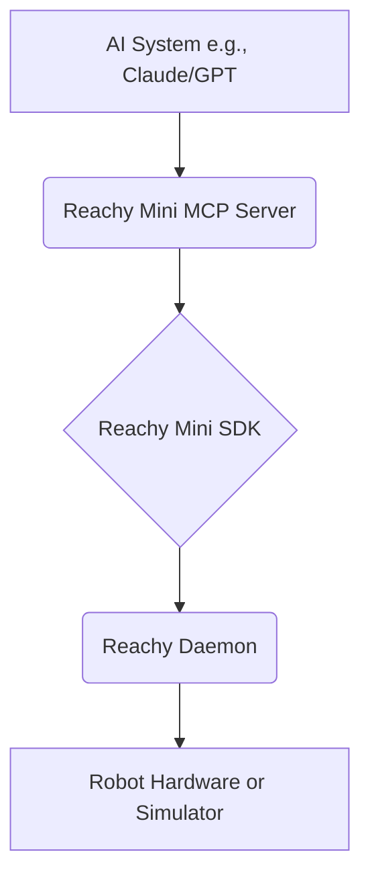
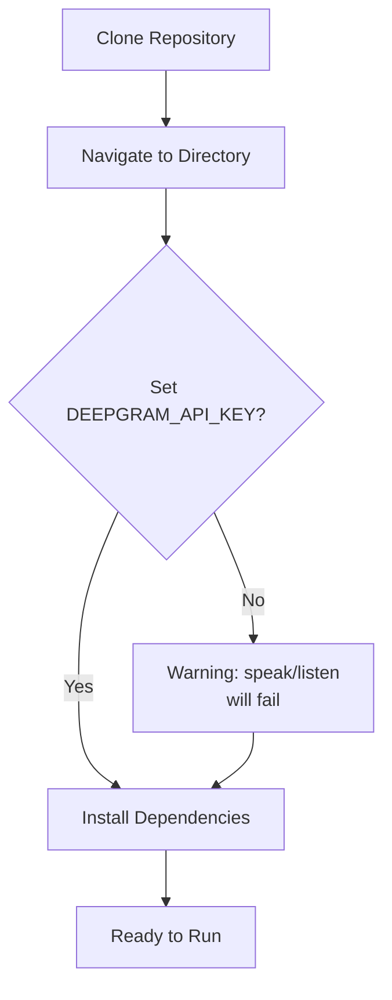
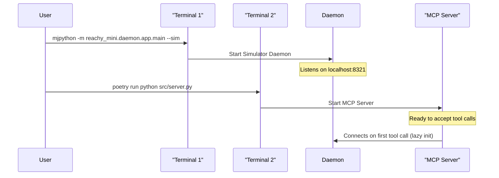
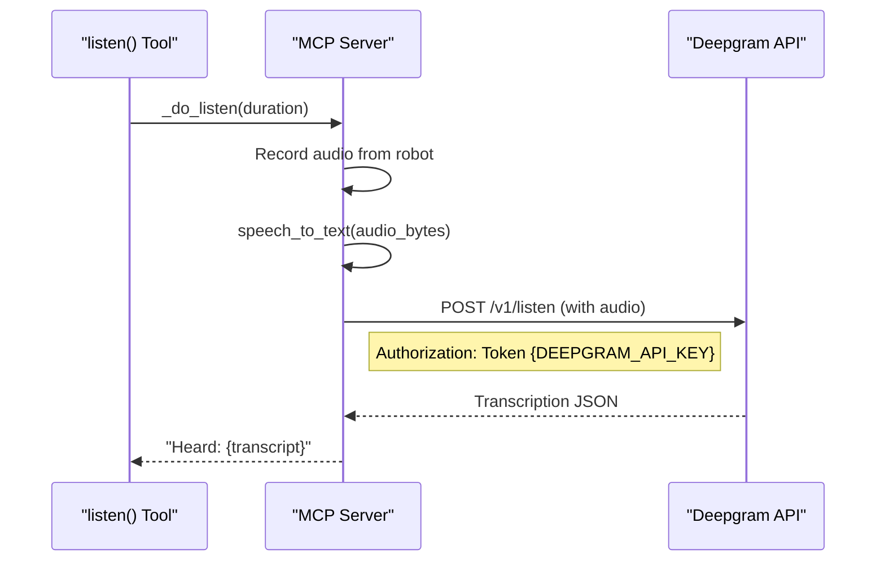
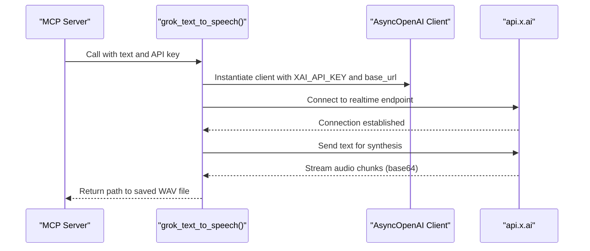
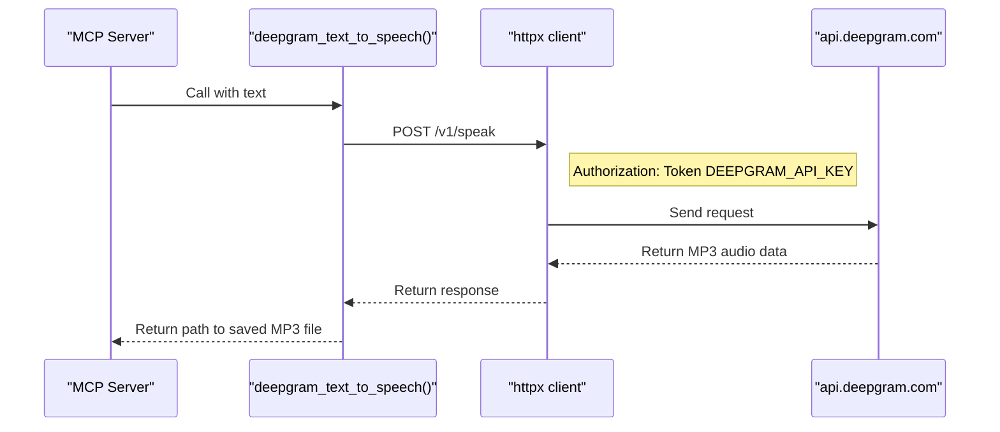
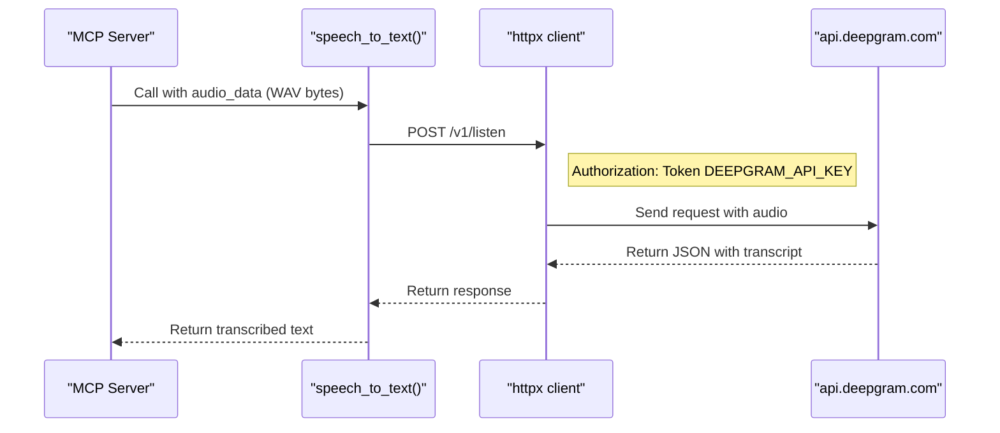
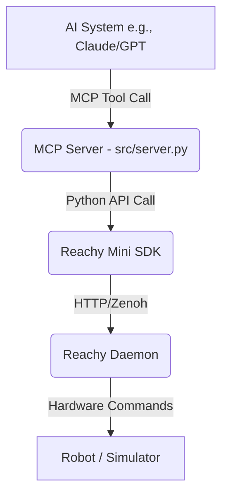
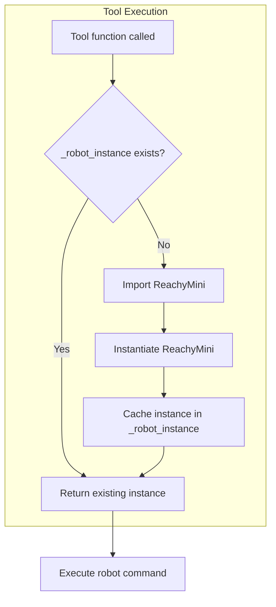

# jackccrawford/reachy-mini-mcp Wiki

Version: 1

## Overview

### Home

<details>
<summary>Relevant source files</summary>
The following files were used as context for generating this wiki page:

- [README.md](https://github.com/jackccrawford/reachy-mini-mcp/blob/main/README.md)
- [pyproject.toml](https://github.com/jackccrawford/reachy-mini-mcp/blob/main/pyproject.toml)
- [src/server.py](https://github.com/jackccrawford/reachy-mini-mcp/blob/main/src/server.py)
- [src/__init__.py](https://github.com/jackccrawford/reachy-mini-mcp/blob/main/src/__init__.py)
- [LICENSE](https://github.com/jackccrawford/reachy-mini-mcp/blob/main/LICENSE)
</details>

# Home

`reachy-mini-mcp` is a Model-Context-Protocol (MCP) server designed to give AI systems control over a [Pollen Robotics' Reachy Mini](https://www.pollen-robotics.com/reachy-mini/) robot. It provides a simple, token-efficient set of tools that allow an AI (such as Claude, GPT, or Grok) to interact with the physical world through the robot's capabilities: speaking, listening, seeing, and expressing emotions via physical movement.

The project's goal is to provide a high-level interface for "embodied consciousness expression," abstracting away the complexities of robotics. The server is built using Python, leveraging the `fastmcp` library for the MCP implementation and the `reachy-mini` SDK for robot communication. The software is distributed under the MIT License.

Sources: [README.md:3-7](), [src/__init__.py:1](), [LICENSE](), [pyproject.toml:2-6]()

## Architecture

The system follows a layered architecture where tool calls from an AI are progressively translated into physical robot actions. The MCP server acts as the central bridge between the AI's intent and the robot's hardware.

This diagram illustrates the data flow from the AI to the robot.

```mermaid
graph TD
    A[AI Model <br/>(Claude/GPT/Grok)] -->|MCP Tool Call| B(MCP Server <br/> `src/server.py`)
    B -->|Python Method Call| C(Reachy Mini SDK <br/> `reachy-mini` library)
    C -->|HTTP API Request| D(Reachy Daemon <br/> `localhost:8321`)
    D -->|Hardware Commands| E[Robot or Simulator]
```

The server exposes seven primary tools, a number chosen to align with Miller's Law for cognitive simplicity.

Sources: [README.md:41-44](), [src/server.py:5-7]()

### Core Components

*   **MCP Server (`server.py`):** The main application, built with `FastMCP`. It defines the tools available to the AI, parses incoming requests, and executes the corresponding robot actions.
*   **Robot Connection (`get_robot`):** A lazy-initialized singleton pattern is used to manage the connection to the robot. The connection is only established on the first tool call, improving startup time. It connects to the Reachy Daemon, which must be running separately.
*   **Reachy Daemon:** A background service provided by the Reachy Mini SDK that exposes a REST API for controlling the robot. The MCP server communicates with this daemon, by default at `http://localhost:8321/api`.

Sources: [src/server.py:29-38, 175-194](), [README.md:92-93]()

## Tools API

The server provides 7 tools for robot control.

| Tool | Args | Purpose |
|------|------|---------|
| `speak` | `text, listen_after=0` | Voice + gesture, optionally listen after |
| `listen` | `duration=3` | STT via Deepgram Nova-2 |
| `snap` | - | Camera capture (base64 JPEG) |
| `show` | `emotion, move=""` | Express emotion or play recorded move |
| `look` | `roll, pitch, yaw, z, duration` | Head positioning (degrees) |
| `rest` | `mode="neutral"` | neutral / sleep / wake |
| `discover` | `library="emotions"` | Find available recorded moves |

Sources: [README.md:13-23]()

### `show(emotion, move)`

This tool controls the robot's physical expression. It has two modes of operation:
1.  **Built-in `emotion`:** Triggers one of 12 pre-defined, local choreographies for common emotions. These are fast and defined directly in `src/server.py`.
2.  **Recorded `move`:** Plays a more complex, professionally choreographed move from Pollen Robotics' libraries. These are fetched and played via the Reachy Daemon. The `move` argument overrides `emotion` if both are provided.

The following diagram shows the logic flow for the `show` tool.

```mermaid
flowchart TD
    A[Call show(emotion, move)] --> B{Is `move` argument provided?};
    B -- Yes --> C[Call _do_play_move(move)];
    B -- No --> D[Call _do_express(emotion)];
    C --> E[Play recorded move via Daemon API];
    D --> F{Is `emotion` in EXPRESSIONS dict?};
    F -- Yes --> G[Execute local choreography];
    F -- No --> H[Return 'Unknown emotion' error];
    G & E --> I[Return Confirmation];
    H --> I;
```

**Built-in Emotions:**
The `EXPRESSIONS` dictionary maps 12 emotion strings to specific head and antenna motor positions, movement duration, and an interpolation method.

*   `neutral`
*   `curious`
*   `uncertain`
*   `recognition`
*   `joy`
*   `thinking`
*   `listening`
*   `agreeing`
*   `disagreeing`
*   `sleepy`
*   `surprised`
*   `focused`

Sources: [src/server.py:61-163, 298-326]()

### `speak(text, listen_after, voice)`

This tool vocalizes text through the robot's speaker and can perform choreographed movements embedded within the text.

**Choreographed Speech:**
Moves can be embedded in the text using the syntax `[move:move_name]`. The server parses this text, triggering the specified move just before speaking the subsequent text chunk.

Example: `speak("[move:curious1] What's this? [move:surprised1] Oh wow!")`

The following sequence diagram illustrates this process.



Sources: [src/server.py:603-611, 680-724]()

**Text-to-Speech (TTS) Providers:**
The `speak` tool uses one of two TTS providers, with Grok Voice being the preferred option if configured.

1.  **Grok Voice:** Used if the `XAI_API_KEY` environment variable is set. Supports several voices like `Eve`, `Ara`, `Leo`, `Rex`, and `Sal`.
2.  **Deepgram Aura 2:** Used as a fallback if `XAI_API_KEY` is not set. Requires the `DEEPGRAM_API_KEY`.

This diagram shows the TTS provider selection logic.

```mermaid
flowchart TD
    A[Call text_to_speech(text)] --> B{Is XAI_API_KEY set?};
    B -- Yes --> C[grok_text_to_speech(text)];
    B -- No --> D[deepgram_text_to_speech(text)];
    C --> E[Return audio file path];
    D --> F{Is DEEPGRAM_API_KEY set?};
    F -- Yes --> G[Return audio file path];
    F -- No --> H[Raise RuntimeError];
```

Sources: [README.md:49-56, 90-91](), [src/server.py:433-440]()

### `listen(duration)`

Captures audio from the robot's microphones for a specified duration and transcribes it to text using Deepgram's Nova-2 Speech-to-Text (STT) service. This requires the `DEEPGRAM_API_KEY` to be set. The function captures raw audio, converts it to WAV format in memory, and sends it to the Deepgram API.

Sources: [src/server.py:794-814, 560-591]()

### `snap()`

Captures a single frame from the robot's camera, encodes it as a JPEG image, and returns it as a base64-encoded string. This allows the AI to "see" its environment.

Sources: [src/server.py:817-838]()

### `look(...)`

Provides direct, fine-grained control over the robot's head orientation (`roll`, `pitch`, `yaw`) and height (`z`). This is a lower-level alternative to the `show` tool, intended for precise positioning. Input values are clamped to safe ranges to prevent hardware strain.

Sources: [src/server.py:329-370]()

### `rest(mode)`

Manages the robot's power state.
*   `neutral`: Returns the robot to a default, upright pose.
*   `sleep`: Moves the robot to a resting position and reduces power to the motors.
*   `wake`: Wakes the robot from sleep mode.

Sources: [src/server.py:841-861]()

### `discover(library)`

Lists the available recorded moves from Pollen Robotics' HuggingFace libraries. This allows an AI to dynamically discover what `move` names can be used with the `show` tool. It queries the Reachy Daemon API to get the list of moves.

*   `emotions`: Lists 81 expressions.
*   `dances`: Lists available dance choreographies.

Sources: [src/server.py:900-925]()

## Configuration

Configuration is managed primarily through environment variables and, for Claude users, a JSON configuration file.

### Environment Variables

| Variable | Required | Default | Purpose |
|----------|----------|---------|---------|
| `XAI_API_KEY` | No | - | API key for Grok Voice TTS (preferred). |
| `GROK_VOICE` | No | `Eve` | Specifies the Grok voice to use. |
| `DEEPGRAM_API_KEY` | Yes* | - | API key for Deepgram TTS (fallback) and STT. |
| `REACHY_DAEMON_URL` | No | `http://localhost:8321/api` | The API endpoint for the Reachy Daemon. |
| `REACHY_MEDIA_BACKEND` | No | `default_no_video` | Configures the SDK's media backend. |

*\*Required if `XAI_API_KEY` is not set.*

Sources: [README.md:90-93](), [src/server.py:186, 434, 444, 564, 870]()

### Claude Integration

The server can be integrated with Anthropic's Claude by adding an entry to the MCP servers configuration file. This allows Claude to discover and use the Reachy Mini tools directly.

**Claude Desktop Config (`claude_desktop_config.json`):**
```json
{
  "mcpServers": {
    "reachy-mini": {
      "command": "poetry",
      "args": ["-C", "/path/to/reachy-mini-mcp", "run", "python", "src/server.py"],
      "env": {
        "DEEPGRAM_API_KEY": "your_key_here"
      }
    }
  }
}
```

Sources: [README.md:59-71]()

## Setup and Execution

The project is managed with Poetry.

**Installation and Execution:**
1.  **Install dependencies:** `poetry install`
2.  **Set API keys:** `export DEEPGRAM_API_KEY=your_key_here`
3.  **Start the simulator daemon:** `mjpython -m reachy_mini.daemon.app.main --sim --scene minimal`
4.  **Run the MCP server:** `poetry run python src/server.py`

The server can also be run via the `reachy-mini-mcp` script defined in `pyproject.toml`. The main entry point in `src/server.py` registers a cleanup function `cleanup_robot` using `atexit` to ensure the robot connection is properly closed on shutdown.

Sources: [README.md:30-38](), [pyproject.toml:15-16](), [src/server.py:950-957]()


## Getting Started

### Quick Start Guide

<details>
<summary>Relevant source files</summary>
The following files were used as context for generating this wiki page:
- [README.md](https://github.com/jackccrawford/reachy-mini-mcp/blob/main/README.md)
- [src/server.py](https://github.com/jackccrawford/reachy-mini-mcp/blob/main/src/server.py)
- [pyproject.toml](https://github.com/jackccrawford/reachy-mini-mcp/blob/main/pyproject.toml)
- [src/__init__.py](https://github.com/jackccrawford/reachy-mini-mcp/blob/main/src/__init__.py)
- [LICENSE](https://github.com/jackccrawford/reachy-mini-mcp/blob/main/LICENSE)
</details>

# Quick Start Guide

This guide provides instructions for setting up and running the Reachy Mini MCP server, which allows AI systems like Claude, GPT, or Grok to control a Pollen Robotics' Reachy Mini robot. The server exposes a set of tools for speech, listening, vision, and emotional expression through physical movement. This project aims to give AI a physical body with zero robotics expertise required.

The system is designed with a simple, token-efficient toolset that fits within an AI's working memory. It can operate with either a physical robot or a MuJoCo-based simulator. The project is licensed under the MIT License.

Sources: [README.md:3-9](), [src/server.py:3-17](), [src/__init__.py](), [LICENSE]()

## Architecture

The system operates through a clear, linear chain of command, starting from the AI system and ending with the robot's physical or simulated actions. The MCP server acts as the central bridge, translating high-level tool calls from the AI into specific commands for the Reachy Mini SDK.

Sources: [README.md:52-55]()

The data flow is as follows:

This diagram illustrates the control flow from the AI to the robot.
Sources: [README.md:52-55](), [src/server.py:5-6]()

## System Requirements

To run the Reachy Mini MCP server, the following components are required:

*   **Python:** Version 3.10 or higher.
*   **Dependencies:** The project uses Poetry for dependency management. Key dependencies include `fastmcp`, `reachy-mini`, `openai`, and `websockets`.
*   **Simulation:** MuJoCo is required for running the robot simulator. On macOS, `mjpython` is needed for visualization.
*   **API Keys:** A Deepgram API key is required for speech-to-text (`listen`) and as a fallback for text-to-speech (`speak`). An optional `XAI_API_KEY` can be used for higher-quality Grok Voice TTS.

Sources: [pyproject.toml:10-14](), [README.md:104-108]()

## Installation and Setup

Follow these steps to get the server running.

1.  **Install Dependencies:**
    Clone the repository and use Poetry to install the required packages.
    ```bash
    cd reachy-mini-mcp
    poetry install
    ```
    Sources: [README.md:42-44](), [pyproject.toml:1-21]()

2.  **Set API Keys:**
    Export your Deepgram API key as an environment variable. This is necessary for the `speak` and `listen` tools.
    ```bash
    export DEEPGRAM_API_KEY=your_key_here
    ```
    Optionally, set the `XAI_API_KEY` to use Grok Voice for TTS.
    ```bash
    export XAI_API_KEY=your_xai_key_here
    ```
    Sources: [README.md:47-48, 93-96]()

3.  **Start the Simulator (Optional):**
    To run without physical hardware, start the Reachy Mini daemon with the simulator.
    ```bash
    mjpython -m reachy_mini.daemon.app.main --sim --scene minimal
    ```
    Sources: [README.md:50-51]()

4.  **Run the MCP Server:**
    Start the main MCP server application.
    ```bash
    poetry run python src/server.py
    ```
    This can also be run using the script defined in `pyproject.toml`: `poetry run reachy-mini-mcp`.
    Sources: [README.md:53-54](), [pyproject.toml:16]()

## Configuration

### Environment Variables

The server's behavior can be configured using several environment variables.

| Variable | Required | Default | Purpose |
| :--- | :--- | :--- | :--- |
| `XAI_API_KEY` | No | - | Enables Grok Voice for TTS. Preferred over Deepgram. |
| `GROK_VOICE` | No | `Eve` | Selects the Grok voice. Options: `Ara`, `Eve`, `Leo`, `Rex`, `Sal`. |
| `DEEPGRAM_API_KEY` | Yes* | - | Used for STT and as a fallback for TTS. |
| `REACHY_DAEMON_URL` | No | `http://localhost:8321/api` | API endpoint for the Reachy daemon. |

*Required if `XAI_API_KEY` is not set.
Sources: [README.md:91-99](), [src/server.py:448-451, 915]()

### Claude Integration

To integrate with Claude applications, you need to update their respective configuration files.

**Claude Desktop:**
Update `~/Library/Application Support/Claude/claude_desktop_config.json`:
```json
{
  "mcpServers": {
    "reachy-mini": {
      "command": "poetry",
      "args": ["-C", "/path/to/reachy-mini-mcp", "run", "python", "src/server.py"],
      "env": {
        "DEEPGRAM_API_KEY": "your_key_here"
      }
    }
  }
}
```
Sources: [README.md:63-75]()

**Claude Code:**
Update `~/.claude.json`:
```json
{
  "mcpServers": {
    "reachy-mini": {
      "command": "poetry",
      "args": ["-C", "/path/to/reachy-mini-mcp", "run", "python", "src/server.py"],
      "env": {
        "DEEPGRAM_API_KEY": "your_key_here"
      }
    }
  }
}
```
Sources: [README.md:77-89]()

## Core MCP Tools

The server provides 7 primary tools for robot interaction, designed to be simple and memorable.

| Tool | Arguments | Purpose |
| :--- | :--- | :--- |
| `speak` | `text`, `listen_after=0`, `voice="eve"` | Voice synthesis with optional choreographed gestures and subsequent listening. |
| `listen` | `duration=3` | Records audio and transcribes it to text using Deepgram Nova-2. |
| `snap` | - | Captures a base64-encoded JPEG image from the robot's camera. |
| `show` | `emotion`, `move=""` | Expresses a built-in emotion or plays a pre-recorded move. |
| `look` | `roll`, `pitch`, `yaw`, `z`, `duration` | Sets the precise orientation of the robot's head. |
| `rest` | `mode="neutral"` | Sets the robot to a neutral, sleep, or wake state. |
| `discover` | `library="emotions"` | Lists available pre-recorded moves from a specified library. |

Sources: [README.md:13-25](), [src/server.py:302-313, 353-370, 686-694, 731-738, 770-781, 930-938, 808-820]()

### `speak` Tool

The `speak` tool vocalizes text and can choreograph movements by parsing embedded markers in the input string.

**Choreography Syntax:**
```
speak("[move:curious1] What's this? [move:surprised1] Oh wow!")
```
In this example, the `curious1` move is executed just before "What's this?" is spoken.

**Voice Provider Logic:**
The tool automatically selects the TTS provider based on environment variables.
```mermaid
flowchart TD
    A[speak() called] --> B{XAI_API_KEY set?};
    B -- Yes --> C[Use Grok Voice TTS];
    B -- No --> D[Use Deepgram TTS];
    C --> E[Play Audio];
    D --> E;
```
This diagram shows the TTS provider selection logic.
Sources: [src/server.py:448-453]()

**Execution Flow:**
The `speak` function parses the text for `[move:...]` markers, triggers the corresponding moves, generates audio for the text segments, and plays them. If `listen_after` is set, it will then activate the microphone to capture a response.
```mermaid
sequenceDiagram
    participant AI
    participant MCP_Server as "MCP Server"
    participant Robot as "Reachy SDK"
    participant Daemon

    AI->>MCP_Server: speak("[move:curious] Hello", listen_after=3)
    activate MCP_Server
    MCP_Server->>MCP_Server: _parse_choreographed_text()
    MCP_Server->>Robot: _do_move("curious")
    Note right of Robot: Waits for move to complete
    MCP_Server->>MCP_Server: text_to_speech("Hello")
    MCP_Server->>Robot: media.play_sound(audio_file)
    Note right of Robot: Waits for audio to finish
    MCP_Server->>MCP_Server: _do_listen(3)
    activate MCP_Server
    MCP_Server->>Robot: media.start_recording()
    delay 3s
    MCP_Server->>Robot: media.stop_recording()
    MCP_Server->>MCP_Server: speech_to_text(audio_data)
    deactivate MCP_Server
    MCP_Server-->>AI: "Spoke: Hello | Heard: User response"
    deactivate MCP_Server
```
This sequence shows a choreographed speech call followed by listening.
Sources: [README.md:28-31](), [src/server.py:686-764]()

### `show` Tool

The `show` tool is used for physical expression. It distinguishes between 12 fast, locally-defined "emotions" and 81 more complex, pre-recorded "moves" from Pollen Robotics.

**Built-in Emotions:**
These are defined in the `EXPRESSIONS` dictionary and map an emotion name to head and antenna motor positions.
*   `neutral`, `curious`, `uncertain`, `recognition`, `joy`, `thinking`
*   `listening`, `agreeing`, `disagreeing`, `sleepy`, `surprised`, `focused`

Sources: [src/server.py:60-158, 302-313](), [README.md:34-36]()

**Recorded Moves:**
These are fetched from HuggingFace libraries via the Reachy daemon. The `discover()` tool can be used to list all available moves, such as `loving1`, `fear1`, or `serenity1`.

Sources: [README.md:38-42, 930-946]()

### `listen` and `snap` Tools

-   **`listen(duration)`**: This tool captures audio for a set duration using the robot's microphones. The raw audio is sent to the Deepgram API for transcription.
-   **`snap()`**: This captures a single frame from the robot's camera, encodes it as a JPEG, and returns it as a base64 string.

Sources: [src/server.py:731-762, 808-828]()

### Connection Management

The connection to the robot is managed via a lazy-initialized singleton pattern. The `get_robot()` function establishes a connection to the `ReachyMini` SDK on the first tool call that requires it. This avoids connecting prematurely and handles potential connection errors. A cleanup function `cleanup_robot()` is registered with `atexit` to ensure the connection is properly closed on shutdown.

```mermaid
flowchart TD
    A[Tool Call e.g., look()] --> B{get_robot()};
    B --> C{_robot_instance is None?};
    C -- Yes --> D[from reachy_mini import ReachyMini];
    D --> E[ReachyMini(media_backend=...)]
    E --> F[_robot_instance = new instance];
    F --> G[Return _robot_instance];
    C -- No --> G;
```
This diagram shows the lazy initialization flow for the robot connection.
Sources: [src/server.py:165-191, 981-983]()

## Summary

The Reachy Mini MCP project provides a powerful yet simple interface for AI systems to interact with the physical world. By following this guide, developers can quickly set up a development environment using a simulator or a real robot, configure it for their chosen AI platform, and begin exploring embodied AI applications. The architecture is straightforward, and the toolset is intentionally concise to facilitate easy integration and use.

Sources: [README.md:3-9](), [src/server.py:3-17]()

### Prerequisites and Installation

<details>
<summary>Relevant source files</summary>

The following files were used as context for generating this wiki page:

- [README.md](https://github.com/jackccrawford/reachy-mini-mcp/blob/main/README.md)
- [pyproject.toml](https://github.com/jackccrawford/reachy-mini-mcp/blob/main/pyproject.toml)
- [src/server.py](https://github.com/jackccrawford/reachy-mini-mcp/blob/main/src/server.py)
- [src/__init__.py](https://github.com/jackccrawford/reachy-mini-mcp/blob/main/src/__init__.py)
- [LICENSE](https://github.com/jackccrawford/reachy-mini-mcp/blob/main/LICENSE)
</details>

# Prerequisites and Installation

This guide provides the necessary steps and requirements to install, configure, and run the `reachy-mini-mcp` server. The server acts as a bridge, enabling AI systems like Claude, GPT, or Grok to control a Pollen Robotics' Reachy Mini robot. By following this guide, you will set up an environment where an AI can use a simple set of tools to make the robot speak, listen, see, and express emotions.

The project's architecture involves an AI communicating with the MCP Server, which in turn uses the Reachy Mini SDK to send commands to a daemon controlling either a physical robot or a simulator. This setup allows for rapid prototyping and development without requiring deep robotics expertise.

Sources: [README.md:3-9](), [README.md:40-42]()

## System Requirements

Before proceeding with the installation, ensure your system meets the following software and hardware requirements.

### Software Requirements

The project is built on Python and relies on several key libraries for its functionality.

| Requirement | Version/Details | Purpose | Source |
| :--- | :--- | :--- | :--- |
| Python | `^3.10` | Core programming language. | [pyproject.toml:10]() |
| `reachy-mini` SDK | git branch `develop` | Official SDK for controlling the robot. | [pyproject.toml:12]() |
| `fastmcp` | `^2.0.0` | Framework for creating the MCP server. | [pyproject.toml:11]() |
| `openai` | `^1.50.0` | Used for Grok Voice TTS integration. | [pyproject.toml:13]() |
| `websockets` | `^13.0` | Dependency for real-time communication. | [pyproject.toml:14]() |
| MuJoCo | - | Required for running the robot simulator. | [README.md:104]() |
| Deepgram API Key | - | Required for Speech-to-Text (STT) and fallback Text-to-Speech (TTS). | [README.md:92]() |

Sources: [pyproject.toml:9-14](), [README.md:102-105]()

### Hardware and Environment Notes

- **Simulator vs. Hardware**: The same MCP server code works for both the physical robot and the simulator. The underlying daemon handles the connection automatically.
- **macOS Simulator**: On macOS, `mjpython` is required to run the MuJoCo visualization for the simulator.
- **Port Conflicts**: Be aware of potential port conflicts. The Reachy Mini daemon uses port `8321` by default, and its underlying Zenoh communication layer uses port `7447`.

Sources: [README.md:107-111]()

## Installation and Setup

The installation process uses `poetry` for dependency management. The following diagram and steps outline the process from cloning the repository to having a runnable server.

This diagram shows the user's journey to get the application ready.



### Step-by-Step Guide

1.  **Clone the Repository**
    Clone the project from GitHub to your local machine.

2.  **Install Dependencies**
    Navigate into the project directory and use Poetry to install the required packages. This command reads the `pyproject.toml` file to install all necessary dependencies, including the `reachy-mini` SDK with MuJoCo extras.

    ```bash
    cd reachy-mini-mcp
    poetry install
    ```

    Sources: [README.md:32-33](), [pyproject.toml:12]()

## Configuration

The server's behavior, particularly for voice services, is controlled via environment variables. It can also be configured to integrate directly with AI clients like Claude.

### Environment Variables

These variables must be set in your shell or via a configuration file before running the server.

| Variable | Required | Default | Purpose |
| :--- | :--- | :--- | :--- |
| `XAI_API_KEY` | No | - | API key for Grok Voice TTS. If set, this is the preferred TTS provider. |
| `GROK_VOICE` | No | `Eve` | Specifies the Grok voice to use. Options: `Ara`, `Eve`, `Leo`, `Rex`, `Sal`, `Mika`, `Valentin`. |
| `DEEPGRAM_API_KEY` | Yes* | - | API key for Deepgram. Used for all STT and as a fallback TTS provider. |
| `REACHY_DAEMON_URL` | No | `http://localhost:8321/api` | The API endpoint for the Reachy Mini daemon. |

*\*`DEEPGRAM_API_KEY` is required if `XAI_API_KEY` is not set.*

Sources: [README.md:89-95](), [src/server.py:461-462]()

### Voice Provider Configuration

The server dynamically selects the Text-to-Speech (TTS) provider based on the available environment variables.

This diagram illustrates the logic for selecting a TTS provider.

```mermaid
graph TD
    A[speak() called] --> B{XAI_API_KEY set?};
    B -- Yes --> C[Use Grok Voice TTS];
    B -- No --> D{DEEPGRAM_API_KEY set?};
    D -- Yes --> E[Use Deepgram TTS];
    D -- No --> F[Raise RuntimeError];
    C --> G[Generate Audio];
    E --> G;
```

The `text_to_speech` function checks for `XAI_API_KEY` first. If present, it calls `grok_text_to_speech`. Otherwise, it falls back to `deepgram_text_to_speech`, which requires `DEEPGRAM_API_KEY`. All Speech-to-Text (STT) operations exclusively use Deepgram.

Sources: [src/server.py:416-421](), [src/server.py:530-532]()

### Claude Integration

To integrate with the Claude desktop app or code editor, you need to update its configuration file to point to the `reachy-mini-mcp` server.

**Claude Desktop Configuration**
Update `~/Library/Application Support/Claude/claude_desktop_config.json`:

```json
{
  "mcpServers": {
    "reachy-mini": {
      "command": "poetry",
      "args": ["-C", "/path/to/reachy-mini-mcp", "run", "python", "src/server.py"],
      "env": {
        "DEEPGRAM_API_KEY": "your_key_here"
      }
    }
  }
}
```

**Claude Code Configuration**
Update `~/.claude.json`:

```json
{
  "mcpServers": {
    "reachy-mini": {
      "command": "poetry",
      "args": ["-C", "/path/to/reachy-mini-mcp", "run", "python", "src/server.py"],
      "env": {
        "DEEPGRAM_API_KEY": "your_key_here"
      }
    }
  }
}
```

Sources: [README.md:65-87]()

## Running the Application

With the prerequisites and configuration complete, you can start the required services.

### System Architecture

The overall system architecture follows a clear path from the AI to the robot.

This diagram shows the flow of commands from the AI system to the robot.

```mermaid
graph TD
    AI[AI System<br>(Claude/GPT/Grok)] -->|MCP Tool Call| MCPServer[MCP Server<br>(src/server.py)];
    MCPServer -->|SDK Command| SDK[Reachy Mini SDK];
    SDK -->|API Request| Daemon[Reachy Daemon];
    Daemon -->|Motor Commands| Robot[Robot / Simulator];
```

Sources: [README.md:40-42](), [src/server.py:5-6]()

### Startup Sequence

Two separate processes must be started in order.

This sequence diagram shows the steps to start the simulator and the MCP server.



1.  **Start the Simulator Daemon**
    In a terminal, run the following command to start the Reachy Mini daemon connected to a minimal simulator scene.

    ```bash
    mjpython -m reachy_mini.daemon.app.main --sim --scene minimal
    ```
    Sources: [README.md:36]()

2.  **Run the MCP Server**
    In a second terminal, set your API key and run the server using `poetry`.

    ```bash
    export DEEPGRAM_API_KEY=your_key_here
    poetry run python src/server.py
    ```
    The server is also defined as a script in `pyproject.toml`, allowing it to be run with `poetry run reachy-mini-mcp`.

    Sources: [README.md:35-39](), [pyproject.toml:16-17]()

### Server Initialization

The `main` function in `src/server.py` starts the `FastMCP` server. It also registers a `cleanup_robot` function to ensure the connection to the robot is properly closed on shutdown. The actual connection to the robot is handled lazily by the `get_robot` function, which only establishes a connection on the first tool call.

Sources: [src/server.py:821-826](), [src/server.py:168-171]()

## Conclusion

By completing these steps, you have successfully installed and configured the `reachy-mini-mcp` server. The system is now ready to accept tool calls from a compatible AI, translating high-level commands into physical actions, speech, and expressions for the Reachy Mini robot. This setup provides a powerful platform for developing and experimenting with embodied AI.

### Environment Variables

<details>
<summary>Relevant source files</summary>

The following files were used as context for generating this wiki page:

- [README.md](https://github.com/jackccrawford/reachy-mini-mcp/blob/main/README.md)
- [src/server.py](https://github.com/jackccrawford/reachy-mini-mcp/blob/main/src/server.py)
- [pyproject.toml](https://github.com/jackccrawford/reachy-mini-mcp/blob/main/pyproject.toml)
- [src/__init__.py](https://github.com/jackccrawford/reachy-mini-mcp/blob/main/src/__init__.py)
- [LICENSE](https://github.com/jackccrawford/reachy-mini-mcp/blob/main/LICENSE)
</details>

# Environment Variables

Environment variables are the primary method for configuring the `reachy-mini-mcp` server. They control critical settings such as API keys for third-party services, connection details for the robot daemon, and behavior of specific tools like voice synthesis and robot initialization. Correctly setting these variables is essential for the server to function, particularly for features involving speech and listening.

The server reads these variables at runtime to dynamically configure its dependencies and select appropriate service providers. For example, the presence of an `XAI_API_KEY` will automatically prioritize Grok Voice for text-to-speech (TTS) over the Deepgram fallback.

Sources: [README.md](), [src/server.py]()

## Configuration Summary

The following table summarizes all environment variables used by the application, their purpose, and default values.

| Variable | Required | Default Value | Purpose |
| :--- | :--- | :--- | :--- |
| `XAI_API_KEY` | No | - | API key for Grok Voice TTS. If set, this is the preferred TTS provider. |
| `GROK_VOICE` | No | `Eve` | Specifies the Grok voice to use. Options: `Ara`, `Eve`, `Leo`, `Rex`, `Sal`. |
| `DEEPGRAM_API_KEY` | Yes* | - | API key for Deepgram. Used for TTS (as a fallback if `XAI_API_KEY` is not set) and always for Speech-to-Text (STT). |
| `REACHY_DAEMON_URL` | No | `http://localhost:8321/api` | The API endpoint for the Reachy Mini daemon, which controls the physical robot or simulator. |
| `REACHY_MEDIA_BACKEND` | No | `default_no_video` | Configures the media backend for the `reachy-mini` SDK, controlling audio and camera access. |

*`DEEPGRAM_API_KEY` is required if `XAI_API_KEY` is not set for speech, and is always required for the `listen()` tool.

Sources: [README.md:104-109](), [src/server.py:195](), [src/server.py:444](), [src/server.py:588]()

## Detailed Variable Usage

### Voice Service Configuration

The server can use two different Text-to-Speech (TTS) providers: Grok Voice (preferred) and Deepgram Aura (fallback). The selection is determined by the presence of the `XAI_API_KEY` environment variable.

The diagram below illustrates the logic within the `text_to_speech` function for selecting a TTS provider.

```mermaid
flowchart TD
    A[Call speak() tool] --> B{text_to_speech() called};
    B --> C{Check for XAI_API_KEY};
    C -- Yes --> D[Use Grok Voice TTS];
    C -- No --> E{Check for DEEPGRAM_API_KEY};
    E -- Yes --> F[Use Deepgram TTS];
    E -- No --> G[Raise RuntimeError];
    D --> H[Return audio file path];
    F --> H;
```
*This flowchart shows the decision process for selecting a Text-to-Speech provider based on available environment variables.*

Sources: [src/server.py:406-412]()

#### `XAI_API_KEY`
This variable holds the API key for xAI's services. When set, the `text_to_speech` function will call `grok_text_to_speech` to generate audio.

*Sources*: [src/server.py:409]()

#### `GROK_VOICE`
This variable customizes the voice used by Grok Voice. The selection logic prioritizes the `voice` parameter in the `speak()` tool, then this environment variable, and finally defaults to "eve".

```python
# src/server.py:453-456
# Voice priority: parameter > env var > default
if voice and voice.lower() in GROK_VOICES:
    voice = voice.lower()
else:
    voice = os.environ.get("GROK_VOICE", "eve").lower()
```
*Sources*: [README.md:106](), [src/server.py:456]()

#### `DEEPGRAM_API_KEY`
This key is mandatory for two functions:
1.  **Speech-to-Text (STT)**: The `listen()` tool and the `listen_after` parameter in `speak()` rely exclusively on Deepgram's Nova-2 model. If this key is missing, any attempt to transcribe audio will fail.
2.  **Fallback TTS**: If `XAI_API_KEY` is not provided, the `speak()` tool falls back to using Deepgram's Aura-2 model for TTS.

The following sequence diagram shows how `DEEPGRAM_API_KEY` is used for STT.


*This diagram shows the sequence of events for transcribing audio, highlighting the use of the Deepgram API key.*

*Sources*: [README.md:107](), [src/server.py:417-419](), [src/server.py:539-541]()

### Robot Connection Configuration

#### `REACHY_DAEMON_URL`
This variable specifies the full URL to the Reachy Mini daemon's API. It is used for interacting with recorded moves, such as listing them with `discover()` or playing them with `show(move=...)`. The default value points to a local daemon instance.

```python
# src/server.py:588
DAEMON_URL = os.environ.get("REACHY_DAEMON_URL", "http://localhost:8321/api")
```
This URL is then used to construct API calls to endpoints like `/move/running` and `/move/play/recorded-move-dataset/...`.

*Sources*: [README.md:108](), [src/server.py:588](), [src/server.py:599](), [src/server.py:644]()

#### `REACHY_MEDIA_BACKEND`
This variable is used during the lazy initialization of the robot connection in the `get_robot()` function. It determines which media backend the `reachy-mini` SDK should use, controlling access to the robot's camera and microphones. The default value `default_no_video` is chosen for simulator compatibility.

```python
# src/server.py:194-195
# Use 'no_media' for headless (no audio or camera)
backend = os.environ.get("REACHY_MEDIA_BACKEND", "default_no_video")
_robot_instance = ReachyMini(media_backend=backend)
```

*Sources*: [src/server.py:195-196]()

## Setting Variables for Claude

The `README.md` provides examples of how to configure the MCP server for use with Claude applications. The environment variables are passed via an `env` dictionary within the JSON configuration file.

### Claude Desktop (`claude_desktop_config.json`)
```json
{
  "mcpServers": {
    "reachy-mini": {
      "command": "poetry",
      "args": ["-C", "/path/to/reachy-mini-mcp", "run", "python", "src/server.py"],
      "env": {
        "DEEPGRAM_API_KEY": "your_key_here"
      }
    }
  }
}
```

### Claude Code (`~/.claude.json`)
```json
{
  "mcpServers": {
    "reachy-mini": {
      "command": "poetry",
      "args": ["-C", "/path/to/reachy-mini-mcp", "run", "python", "src/server.py"],
      "env": {
        "DEEPGRAM_API_KEY": "your_key_here"
      }
    }
  }
}
```
In these examples, `DEEPGRAM_API_KEY` is set, but other variables like `XAI_API_KEY` could be added to the `env` object as needed.

*Sources*: [README.md:80-92](), [README.md:95-101]()

### API Key Management

<details>
<summary>Relevant source files</summary>
The following files were used as context for generating this wiki page:

- [README.md](https://github.com/jackccrawford/reachy-mini-mcp/blob/main/README.md)
- [src/server.py](https://github.com/jackccrawford/reachy-mini-mcp/blob/main/src/server.py)
- [pyproject.toml](https://github.com/jackccrawford/reachy-mini-mcp/blob/main/pyproject.toml)
- [src/__init__.py](https://github.com/jackccrawford/reachy-mini-mcp/blob/main/src/__init__.py)
- [LICENSE](https://github.com/jackccrawford/reachy-mini-mcp/blob/main/LICENSE)
</details>

# API Key Management

The `reachy-mini-mcp` server integrates with third-party services for voice capabilities, specifically Text-to-Speech (TTS) and Speech-to-Text (STT). Access to these services is managed through API keys configured via environment variables. This system allows for flexible selection of voice providers and secure handling of credentials without hardcoding them into the source.

The primary services requiring API keys are Grok Voice for preferred TTS and Deepgram for fallback TTS and all STT functionalities. Proper configuration of these keys is essential for the `speak()` and `listen()` tools to function correctly.

Sources: [README.md](), [src/server.py]()

## Supported Services and Keys

The server utilizes two main external services for its voice features, each requiring a specific API key set as an environment variable.

| Service | Environment Variable | Purpose | Required |
| :--- | :--- | :--- | :--- |
| Grok Voice | `XAI_API_KEY` | Preferred Text-to-Speech (TTS) | No |
| Deepgram | `DEEPGRAM_API_KEY` | Fallback TTS and all Speech-to-Text (STT) | Yes* |

*`DEEPGRAM_API_KEY` is required if `XAI_API_KEY` is not set, and is always required for the `listen()` tool.

Sources: [README.md:88-93](), [src/server.py:423-427, 533-537]()

## Configuration Methods

API keys are provided to the application exclusively through environment variables. This can be done directly in the shell or through a configuration file for integrated environments like Claude.

### Shell Export

For local development or direct execution, keys can be exported in the shell session before running the server.

```bash
# Set API key (required for speak/listen)
export DEEPGRAM_API_KEY=your_key_here
export XAI_API_KEY=your_grok_key_here # Optional

# Run MCP server
poetry run python src/server.py
```

Sources: [README.md:52-55]()

### Claude Integration

When running the server via Claude Desktop or Claude Code, the environment variables are set within the respective JSON configuration file. This ensures the MCP server process starts with the necessary credentials.

**Claude Desktop (`claude_desktop_config.json`)**
```json
{
  "mcpServers": {
    "reachy-mini": {
      "command": "poetry",
      "args": ["-C", "/path/to/reachy-mini-mcp", "run", "python", "src/server.py"],
      "env": {
        "DEEPGRAM_API_KEY": "your_key_here",
        "XAI_API_KEY": "your_grok_key_here"
      }
    }
  }
}
```

**Claude Code (`~/.claude.json`)**
```json
{
  "mcpServers": {
    "reachy-mini": {
      "command": "poetry",
      "args": ["-C", "/path/to/reachy-mini-mcp", "run", "python", "src/server.py"],
      "env": {
        "DEEPGRAM_API_KEY": "your_key_here"
      }
    }
  }
}
```
Sources: [README.md:99-113](), [README.md:115-126]()

## API Key Usage and Logic

The server's Python code reads the environment variables at runtime to authenticate with the external voice services.

### Text-to-Speech (TTS) Provider Selection

The `text_to_speech` function implements a fallback mechanism. It prioritizes Grok Voice if `XAI_API_KEY` is available; otherwise, it defaults to Deepgram.

This diagram illustrates the provider selection logic within the `text_to_speech` function.
```mermaid
flowchart TD
    A[Call text_to_speech(text)] --> B{Check for XAI_API_KEY env var};
    B -- Yes --> C[Use Grok Voice TTS];
    B -- No --> D{Check for DEEPGRAM_API_KEY env var};
    D -- Yes --> E[Use Deepgram TTS];
    D -- No --> F[Raise RuntimeError];
    C --> G[Return audio file path];
    E --> G[Return audio file path];
```
Sources: [src/server.py:423-429]()

### Grok Voice (x.ai) TTS

When `XAI_API_KEY` is set, the `grok_text_to_speech` function is called. It uses the `openai` Python library, configured with Grok's API endpoint, to synthesize speech.

The following sequence diagram shows the process of generating speech with Grok Voice.

Sources: [src/server.py:461-529]()

### Deepgram TTS (Fallback)

If `XAI_API_KEY` is not present, the server falls back to using Deepgram for TTS. The `deepgram_text_to_speech` function makes a direct HTTP POST request to the Deepgram API, authenticating with the `DEEPGRAM_API_KEY`.

This diagram shows the sequence for Deepgram TTS.

Sources: [src/server.py:432-458]()

### Deepgram Speech-to-Text (STT)

For the `listen()` functionality, the server exclusively uses Deepgram's Nova-2 model. The `speech_to_text` function is called with the recorded audio data, and it authenticates using the `DEEPGRAM_API_KEY`.

This diagram shows the sequence for transcribing audio with Deepgram.

Sources: [src/server.py:532-560]()


## System Architecture

### Architecture Overview

<details>
<summary>Relevant source files</summary>
The following files were used as context for generating this wiki page:

- [README.md](https://github.com/jackccrawford/reachy-mini-mcp/blob/main/README.md)
- [pyproject.toml](https://github.com/jackccrawford/reachy-mini-mcp/blob/main/pyproject.toml)
- [src/server.py](https://github.com/jackccrawford/reachy-mini-mcp/blob/main/src/server.py)
- [src/__init__.py](https://github.com/jackccrawford/reachy-mini-mcp/blob/main/src/__init__.py)
- [LICENSE](https://github.com/jackccrawford/reachy-mini-mcp/blob/main/LICENSE)
</details>

# Architecture Overview

The `reachy-mini-mcp` project provides a Model-Context-Protocol (MCP) server that acts as a bridge between AI systems (like Claude, GPT, or Grok) and Pollen Robotics' Reachy Mini robot. This enables an AI to control the robot's physical actions, including speech, movement, emotional expression, and sensory input (vision and hearing). The architecture is designed to be simple and efficient, exposing a limited set of seven high-level tools to the AI, following Miller's Law for cognitive ease.

The system is composed of several key layers: the AI system making tool calls, the MCP server translating those calls, the Reachy Mini SDK providing a Python API for the robot, a daemon process managing the low-level hardware communication, and finally the physical robot or its simulator. This layered approach abstracts the complexities of robotics, allowing AI developers to imbue their systems with a physical body without requiring specialized robotics expertise.

Sources: [README.md:3-7](), [src/server.py:5-16]()

## High-Level System Flow

The core architectural flow is a unidirectional chain of command from the AI to the robot. An AI system invokes a tool, which is processed by the MCP server, passed to the robot's SDK, and executed by the daemon on the hardware or in a simulator.

This diagram illustrates the primary data flow between components.


*Sources: [README.md:26](), [src/server.py:6-7]()*

## Components

### MCP Server (`src/server.py`)

The heart of the project is the `server.py` file, which implements the MCP server using the `fastmcp` library. It defines the seven tools available to the AI and contains the logic for translating these high-level commands into specific actions using the Reachy Mini SDK.

**Key Responsibilities:**
- Initialize the `FastMCP` server with a name (`reachy-mini`) and instructions for the AI.
- Define and expose 7 tools using the `@mcp.tool()` decorator.
- Manage the connection to the robot via a lazy-initialized `ReachyMini` instance.
- Handle text-to-speech (TTS) and speech-to-text (STT) operations through external voice providers.
- Parse and execute choreographed speech and movement.

*Sources: [src/server.py:20-41](), [pyproject.toml:13]()*

### MCP Tools

The server exposes seven tools designed to be a concise but powerful interface for robot control.

| Tool | Arguments | Purpose | Source File |
|---|---|---|---|
| `speak` | `text`, `listen_after=0`, `voice="eve"` | Voice + gesture, with optional listening after. Supports choreographed moves. | `src/server.py:614-679` |
| `listen` | `duration=3` | Speech-to-text (STT) via Deepgram Nova-2. | `src/server.py:768-785` |
| `snap` | - | Captures a base64-encoded JPEG image from the robot's camera. | `src/server.py:788-810` |
| `show` | `emotion`, `move=""` | Expresses a built-in emotion or plays a pre-recorded move. | `src/server.py:316-351` |
| `look` | `roll`, `pitch`, `yaw`, `z`, `duration` | Sets precise head position in degrees. | `src/server.py:354-394` |
| `rest` | `mode="neutral"` | Sets the robot to a neutral, sleep, or wake state. | `src/server.py:813-833` |
| `discover`| `library="emotions"` | Lists available recorded moves from Pollen's libraries. | `src/server.py:869-894` |

*Sources: [README.md:11-23](), [src/server.py]()*

### Robot Connection Management

Connection to the robot is not established on server startup but is created on-demand when the first tool is called. The `get_robot()` function implements this lazy initialization pattern. It creates and caches a global `_robot_instance` of the `ReachyMini` class. A cleanup function `cleanup_robot()` is registered with `atexit` to ensure the connection is properly closed on server shutdown.

This diagram shows the lazy initialization flow.


*Sources: [src/server.py:170-194](), [src/server.py:924-926]()*

### Voice and Speech Processing

The system integrates with external services for Text-to-Speech (TTS) and Speech-to-Text (STT).

#### TTS Provider Logic

The `text_to_speech` function dynamically chooses a provider. It prioritizes Grok Voice if the `XAI_API_KEY` environment variable is set. Otherwise, it falls back to Deepgram's Aura-2 model, which requires the `DEEPGRAM_API_KEY`.

```mermaid
flowchart TD
    A[text_to_speech(text)] --> B{XAI_API_KEY set?}
    B -- Yes --> C[grok_text_to_speech()]
    B -- No --> D[deepgram_text_to_speech()]
    C --> E[Return .wav audio path]
    D --> F[Return .mp3 audio path]
```
*Sources: [src/server.py:399-406](), [README.md:100-105]()*

#### Choreographed Speech (`speak` tool)

The `speak` tool has advanced capabilities for choreographing movement with speech. It parses the input text for markers like `[move:curious1]`.

The execution flow is as follows:
1.  The `_parse_choreographed_text` helper function splits the text into a sequence of text and move segments.
2.  The `speak` function iterates through these segments.
3.  When a `move` segment is encountered, it is queued.
4.  When a `text` segment is encountered, the queued move is executed first. The system then waits for the move to complete.
5.  After the move is done, the text segment is converted to audio and played.
6.  This process repeats for all segments.

This sequence diagram shows an example call to `speak("Hello [move:joy] world")`.

```mermaid
sequenceDiagram
    participant AI
    participant MCP_Server as "MCP Server (speak)"
    participant Robot as "ReachyMini SDK"
    participant Daemon

    AI->>MCP_Server: speak("Hello [move:joy] world")
    MCP_Server->>MCP_Server: _parse_choreographed_text()
    Note over MCP_Server: Segments: [text:"Hello"], [move:"joy"], [text:" world"]
    
    MCP_Server->>MCP_Server: Process "Hello"
    MCP_Server->>MCP_Server: text_to_speech("Hello")
    MCP_Server->>Robot: media.play_sound("hello.mp3")

    MCP_Server->>MCP_Server: Process "joy" (queued)
    MCP_Server->>MCP_Server: Process " world"
    Note over MCP_Server: Execute queued move "joy" before speaking
    MCP_Server->>MCP_Server: _do_move("joy")
    MCP_Server->>Daemon: POST /move/play/.../joy
    MCP_Server->>MCP_Server: _wait_for_moves_complete()
    MCP_Server->>Daemon: GET /move/running
    Daemon-->>MCP_Server: [] (empty list)
    
    MCP_Server->>MCP_Server: text_to_speech(" world")
    MCP_Server->>Robot: media.play_sound("world.mp3")
    
    MCP_Server-->>AI: "Performed: 'Hello world' with moves: ['joy']"
```
*Sources: [src/server.py:581-611](), [src/server.py:644-679]()*

### Expression and Movement

The robot's physical expressions are handled by two main mechanisms: built-in emotions and recorded moves.

#### Built-in Emotions (`show(emotion=...)`)

The `src/server.py` file defines a dictionary named `EXPRESSIONS` that maps 12 high-level emotion strings to specific motor coordinates for the head and antennas, along with movement duration and interpolation style. These are executed locally by the `_do_express` function, which calls the SDK's `goto_target` method.

*Sources: [src/server.py:51-166](), [src/server.py:280-307]()*

#### Recorded Moves (`show(move=...)`)

For more complex or nuanced movements, the system can play pre-recorded moves hosted on HuggingFace. The `discover` tool queries the daemon to list available moves from libraries like `pollen-robotics/reachy-mini-emotions-library`. The `show(move=...)` command triggers a POST request to the daemon's `/move/play/...` endpoint to execute the specified move.

*Sources: [src/server.py:859-864](), [src/server.py:869-894](), [src/server.py:897-917]()*

## Configuration

Configuration is managed primarily through environment variables.

| Variable | Required | Default | Purpose |
|---|---|---|---|
| `XAI_API_KEY` | No | - | API key for Grok Voice TTS (preferred). |
| `GROK_VOICE` | No | `Eve` | Specifies the Grok voice to use (e.g., Ara, Eve, Leo). |
| `DEEPGRAM_API_KEY` | Yes* | - | API key for Deepgram TTS (fallback) and STT. |
| `REACHY_DAEMON_URL` | No | `http://localhost:8321/api` | The API endpoint for the Reachy daemon. |

*\*Required if `XAI_API_KEY` is not set.*

*Sources: [README.md:100-105](), [src/server.py:402](), [src/server.py:856]()*

## Dependencies

The project relies on several key Python packages, which are managed by Poetry.

| Package | Version | Purpose |
|---|---|---|
| `fastmcp` | `^2.0.0` | Core library for creating the MCP server. |
| `reachy-mini`| `develop` branch | The official SDK for controlling the robot. |
| `openai` | `^1.50.0` | Used as a client for the Grok Voice API. |
| `websockets`| `^13.0` | Dependency for real-time communication (likely for Grok Voice). |

*Sources: [pyproject.toml:12-16]()*

### Data Flow

<details>
<summary>Relevant source files</summary>
The following files were used as context for generating this wiki page:

- [README.md](https://github.com/jackccrawford/reachy-mini-mcp/blob/main/README.md)
- [src/server.py](https://github.com/jackccrawford/reachy-mini-mcp/blob/main/src/server.py)
- [pyproject.toml](https://github.com/jackccrawford/reachy-mini-mcp/blob/main/pyproject.toml)
- [src/__init__.py](https://github.com/jackccrawford/reachy-mini-mcp/blob/main/src/__init__.py)
- [LICENSE](https://github.com/jackccrawford/reachy-mini-mcp/blob/main/LICENSE)
</details>

# Data Flow

The `reachy-mini-mcp` project acts as a bridge, translating high-level commands from an AI system into low-level actions for the Reachy Mini robot. It exposes a set of tools via the Model-Context Protocol (MCP) that an AI can call to make the robot speak, listen, see, and express emotions. The core of the data flow is a one-way street from the AI to the robot, abstracting the complexities of robotics into a simple, token-efficient toolset.

This server receives a tool call, processes it, and communicates with the underlying `reachy-mini` SDK and its associated daemon process. The daemon, in turn, controls the physical robot or its simulator. Data flows back to the AI primarily as the results of tool calls, such as transcribed text from listening or a base64-encoded image from the camera.

Sources: [README.md](), [src/server.py:4-20]()

## Overall Architecture

The system is composed of several distinct components that communicate in a linear chain. An AI system (like Claude, GPT, or Grok) initiates a tool call, which is received by the MCP Server. The server then uses the Reachy Mini SDK to send commands to the Reachy Daemon, which finally controls the robot hardware or simulator.

Sources: [README.md:32-34]()

This diagram illustrates the high-level data flow from the AI to the robot.

```mermaid
graph TD
    subgraph AI System
        A[AI Model e.g., Claude/GPT]
    end
    subgraph MCP Server
        B[FastMCP Server<br/>(src/server.py)]
    end
    subgraph Reachy Mini Stack
        C[Reachy Mini SDK]
        D[Reachy Daemon]
        E[Robot Hardware / Simulator]
    end

    A -- MCP Tool Call --> B
    B -- SDK Function Call --> C
    C -- API Request --> D
    D -- Hardware Command --> E
```
Sources: [README.md:32-34](), [src/server.py:4-7]()

## MCP Server Core

The server is built using the `fastmcp` library. It initializes a `FastMCP` instance and defines seven tools for robot control. These tools are the exclusive entry points for any data or command to enter the system from the AI.

Sources: [src/server.py:23-44]()

### Tool Definitions

The server exposes 7 tools to the AI. Each tool is a Python function decorated with `@mcp.tool()`.

| Tool | Arguments | Purpose | Source File |
|---|---|---|---|
| `speak` | `text`, `listen_after=0`, `voice="eve"` | Voice synthesis with optional choreographed moves and subsequent listening. | `src/server.py:610-667` |
| `listen` | `duration=3` | Records audio and transcribes it using Deepgram Nova-2. | `src/server.py:726-743` |
| `snap` | - | Captures a JPEG image from the robot's camera and returns it as base64. | `src/server.py:746-768` |
| `show` | `emotion`, `move=""` | Expresses a built-in emotion or plays a pre-recorded move. | `src/server.py:314-351` |
| `look` | `roll`, `pitch`, `yaw`, `z`, `duration` | Sets the precise orientation of the robot's head. | `src/server.py:354-398` |
| `rest` | `mode="neutral"` | Sets the robot to a neutral, sleep, or wake state. | `src/server.py:771-791` |
| `discover` | `library="emotions"` | Lists available pre-recorded moves from a specified library. | `src/server.py:821-847` |

Sources: [README.md:12-25](), [src/server.py]()

### Robot Connection Management

The connection to the robot is managed through a lazy-initialized global instance. The `get_robot()` function establishes a connection to the `ReachyMini` SDK on the first tool call that requires it. This avoids connecting to the daemon if the server is started but not used. A cleanup function, `cleanup_robot()`, is registered with `atexit` to ensure the connection is properly closed on server shutdown.

Sources: [src/server.py:169-192](), [src/server.py:882-884]()

This diagram shows the lazy initialization flow.

```mermaid
flowchart TD
    A[Tool Call e.g., show()] --> B{_robot_instance is None?}
    B -- Yes --> C[Instantiate ReachyMini]
    C --> D[Store in _robot_instance]
    D --> E[Return instance]
    B -- No --> E
    E --> F[Execute robot command]
```
Sources: [src/server.py:173-192]()

## Command Execution Data Flow

Each tool follows a specific data flow to execute its function.

### Movement and Expression (`show`, `look`, `rest`)

Movement commands translate abstract concepts (like "curious") or specific coordinates into motor positions.

*   **`show(emotion=...)`**: This call is handled by the `_do_express` helper. It looks up the specified emotion in the `EXPRESSIONS` dictionary, which maps emotion names to head poses and antenna angles. It then calls `robot.goto_target()` with the retrieved parameters.
*   **`show(move=...)`**: This call is delegated to `_do_play_move`. It makes an HTTP POST request to the Reachy Daemon's API endpoint (`/move/play/recorded-move-dataset/...`) to trigger a pre-choreographed routine.
*   **`look(...)`**: This provides direct control over the head's position. It clamps the input values to safe ranges and calls `robot.goto_target()` with a transformation matrix created by `create_head_pose_array`.

Sources: [src/server.py:288-309](), [src/server.py:314-351](), [src/server.py:354-398](), [src/server.py:849-870]()

The flow for the `show` tool demonstrates its dual nature.

```mermaid
flowchart TD
    A[Call show(emotion, move)] --> B{move parameter provided?};
    B -- Yes --> C[Call _do_play_move(move)];
    C --> D[HTTP POST to Daemon API<br/>/move/play/...];
    D --> E[Return confirmation];
    B -- No --> F[Call _do_express(emotion)];
    F --> G{emotion in EXPRESSIONS?};
    G -- Yes --> H[Get pose from EXPRESSIONS dict];
    H --> I[Call robot.goto_target()];
    I --> E;
    G -- No --> J[Return 'Unknown emotion' error];
    J --> E;
```
Sources: [src/server.py:314-351]()

### Speech Synthesis (`speak`)

The `speak` tool is the most complex, orchestrating Text-To-Speech (TTS) and optional choreographed movements.

1.  **Choreography Parsing**: If the input text contains `[move:...]` markers, the `_parse_choreographed_text` function splits the string into a list of text and move segments.
2.  **TTS Provider Selection**: The `text_to_speech` function determines which TTS service to use. If the `XAI_API_KEY` environment variable is set, it uses Grok Voice; otherwise, it falls back to Deepgram.
3.  **Execution Loop**: The server iterates through the segments. For each `move` segment, it calls `_do_move`. For each `text` segment, it calls the selected TTS provider, saves the audio to a temporary file, and plays it using `robot.media.play_sound()`.
4.  **Listening**: If `listen_after` is greater than 0, it waits for the speech and moves to finish, then calls `_do_listen` to capture and transcribe audio.

Sources: [src/server.py:610-667](), [src/server.py:401-410](), [src/server.py:570-607]()

The sequence diagram below details the flow for a choreographed `speak` call.

```mermaid
sequenceDiagram
    participant AI
    participant MCP_Server as "MCP Server (server.py)"
    participant TTS as "TTS Service (Grok/Deepgram)"
    participant Daemon as "Reachy Daemon"

    AI->>MCP_Server: speak(text="[move:curious] Hello")
    activate MCP_Server
    MCP_Server->>MCP_Server: _parse_choreographed_text()
    Note over MCP_Server: Segments: [move:curious], [text:Hello]
    
    MCP_Server->>Daemon: POST /move/play/... (for 'curious')
    Note over MCP_Server: Calls _do_move('curious')
    
    MCP_Server->>MCP_Server: _wait_for_moves_complete()
    
    MCP_Server->>TTS: Request speech for "Hello"
    activate TTS
    TTS-->>MCP_Server: Audio data (.mp3/.wav)
    deactivate TTS
    
    MCP_Server->>Daemon: Play audio file
    Note over MCP_Server: Calls robot.media.play_sound()
    
    MCP_Server-->>AI: "Performed: 'Hello' with moves: ['curious']"
    deactivate MCP_Server
```
Sources: [src/server.py:610-698]()

### Speech Recognition (`listen`)

The `listen` tool captures audio and converts it to text.

1.  **Audio Capture**: The internal `_do_listen` function calls `robot.media.start_recording()`, waits for the specified duration, and retrieves the audio sample as a NumPy array.
2.  **Data Formatting**: The raw audio data is converted into WAV format in an in-memory buffer.
3.  **Transcription**: The `speech_to_text` function sends the WAV data to the Deepgram API (`/v1/listen`) via an HTTP POST request.
4.  **Response**: The JSON response from Deepgram is parsed to extract the transcript, which is returned to the AI.

Sources: [src/server.py:701-743](), [src/server.py:531-567]()

### Vision (`snap`)

The `snap` tool captures a single frame from the robot's camera.

1.  **Frame Capture**: It calls `robot.media.get_frame()` to get the current camera image as a raw frame (NumPy array).
2.  **Encoding**: The `cv2.imencode` function is used to encode the frame into JPEG format.
3.  **Base64 Conversion**: The resulting JPEG buffer is base64-encoded and formatted into a data URI string (`data:image/jpeg;base64,...`).
4.  **Response**: The base64 string is returned to the AI, allowing it to "see" what the robot sees.

Sources: [src/server.py:746-768]()

## Configuration and Environment

The data flow can be altered by environment variables, which control API keys and service endpoints.

| Variable | Purpose | Effect on Data Flow | Source |
|---|---|---|---|
| `XAI_API_KEY` | API key for Grok Voice. | If set, `speak()` uses Grok TTS. Otherwise, it falls back to Deepgram. | [README.md:82-85](), [src/server.py:404-407]() |
| `GROK_VOICE` | Specifies the voice to use with Grok TTS. | Changes the voice used in the request to the Grok API. | [README.md:82-85](), [src/server.py:441-445]() |
| `DEEPGRAM_API_KEY` | API key for Deepgram. | Required for `listen()` and for `speak()` if `XAI_API_KEY` is not set. | [README.md:82-85](), [src/server.py:414-416](), [src/server.py:534-536]() |
| `REACHY_DAEMON_URL` | The URL for the Reachy Daemon API. | Determines the endpoint for playing recorded moves (`show(move=...)`) and discovering them (`discover()`). | [README.md:82-85](), [src/server.py:796]() |

Sources: [README.md:82-89](), [src/server.py]()

## Summary

The data flow in `reachy-mini-mcp` is a well-defined, unidirectional process that begins with a high-level command from an AI and ends with a physical action by the robot. The server acts as a crucial abstraction layer, handling connection management, command translation, and interaction with external services like TTS and STT APIs. By exposing a limited but powerful set of tools, it enables complex, expressive behavior from the robot without requiring the AI to have any knowledge of the underlying robotics hardware or software stack.

Sources: [src/server.py](), [README.md]()


## Core Features (Tools)

### Tool: speak()

<details>
<summary>Relevant source files</summary>

The following files were used as context for generating this wiki page:

- [README.md](https://github.com/jackccrawford/reachy-mini-mcp/blob/main/README.md)
- [src/server.py](https://github.com/jackccrawford/reachy-mini-mcp/blob/main/src/server.py)
- [pyproject.toml](https://github.com/jackccrawford/reachy-mini-mcp/blob/main/pyproject.toml)
- [src/__init__.py](https://github.com/jackccrawford/reachy-mini-mcp/blob/main/src/__init__.py)
- [LICENSE](https://github.com/jackccrawford/reachy-mini-mcp/blob/main/LICENSE)
</details>

# Tool: speak()

The `speak()` tool is a core function within the Reachy Mini MCP server, designed to give the robot a voice and enable expressive, choreographed performances. It converts text to audible speech, plays it through the robot's speaker, and can optionally trigger physical movements synchronized with the speech. This tool is central to creating interactive and life-like behaviors for the robot.

The `speak()` function is part of a suite of seven tools designed for AI systems to control the Reachy Mini robot, allowing for voice, listening, vision, and emotional expression. It supports multiple Text-to-Speech (TTS) providers and can be combined with a subsequent listening action to create a conversational loop. The project is licensed under the MIT License.

Sources: [src/server.py:657-755](), [README.md:10-14](), [LICENSE]()

## Core Functionality

The `speak()` function serves as the primary interface for the robot's vocalization. It is exposed as an MCP tool and handles various input types, from simple text to complex choreographed sequences.

Sources: [src/server.py:657-679]()

### Parameters

The tool accepts the following arguments:

| Parameter | Type | Description | Default |
| :--- | :--- | :--- | :--- |
| `text` | `str` | The text to be spoken. Can contain `[move:name]` markers for choreography or be a path to an audio file (`.wav`, `.mp3`, `.ogg`). | N/A (Required) |
| `listen_after` | `float` | The duration in seconds to listen for a response after speaking. A value of `0` disables listening. | `0` |
| `voice` | `Literal` | The specific Grok voice to use. Only applicable when using Grok Voice TTS. | `"eve"` |

The available Grok voices are `ara`, `eve`, `leo`, `rex`, and `sal`.

Sources: [src/server.py:657-679](), [README.md:12]()

### Execution Flow

The function's logic branches based on the content of the `text` parameter. It can handle direct audio file playback, simple text-to-speech, or complex choreographed speech with embedded movements.

The diagram below illustrates the main execution paths within the `speak()` function.

```mermaid
flowchart TD
    A[Call speak(text, listen_after, voice)] --> B{Analyze 'text' content};
    B -->|Ends with .wav, .mp3, .ogg| C[Play Audio File];
    B -->|Contains '[move:...]''| D[Parse Choreographed Text];
    B -->|Simple Text| E[Perform Simple Speech];

    D --> F[For each segment];
    F --> G{Segment type?};
    G -->|'move'| H[Queue Move];
    G -->|'text'| I[Trigger Queued Move];
    I --> J[Convert Text to Speech];
    J --> K[Play Speech Chunk];
    K --> F;
    
    E --> L[Convert Full Text to Speech];
    L --> M[Play Full Audio];

    subgraph Post-Speech
        C --> N{listen_after > 0?};
        M --> N;
        K --> N;
    end

    N -->|Yes| O[Wait for audio to finish];
    O --> P[Call _do_listen()];
    P --> Q[Return Confirmation + Transcript];
    N -->|No| R[Return Confirmation];
```
Sources: [src/server.py:684-755]()

## Choreographed Speech

A key feature of `speak()` is its ability to synchronize speech with physical movements. This is achieved by embedding move markers directly into the text string.

Sources: [README.md:16-19](), [src/server.py:695-731]()

### Syntax

Moves are embedded using the format `[move:name]`, where `name` corresponds to a built-in emotion or a recorded move from the Pollen Robotics library.

Example:
```
speak("[move:curious1] What's this? [move:surprised1] Oh wow!")
```
Sources: [README.md:18](), [src/server.py:663-664]()

### Implementation

When a string with move markers is detected, the `_parse_choreographed_text` helper function is called to split the text into a list of text and move segments. The `speak` function then iterates through these segments. A move is triggered and awaited just before its corresponding text segment is spoken, ensuring synchronization.

The following sequence diagram shows the interaction for a choreographed phrase.

```mermaid
sequenceDiagram
    participant S as speak()
    participant P as _parse_choreographed_text()
    participant M as _do_move()
    participant W as _wait_for_moves_complete()
    participant T as text_to_speech()
    participant R as robot.media.play_sound()

    S->>P: Parse "[move:curious] What's this?"
    P-->>S: Segments: [move], [text]
    
    Note over S: Processing 'move:curious' segment
    S->>M: _do_move("curious")
    M-->>S: Move initiated
    
    Note over S: Processing 'What's this?' segment
    S->>W: Wait for move completion
    W-->>S: Move complete
    S->>T: text_to_speech("What's this?")
    T-->>S: /tmp/audio.mp3
    S->>R: play_sound("/tmp/audio.mp3")
    R-->>S: Playback started
```
Sources: [src/server.py:613-640, 695-731]()

## Text-to-Speech (TTS) Providers

The `speak()` tool relies on a helper function, `text_to_speech`, which dynamically selects a TTS provider based on environment variable configuration. It prioritizes Grok Voice and falls back to Deepgram Aura.

Sources: [src/server.py:441-447](), [README.md:43-46]()

### Provider Selection Logic

1.  **Grok Voice**: If the `XAI_API_KEY` environment variable is set, `grok_text_to_speech` is used. This function interacts with the x.ai API. The specific voice (`eve`, `ara`, etc.) is chosen from the `voice` parameter, the `GROK_VOICE` environment variable, or a default.
2.  **Deepgram**: If `XAI_API_KEY` is not set, the system falls back to `deepgram_text_to_speech`, which requires the `DEEPGRAM_API_KEY`. This function calls the Deepgram Aura-2 model.

This flow is visualized below:

```mermaid
flowchart TD
    A[call text_to_speech(text)] --> B{XAI_API_KEY set?};
    B -->|Yes| C[grok_text_to_speech];
    B -->|No| D[deepgram_text_to_speech];
    C --> E[Return audio file path];
    D --> F{DEEPGRAM_API_KEY set?};
    F -->|Yes| G[Return audio file path];
    F -->|No| H[Raise RuntimeError];
```
Sources: [src/server.py:441-447](), [README.md:58-62]()

## Listening After Speaking

The `listen_after` parameter enables a conversational turn. If its value is greater than zero, the robot will activate its microphones to capture and transcribe audio after it has finished speaking.

To prevent the robot from transcribing its own voice, the system first waits for all active movements and audio playback to complete by calling `_wait_for_moves_complete()`. It then calls the internal `_do_listen()` helper, which records audio for the specified duration and uses `speech_to_text()` (via Deepgram Nova-2) to get a transcription.

The final return string from `speak()` will include both the confirmation of speech and the transcribed text, separated by a pipe (`|`).

Sources: [src/server.py:734-747, 759-805]()

## Dependencies

The `speak()` function and its helpers rely on several external packages and environment variables.

| Dependency | Purpose | Source |
| :--- | :--- | :--- |
| `fastmcp` | MCP tool framework | `pyproject.toml:12` |
| `reachy-mini` | Robot SDK for audio playback and movement | `pyproject.toml:13` |
| `openai` | SDK used to connect to Grok Voice API | `pyproject.toml:14` |
| `XAI_API_KEY` | Env Var for Grok Voice authentication | `README.md:58` |
| `DEEPGRAM_API_KEY` | Env Var for Deepgram TTS/STT authentication | `README.md:60` |

Sources: [pyproject.toml:11-15](), [README.md:57-62](), [src/server.py:444, 453, 574]()

### Tool: listen()

<details>
<summary>Relevant source files</summary>
The following files were used as context for generating this wiki page:

- [README.md](https://github.com/jackccrawford/reachy-mini-mcp/blob/main/README.md)
- [src/server.py](https://github.com/jackccrawford/reachy-mini-mcp/blob/main/src/server.py)
- [pyproject.toml](https://github.com/jackccrawford/reachy-mini-mcp/blob/main/pyproject.toml)
- [src/__init__.py](https://github.com/jackccrawford/reachy-mini-mcp/blob/main/src/__init__.py)
- [LICENSE](https://github.com/jackccrawford/reachy-mini-mcp/blob/main/LICENSE)
</details>

# Tool: listen()

The `listen()` tool is a core function within the Reachy Mini MCP server that enables the robot to capture and transcribe audio from its environment. It utilizes the robot's built-in microphones to record sound for a specified duration and then processes this audio through the Deepgram Nova-2 speech-to-text (STT) service to convert it into text. This functionality is essential for creating interactive experiences where an AI can perceive and respond to human speech.

The `listen()` tool can be invoked directly by an AI system or indirectly via the [speak()](#tool-speak) tool's `listen_after` parameter, allowing for conversational turn-taking. The entire process is designed to be a single, simple tool call for the controlling AI, abstracting away the complexities of audio recording, data formatting, and external API communication.

Sources: [README.md:12-13](), [src/server.py:12-13, 715-727]()

## Architecture and Data Flow

The `listen()` tool orchestrates a sequence of operations across the MCP server, the Reachy Mini SDK, the robot hardware (or simulator), and the external Deepgram STT service. The process is initiated by a tool call from a connected AI system.

The following sequence diagram illustrates the end-to-end data flow when `listen()` is called.

```mermaid
sequenceDiagram
    participant AI as "AI System"
    participant MCP as "MCP Server (server.py)"
    participant SDK as "ReachyMini SDK"
    participant HW as "Robot Hardware/Sim"
    participant DG as "Deepgram API"

    AI->>MCP: Call listen(duration=3)
    activate MCP
    MCP->>SDK: get_robot()
    SDK-->>MCP: robot_instance
    MCP->>SDK: media.start_recording()
    SDK->>HW: Activate Microphones
    Note over MCP,HW: time.sleep(duration)
    MCP->>SDK: media.get_audio_sample()
    SDK->>HW: Read Audio Buffer
    HW-->>SDK: Raw Audio Data (numpy array)
    SDK-->>MCP: Raw Audio Data
    MCP->>SDK: media.stop_recording()
    SDK->>HW: Deactivate Microphones
    Note over MCP: Convert audio to WAV format
    MCP->>DG: POST /v1/listen (WAV bytes)
    activate DG
    DG-->>MCP: JSON with transcription
    deactivate DG
    MCP-->>AI: "Heard: {transcribed_text}"
    deactivate MCP
```
This diagram shows the process from the initial AI call to the final transcribed text being returned. The MCP server manages the interaction with both the robot's hardware via the SDK and the external Deepgram API for transcription.

Sources: [src/server.py:680-713](), [README.md:20]()

## Core Implementation

The implementation is split between a public-facing MCP tool, `listen()`, and two internal helper functions, `_do_listen()` and `speech_to_text()`, which handle the core logic.

Sources: [src/server.py:680-758]()

### `listen()` Tool Interface

This function serves as the entry point for the MCP tool call. Its primary role is to invoke the internal `_do_listen()` function and format the result for the AI system, including handling cases where no audio is detected or an error occurs.

| Parameter  | Type    | Default | Description                                  |
|------------|---------|---------|----------------------------------------------|
| `duration` | `float` | `3.0`   | How long to listen in seconds. Min: 1, Max: 30. |

Sources: [README.md:13](), [src/server.py:715-727]()

```python
# File: src/server.py:715-727

@mcp.tool()
def listen(duration: float = 3.0) -> str:
    """
    Listen through the robot's microphones and transcribe.

    Captures audio for the specified duration and converts to text
    using Deepgram Nova-2 speech-to-text.

    Args:
        duration: How long to listen in seconds (1-30)

    Returns:
        Transcribed text of what was heard
    """
    try:
        transcript = _do_listen(duration)
        if transcript:
            return f"Heard: {transcript}"
        else:
            return "Heard: (silence or unclear audio)"
    except Exception as e:
        return f"Listen failed: {e}"
```

### `_do_listen()` Internal Logic

This helper function contains the main logic for audio capture and processing. It interacts directly with the `reachy-mini` SDK to control the robot's microphones and retrieve the audio data. The value for `duration` is clamped between 1 and 30 seconds.

The key steps are:
1.  Start the robot's microphone recording.
2.  Wait for the specified `duration`.
3.  Retrieve the captured audio sample as a NumPy array.
4.  Stop the recording.
5.  Convert the raw audio data (float32 NumPy array) into a 16-bit integer format.
6.  Package the audio data into an in-memory WAV file.
7.  Pass the WAV bytes to the `speech_to_text()` function for transcription.

Sources: [src/server.py:680-713]()

The following flowchart visualizes the logic within `_do_listen()`.

```mermaid
flowchart TD
    A[Start _do_listen(duration)] --> B{Clamp duration (1-30s)};
    B --> C[Get robot instance];
    C --> D[Start media.start_recording()];
    D --> E[time.sleep(duration)];
    E --> F[Get audio sample from SDK];
    F --> G[Stop media.stop_recording()];
    G --> H{Audio data received?};
    H -- No --> I[Return ""];
    H -- Yes --> J[Convert numpy array to WAV bytes];
    J --> K[Call speech_to_text(wav_bytes)];
    K --> L[Return transcript];
    I --> M[End];
    L --> M[End];
```
Sources: [src/server.py:680-713]()

### `speech_to_text()` Transcription Service

This function is responsible for communicating with the Deepgram API. It takes raw WAV audio bytes as input, sends them to the Deepgram `v1/listen` endpoint, and parses the JSON response to extract the transcribed text.

This function requires the `DEEPGRAM_API_KEY` environment variable to be set for authentication.

Key details of the API call:
-   **Endpoint**: `https://api.deepgram.com/v1/listen`
-   **Model**: `nova-2`
-   **Parameters**: `punctuate=true`, `smart_format=true`
-   **Authentication**: `Authorization: Token {api_key}`
-   **Content-Type**: `audio/wav`

Sources: [src/server.py:560-590]()

```python
# File: src/server.py:560-590

def speech_to_text(audio_data: bytes) -> str:
    """
    Convert audio to text using Deepgram STT (Nova-2).

    Args:
        audio_data: Raw audio bytes (WAV format expected from robot)

    Returns:
        Transcribed text
    """
    import httpx

    api_key = os.environ.get("DEEPGRAM_API_KEY")
    if not api_key:
        raise RuntimeError("DEEPGRAM_API_KEY environment variable not set")

    # Deepgram pre-recorded transcription endpoint
    url = "https://api.deepgram.com/v1/listen?model=nova-2&punctuate=true&smart_format=true"
    headers = {
        "Authorization": f"Token {api_key}",
        "Content-Type": "audio/wav"
    }

    response = httpx.post(url, headers=headers, content=audio_data, timeout=30.0)
    response.raise_for_status()

    result = response.json()

    # Extract transcript from Deepgram response
    try:
        transcript = result["results"]["channels"][0]["alternatives"][0]["transcript"]
        return transcript if transcript else ""
    except (KeyError, IndexError):
        return ""
```

## Usage Context

The `listen()` tool is fundamental to the robot's ability to perceive its auditory environment. It is one of the seven primary tools provided by the MCP server.

It can be used in two main ways:
1.  **Directly**: An AI can call `listen()` to explicitly wait for and transcribe user input.
2.  **Indirectly**: The `speak()` tool can automatically trigger a listening session after it finishes speaking by setting the `listen_after` argument. This creates a natural conversational flow, preventing the robot from recording its own voice.

Sources: [README.md:12, 650-658](), [src/server.py:12, 650-658]()

## Dependencies and Configuration

The functionality of `listen()` relies on several external dependencies and environment configurations.

### Environment Variables

| Variable           | Required | Purpose                                |
|--------------------|----------|----------------------------------------|
| `DEEPGRAM_API_KEY` | Yes      | API key for Deepgram TTS and STT services. |

Sources: [README.md:82](), [src/server.py:567-569]()

### Python Packages

The following packages listed in `pyproject.toml` are essential for the `listen()` tool's operation:
-   `fastmcp`: The framework for creating the MCP tool.
-   `reachy-mini`: The SDK for interacting with the robot hardware.
-   `websockets`: A dependency of `reachy-mini` for communication.

The implementation also uses `httpx` for making API calls to Deepgram, although it is not listed as a direct dependency in `pyproject.toml`, it is a common library for such tasks and is implicitly required. The code explicitly imports `numpy` and `wave` for audio processing.

Sources: [pyproject.toml:10-14](), [src/server.py:681-684]()

### Tool: snap()

<details>
<summary>Relevant source files</summary>
The following files were used as context for generating this wiki page:

- [README.md](https://github.com/jackccrawford/reachy-mini-mcp/blob/main/README.md)
- [src/server.py](https://github.com/jackccrawford/reachy-mini-mcp/blob/main/src/server.py)
- [pyproject.toml](https://github.com/jackccrawford/reachy-mini-mcp/blob/main/pyproject.toml)
- [src/__init__.py](https://github.com/jackccrawford/reachy-mini-mcp/blob/main/src/__init__.py)
- [LICENSE](https://github.com/jackccrawford/reachy-mini-mcp/blob/main/LICENSE)
</details>

# Tool: snap()

The `snap()` tool is a core function within the Reachy Mini MCP server, designed to provide visual perception capabilities to a connected AI system. It is one of the seven primary tools available for controlling the Reachy Mini robot. The function's sole purpose is to capture a single image from the robot's camera and return it in a machine-readable format. This allows an AI to "see" its environment and use that visual information for decision-making. The project is licensed under the MIT License.

Sources: [README.md:10-16](), [src/server.py:12, 946-948](), [LICENSE]()

## Function Definition

The `snap()` tool is defined as an MCP tool with no arguments. It is decorated with `@mcp.tool()` to register it with the FastMCP server.

Sources: [src/server.py:945-954]()

```python
@mcp.tool()
def snap() -> str:
    """
    Capture an image from the robot's camera.

    Returns the current view as base64-encoded image.
    Use this to perceive the environment.

    Returns:
        Base64-encoded image data (JPEG)
    """
```
Sources: [src/server.py:946-954]()

## Execution Flow

The `snap()` function follows a clear sequence to capture, process, and return an image. The process involves connecting to the robot, capturing a raw frame, encoding it, and formatting the output.

This sequence diagram illustrates the interactions between the components when `snap()` is called.

```mermaid
sequenceDiagram
    participant AI as AI System
    participant MCP_Server as MCP Server (server.py)
    participant ReachySDK as ReachyMini SDK
    participant RobotDaemon as Robot/Simulator Daemon

    AI->>MCP_Server: Call snap()
    activate MCP_Server
    MCP_Server->>MCP_Server: get_robot()
    Note over MCP_Server: Lazy-initializes robot connection
    MCP_Server->>ReachySDK: ReachyMini()
    ReachySDK->>RobotDaemon: Establish Connection
    RobotDaemon-->>ReachySDK: Connection OK
    ReachySDK-->>MCP_Server: robot instance
    MCP_Server->>ReachySDK: robot.media.get_frame()
    ReachySDK->>RobotDaemon: Request camera frame
    RobotDaemon-->>ReachySDK: Return raw frame data
    ReachySDK-->>MCP_Server: frame (numpy array)
    Note over MCP_Server: Encode frame to JPEG
    MCP_Server->>MCP_Server: cv2.imencode('.jpg', frame)
    Note over MCP_Server: Encode JPEG to base64
    MCP_Server->>MCP_Server: base64.b64encode(buffer)
    Note over MCP_Server: Format as data URI string
    MCP_Server-->>AI: "data:image/jpeg;base64,..."
    deactivate MCP_Server
```
Sources: [src/server.py:955-968]()

### Detailed Steps

1.  **Get Robot Instance**: The function first calls `get_robot()` to ensure a connection to the Reachy Mini is established. This uses lazy initialization, connecting only on the first tool call.
    Sources: [src/server.py:183-186, 955]()
2.  **Capture Frame**: It then invokes `robot.media.get_frame()` via the Reachy Mini SDK to retrieve the current camera view as a raw image frame (typically a NumPy array).
    Sources: [src/server.py:958]()
3.  **Encode to JPEG**: If a frame is successfully captured, the `cv2.imencode` function is used to encode the raw frame into the JPEG format. This requires the OpenCV library to be available.
    Sources: [src/server.py:961]()
4.  **Encode to Base64**: The resulting JPEG image buffer is then encoded into a base64 string. This makes the binary image data safe for transport as a JSON-compatible string.
    Sources: [src/server.py:962]()
5.  **Format Output**: The final base64 string is prepended with `data:image/jpeg;base64,` to form a complete data URI, which is a standard way to embed images in web documents and other text-based formats.
    Sources: [src/server.py:963]()

## Return Value

The function returns a single string. The structure of this string is a data URI, which is detailed below.

| Part | Description | Example |
|---|---|---|
| Scheme | Identifies the content as embedded data. | `data:` |
| MIME Type | Specifies the media type of the data. For `snap()`, this is always JPEG. | `image/jpeg` |
| Encoding | Specifies the encoding used for the data. | `base64` |
| Data | The base64-encoded image data. | `iVBORw0KGgoAAAANSUhEUg...` |

A successful call returns the full data URI string. If no frame is captured, it returns the string `"No frame captured"`.
Sources: [src/server.py:963, 965]()

## Error Handling

The `snap()` function includes basic error handling for two primary failure modes:

-   **OpenCV Not Found**: If the `cv2` library (OpenCV) cannot be imported, an `ImportError` is caught, and the function returns the string `"OpenCV not available for image encoding"`.
    Sources: [src/server.py:967-968]()
-   **General Vision Failure**: Any other exception during the process (e.g., failure to get a frame from the daemon) is caught, and a formatted error message `f"Vision failed: {e}"` is returned.
    Sources: [src/server.py:969-970]()

## Dependencies

The `snap()` tool's functionality relies on several key dependencies.

| Dependency | Purpose | Source |
|---|---|---|
| `reachy-mini` SDK | Provides the `robot.media.get_frame()` method to interface with the robot's hardware/simulator. | [pyproject.toml:12]() |
| `fastmcp` | The framework used to define `snap()` as a callable tool. | [pyproject.toml:11]() |
| `opencv-python` | Used via `import cv2` for encoding the raw image frame into JPEG format. This is a runtime dependency handled within the code. | [src/server.py:960, 967]() |
| `base64` | A standard Python library used for encoding the image data. | [src/server.py:25, 962]() |

Sources: [pyproject.toml:10-12](), [src/server.py:24, 960-968]()

### Tool: show()

<details>
<summary>Relevant source files</summary>

The following files were used as context for generating this wiki page:

- [README.md](https://github.com/jackccrawford/reachy-mini-mcp/blob/main/README.md)
- [src/server.py](https://github.com/jackccrawford/reachy-mini-mcp/blob/main/src/server.py)
- [pyproject.toml](https://github.com/jackccrawford/reachy-mini-mcp/blob/main/pyproject.toml)
- [src/__init__.py](https://github.com/jackccrawford/reachy-mini-mcp/blob/main/src/__init__.py)
- [LICENSE](https://github.com/jackccrawford/reachy-mini-mcp/blob/main/LICENSE)
</details>

# Tool: show()

The `show()` tool is a high-level function within the Reachy Mini MCP server designed to make the robot express an emotion or perform a pre-recorded movement. It serves as a primary interface for an AI to give the robot a physical personality, abstracting away the low-level motor controls into simple, descriptive commands. The tool is intentionally designed for cognitive simplicity, allowing the caller to specify *what* to express, while the tool handles *how* to move the robot's head and antennas.

The `show()` function operates in two distinct modes, determined by which parameter is provided:
1.  **Built-in Emotions**: Using the `emotion` parameter, one of 12 locally-defined, fast expressions can be triggered. These are motor-only choreographies.
2.  **Recorded Moves**: Using the `move` parameter, one of 81+ professionally choreographed moves from Pollen Robotics' libraries can be played. These are more nuanced and may include audio. This mode overrides the `emotion` parameter if both are provided.

Sources: [README.md](), [src/server.py:321-352]()

## Architecture and Logic Flow

The `show()` tool is implemented as a Python function decorated with `@mcp.tool()`, making it available to a connected MCP client. Its core logic is a simple conditional check on the `move` parameter.

- If the `move` parameter has a value, the function calls the internal helper `_do_play_move(move)`.
- If the `move` parameter is empty, it calls `_do_express(emotion)` using the value of the `emotion` parameter.

This logic ensures that recorded moves take precedence over built-in emotions.

Sources: [src/server.py:350-352]()

The following diagram illustrates the primary decision flow within the `show()` function.

```mermaid
flowchart TD
    A[Call show(emotion, move)] --> B{Is `move` parameter provided?};
    B -- Yes --> C[Call _do_play_move(move)];
    B -- No --> D[Call _do_express(emotion)];
    C --> E[Return move confirmation];
    D --> F[Return expression confirmation];
```
*This diagram shows the conditional logic inside the `show` tool based on its parameters.*
Sources: [src/server.py:350-352]()

## Built-in Emotions (`emotion`)

When called with the `emotion` parameter, `show()` executes a fast, locally-defined motor choreography. These are defined in the `EXPRESSIONS` dictionary, which maps an emotion name to a set of motor targets and movement properties.

Sources: [src/server.py:60-161]()

### The `EXPRESSIONS` Data Structure

The `EXPRESSIONS` constant is a dictionary where each key is an emotion name and the value is another dictionary specifying the target pose and animation style.

- **`head`**: A dictionary containing `z`, `roll`, `pitch`, and `yaw` target values in degrees.
- **`antennas`**: A list of two integers for the left and right antenna angles in degrees.
- **`duration`**: The time in seconds for the movement to complete.
- **`method`**: The interpolation technique for the movement, such as `minjerk` or `cartoon`.

Sources: [src/server.py:60-65]()

### Execution Flow: `_do_express()`

The internal `_do_express()` function is responsible for executing these built-in emotions.

1.  It retrieves the expression details from the `EXPRESSIONS` dictionary.
2.  It gets a connection to the robot via `get_robot()`.
3.  It converts antenna degrees to radians.
4.  It calls the `robot.goto_target()` method from the `reachy-mini` SDK, passing the head pose, antenna positions, duration, and interpolation method.

The following diagram shows the process for expressing a built-in emotion.

```mermaid
flowchart TD
    subgraph _do_express
        A[Get emotion name] --> B[Lookup in EXPRESSIONS dict];
        B --> C[Get robot instance];
        C --> D[Convert antenna degrees to radians];
        D --> E[Create head pose matrix];
        E --> F[Call robot.goto_target()];
    end
    F --> G[Robot performs movement];
```
*This diagram illustrates the steps taken by the `_do_express` helper function to execute a built-in emotion.*
Sources: [src/server.py:284-312]()

### Available Emotions

The following 12 built-in emotions are available via the `emotion` parameter.

| Emotion | Head Pose (z, roll, pitch, yaw) | Antennas (L, R) | Duration (s) | Method |
| :--- | :--- | :--- | :--- | :--- |
| `neutral` | `0, 0, 0, 0` | `0, 0` | 1.5 | `minjerk` |
| `curious` | `0, 0, 10, 8` | `20, 20` | 1.2 | `ease_in_out` |
| `uncertain` | `0, 8, -3, 3` | `-15, 15` | 2.0 | `minjerk` |
| `recognition`| `0, 0, 5, 0` | `30, 30` | 0.8 | `cartoon` |
| `joy` | `0, -3, 8, 0` | `40, 40` | 1.0 | `cartoon` |
| `thinking` | `0, 5, 3, 12` | `8, -8` | 1.5 | `ease_in_out` |
| `listening` | `0, -3, 8, 0` | `25, 25` | 1.0 | `minjerk` |
| `agreeing` | `0, 0, 8, 0` | `20, 20` | 0.5 | `ease_in_out` |
| `disagreeing`| `0, 0, 0, 12` | `-8, -8` | 0.4 | `ease_in_out` |
| `sleepy` | `0, 8, -10, 0` | `-20, -20` | 2.5 | `minjerk` |
| `surprised` | `0, 0, -8, 0` | `45, 45` | 0.3 | `cartoon` |
| `focused` | `0, 0, 6, 0` | `18, 18` | 1.0 | `minjerk` |

Sources: [src/server.py:60-161]()

## Recorded Moves (`move`)

When called with the `move` parameter, `show()` plays a more complex, professionally choreographed move from a library hosted on HuggingFace. This functionality is handled by the `_do_play_move()` helper function, which communicates with the Reachy Mini daemon.

Sources: [README.md](), [src/server.py:350-351]()

### Execution Flow: `_do_play_move()`

Unlike built-in emotions, recorded moves are not stored in the MCP server code. Instead, the server sends an HTTP request to the robot's daemon, which is responsible for fetching and executing the move.

1.  The `_do_play_move()` function is called with a `move_name`.
2.  It constructs a URL targeting the daemon's API endpoint: `http://localhost:8321/api/move/play/recorded-move-dataset/{dataset}/{move_name}`.
3.  It sends an HTTP POST request to this endpoint.
4.  The daemon receives the request, finds the corresponding move in its library, and commands the robot to perform it.
5.  The MCP server returns a confirmation message, including a UUID for the move execution.

The available moves can be found using the [discover()](#) tool.

Sources: [src/server.py:750-768]()

The sequence diagram below shows the interaction between the MCP server and the Reachy daemon when playing a recorded move.

```mermaid
sequenceDiagram
    participant AI as "AI Client"
    participant MCP_Server as "MCP Server (show)"
    participant Daemon as "Reachy Daemon"
    participant Robot as "Reachy Mini"

    AI->>MCP_Server: Call show(move="loving1")
    activate MCP_Server
    MCP_Server->>Daemon: POST /api/move/play/.../loving1
    activate Daemon
    Note right of MCP_Server: Handled by _do_play_move()
    Daemon-->>MCP_Server: 200 OK {uuid: "..."}
    deactivate Daemon
    MCP_Server-->>AI: "Playing: loving1 (uuid: ...)"
    deactivate MCP_Server
    
    Daemon->>Robot: Execute "loving1" move
```
*This diagram shows the HTTP-based communication for triggering a recorded move.*
Sources: [src/server.py:750-768](), [README.md]()

## API and Parameters

The `show` tool is defined with the `@mcp.tool()` decorator and has two optional string parameters.

```python
@mcp.tool()
def show(
    emotion: Literal[
        "neutral", "curious", "uncertain", "recognition", "joy",
        "thinking", "listening", "agreeing", "disagreeing",
        "sleepy", "surprised", "focused"
    ] = "neutral",
    move: str = ""
) -> str:
```
Sources: [src/server.py:321-331]()

| Parameter | Type | Default | Description |
| :--- | :--- | :--- | :--- |
| `emotion` | `string` | `"neutral"` | The name of one of the 12 built-in emotions to express. |
| `move` | `string` | `""` | The name of a recorded move from the Pollen Robotics library. If provided, this overrides the `emotion` parameter. |

Sources: [src/server.py:322-352](), [README.md]()

## Summary

The `show()` tool provides a powerful, dual-mode interface for controlling the Reachy Mini's expressive movements. By offering both simple, fast, built-in emotions and more complex, nuanced, recorded moves, it gives an AI flexible options for physical embodiment. The clear separation of concerns—with `emotion` handled locally and `move` delegated to the robot's daemon—creates a robust and extensible system for robotic expression. This tool is a cornerstone of the `reachy-mini-mcp` project's goal to "give your AI a body."

Sources: [src/server.py](), [README.md](), [src/__init__.py]()

### Tool: look()

<details>
<summary>Relevant source files</summary>

The following files were used as context for generating this wiki page:

- [README.md](https://github.com/jackccrawford/reachy-mini-mcp/blob/main/README.md)
- [src/server.py](https://github.com/jackccrawford/reachy-mini-mcp/blob/main/src/server.py)
- [pyproject.toml](https://github.com/jackccrawford/reachy-mini-mcp/blob/main/pyproject.toml)
- [src/__init__.py](https://github.com/jackccrawford/reachy-mini-mcp/blob/main/src/__init__.py)
- [LICENSE](https://github.com/jackccrawford/reachy-mini-mcp/blob/main/LICENSE)
</details>

# Tool: look()

The `look()` tool provides direct and precise control over the head positioning of the Reachy Mini robot. It is one of the seven core tools available in the MCP server, designed for scenarios where specific head orientation is required.

Unlike the more abstract `show()` tool, which expresses high-level emotions, `look()` offers granular control over the head's roll, pitch, yaw, and vertical position. This makes it suitable for tasks that require the robot to focus on a specific point or perform explicit head movements not covered by the predefined emotions.

*Sources: [README.md:14](), [src/server.py:35-43, 348-352]()*

## API Definition

The `look()` tool is exposed via the FastMCP server and can be called with five optional arguments to define the target head pose and movement duration.

*Sources: [src/server.py:345-359]()*

### Parameters

The function accepts floating-point values for orientation and timing. All angle values are in degrees. The input values are clamped to safe operational ranges to prevent mechanical strain.

| Parameter  | Type    | Description                                            | Safe Range     | Default |
|------------|---------|--------------------------------------------------------|----------------|---------|
| `roll`     | `float` | Tilt left/right. Positive = right ear to shoulder.     | -45 to 45      | `0`     |
| `pitch`    | `float` | Nod up/down. Positive = looking up.                    | -30 to 30      | `0`     |
| `yaw`      | `float` | Turn left/right. Positive = looking right.             | -90 to 90      | `0`     |
| `z`        | `float` | Vertical offset. Positive = head higher.               | -20 to 20      | `0`     |
| `duration` | `float` | Movement time in seconds.                              | 0.1 to 5.0     | `1.0`   |

*Sources: [README.md:14](), [src/server.py:354-365]()*

### Code Snippet

The `look()` tool is defined as a standard Python function decorated with `@mcp.tool()`.

```python
# File: src/server.py

@mcp.tool()
def look(
    roll: float = 0,
    pitch: float = 0,
    yaw: float = 0,
    z: float = 0,
    duration: float = 1.0
) -> str:
    """
    Direct head positioning in degrees.

    Use for precise control when express() doesn't fit.
    For most cases, prefer express() for cognitive simplicity.

    Args:
        roll: Tilt left/right (-45 to 45). Positive = right ear to shoulder
        pitch: Nod up/down (-30 to 30). Positive = looking up
        yaw: Turn left/right (-90 to 90). Positive = looking right
        z: Vertical offset (-20 to 20). Positive = head higher
        duration: Movement time in seconds (0.1 to 5.0)

    Returns:
        Confirmation
    """
    # Clamp values to safe ranges
    roll = max(-45, min(45, roll))
    pitch = max(-30, min(30, pitch))
    yaw = max(-90, min(90, yaw))
    z = max(-20, min(20, z))
    duration = max(0.1, min(5.0, duration))

    robot = get_robot()

    try:
        robot.goto_target(
            head=create_head_pose_array(z=z, roll=roll, pitch=pitch, yaw=yaw),
            duration=duration,
            method=get_interpolation_method("minjerk")
        )
        return f"Head positioned: roll={roll}°, pitch={pitch}°, yaw={yaw}°, z={z}"

    except Exception as e:
        return f"Movement failed: {e}"
```

*Sources: [src/server.py:345-388]()*

## Execution Flow

When the `look()` tool is called, it initiates a sequence of operations to translate the degree-based inputs into a physical robot movement.

The following diagram illustrates the internal logic of the `look()` function.

```mermaid
flowchart TD
    A[MCP Tool Call: look()] --> B{Clamp Input Values};
    B --> C[Get Robot Instance via get_robot()];
    C --> D[Create Head Pose Matrix via create_head_pose_array()];
    D --> E[Get 'minjerk' Interpolation Method];
    E --> F[Call robot.goto_target()];
    F --> G{Movement Successful?};
    G -- Yes --> H[Return Confirmation String];
    G -- No --> I[Return Error String];
```

This diagram shows the process from receiving the tool call to returning a result.
1.  **Clamp Inputs**: The `roll`, `pitch`, `yaw`, `z`, and `duration` values are clamped to their predefined safe ranges.
2.  **Get Robot Instance**: The `get_robot()` helper ensures a connection to the `ReachyMini` instance is available, initializing it on the first call.
3.  **Create Pose Matrix**: The `create_head_pose_array()` helper is called with the clamped `z`, `roll`, `pitch`, and `yaw` values to generate a 4x4 numpy transformation matrix required by the SDK.
4.  **Set Interpolation**: The `get_interpolation_method()` helper is used to select the movement interpolation, which is hardcoded to `minjerk` for the `look()` tool.
5.  **Execute Movement**: The `robot.goto_target()` method from the `reachy-mini` SDK is called with the head pose matrix, duration, and interpolation method.
6.  **Return Result**: A success or failure message is constructed and returned to the caller.

*Sources: [src/server.py:367-388]()*

## Dependencies and Helper Functions

The `look()` function relies on several internal helpers and SDK functionalities to perform its task.

*Sources: [src/server.py]()*

### `get_robot()`
This function manages the connection to the robot. It uses lazy initialization, meaning it only connects to the Reachy Mini daemon on the first tool call that requires it. This avoids connection overhead if only non-robot tools are used.

*Sources: [src/server.py:180-201]()*

### `create_head_pose_array()`
This is a wrapper around the `create_head_pose` utility from the `reachy_mini.utils` module. It simplifies the process of creating the required 4x4 transformation matrix from simple degree-based roll, pitch, and yaw values.

*Sources: [src/server.py:211-224]()*

### `get_interpolation_method()`
This helper maps a string name (e.g., "minjerk") to an `InterpolationTechnique` enum from the SDK. The `look()` function consistently uses the `"minjerk"` method for smooth, jerk-minimized movements.

*Sources: [src/server.py:227-239, 381-385]()*

## Summary

The `look()` tool is a fundamental component for direct robotic control within the `reachy-mini-mcp` project. It provides a low-level, precise interface for head positioning, complementing the high-level, expressive `show()` tool. By taking simple degree-based inputs and handling the complexities of transformation matrices and SDK calls, it offers a powerful yet easy-to-use function for developers to make the robot perceive its environment in a directed manner.

*Sources: [README.md:14](), [src/server.py:348-352]()*

### Tool: rest()

<details>
<summary>Relevant source files</summary>

The following files were used as context for generating this wiki page:

- [README.md](https://github.com/jackccrawford/reachy-mini-mcp/blob/main/README.md)
- [src/server.py](https://github.com/jackccrawford/reachy-mini-mcp/blob/main/src/server.py)
- [pyproject.toml](https://github.com/jackccrawford/reachy-mini-mcp/blob/main/pyproject.toml)
- [src/__init__.py](https://github.com/jackccrawford/reachy-mini-mcp/blob/main/src/__init__.py)
- [LICENSE](https://github.com/jackccrawford/reachy-mini-mcp/blob/main/LICENSE)
</details>

# Tool: rest()

The `rest()` tool is a function within the Reachy Mini MCP server designed to control the robot's resting state. It provides a simple interface for an AI system to transition the robot between neutral, sleep (low power), and wake states. This tool is one of the seven primary functions exposed by the MCP server for high-level robot control.

Sources: [src/server.py:1003-1022](), [README.md:15]()

## Function Definition

The `rest()` function is exposed as an MCP tool using the `@mcp.tool()` decorator. It accepts a single optional argument, `mode`.

Sources: [src/server.py:1003-1004]()

```python
# File: src/server.py

@mcp.tool()
def rest(mode: Literal["neutral", "sleep", "wake"] = "neutral") -> str:
    """
    Control robot rest state.

    Args:
        mode:
            - "neutral": Return to neutral pose (default)
            - "sleep": Enter sleep mode (low power)
            - "wake": Wake from sleep mode

    Returns:
        Confirmation
    """
    robot = get_robot()
    try:
        if mode == "sleep":
            robot.goto_sleep()
            return "Robot sleeping"
        elif mode == "wake":
            robot.wake_up()
            return "Robot awakened"
        else:  # neutral
            return _do_express("neutral")
    except Exception as e:
        return f"Rest failed: {e}"
```
Sources: [src/server.py:1003-1022]()

## Parameters

The `rest()` tool has one parameter that determines its behavior.

| Parameter | Type                                   | Default   | Description                                                                                                                                                                                          |
| :-------- | :------------------------------------- | :-------- | :--------------------------------------------------------------------------------------------------------------------------------------------------------------------------------------------------- |
| `mode`    | `Literal["neutral", "sleep", "wake"]` | `neutral` | Specifies the target state for the robot. Can be "neutral" for a standard pose, "sleep" for a low-power state, or "wake" to exit the sleep state. |

Sources: [README.md:15](), [src/server.py:1004-1011]()

## Functional Logic

The `rest()` function's behavior is determined by the `mode` parameter. It first acquires a connection to the robot via the `get_robot()` helper function and then executes one of three branches within a `try...except` block for error handling.

The following diagram illustrates the control flow within the `rest()` function.

```mermaid
flowchart TD
    A[Call rest(mode)] --> B{Check mode value};
    B -- "sleep" --> C[robot.goto_sleep()];
    B -- "wake" --> D[robot.wake_up()];
    B -- "neutral" (default) --> E[Call _do_express("neutral")];
    C --> F[Return "Robot sleeping"];
    D --> G[Return "Robot awakened"];
    E --> H[Return "Expressed: neutral"];
    subgraph Error Handling
        C -- "Exception" --> I{Catch Exception};
        D -- "Exception" --> I;
        E -- "Exception" --> I;
        I --> J[Return "Rest failed: {e}"];
    end
```
Sources: [src/server.py:1012-1022]()

### Neutral Mode

When `mode` is `"neutral"` or not provided, the function calls the internal helper `_do_express("neutral")`. This function looks up the "neutral" state in the `EXPRESSIONS` dictionary and uses the `reachy_mini` SDK's `goto_target` method to move the robot's head and antennas to a predefined neutral position.

The "neutral" expression is defined as:
```python
# File: src/server.py

"neutral": {
    "head": {"z": 0, "roll": 0, "pitch": 0, "yaw": 0},
    "antennas": [0, 0],
    "duration": 1.5,
    "method": "minjerk"
},
```
This configuration sets the head to a level position with no rotation and the antennas to their zero-degree position over 1.5 seconds using a "minjerk" interpolation.

Sources: [src/server.py:59-64](), [src/server.py:1017-1018](), [src/server.py:270-291]()

### Sleep Mode

If `mode` is set to `"sleep"`, the function directly calls `robot.goto_sleep()`. This is a method from the `reachy-mini` SDK that puts the robot into a low-power state.

Sources: [src/server.py:1013-1014]()

### Wake Mode

If `mode` is set to `"wake"`, the function calls `robot.wake_up()`, another method from the `reachy-mini` SDK that brings the robot out of its sleep state.

Sources: [src/server.py:1015-1016]()

## Sequence Diagram

This diagram shows the sequence of calls when an AI system uses the `rest(mode="sleep")` tool.

```mermaid
sequenceDiagram
    participant AI as "AI System"
    participant MCP_Server as "MCP Server (server.py)"
    participant ReachySDK as "ReachyMini SDK"
    participant RobotDaemon as "Robot Daemon"

    AI->>MCP_Server: Call rest(mode="sleep")
    activate MCP_Server
    MCP_Server->>MCP_Server: get_robot()
    MCP_Server->>ReachySDK: goto_sleep()
    activate ReachySDK
    ReachySDK->>RobotDaemon: (API call to enter sleep)
    RobotDaemon-->>ReachySDK: (Confirmation)
    deactivate ReachySDK
    MCP_Server-->>AI: "Robot sleeping"
    deactivate MCP_Server
```
Sources: [src/server.py:1013-1014](), [README.md:41]()

## Project Context

The `rest()` tool is part of the `reachy-mini-mcp` project, which aims to provide a simple, high-level interface for AI systems to control a Reachy Mini robot. The project is defined with its dependencies in `pyproject.toml` and is licensed under the MIT License. The `__init__.py` file marks the `src` directory as a Python package.

Sources: [pyproject.toml](), [src/__init__.py](), [LICENSE](), [README.md:1-5]()

### Tool: discover()

<details>
<summary>Relevant source files</summary>

The following files were used as context for generating this wiki page:

- [README.md](https://github.com/jackccrawford/reachy-mini-mcp/blob/main/README.md)
- [src/server.py](https://github.com/jackccrawford/reachy-mini-mcp/blob/main/src/server.py)
- [pyproject.toml](https://github.com/jackccrawford/reachy-mini-mcp/blob/main/pyproject.toml)
- [src/__init__.py](https://github.com/jackccrawford/reachy-mini-mcp/blob/main/src/__init__.py)
- [LICENSE](https://github.com/jackccrawford/reachy-mini-mcp/blob/main/LICENSE) (Existence referenced in `README.md`)
</details>

# Tool: discover()

The `discover()` tool provides a mechanism for an AI system to query the available pre-recorded moves that the Reachy Mini robot can perform. These moves, choreographed by Pollen Robotics, offer a library of nuanced expressions and dances, which can be executed using the [show(move=...)](#tool-show) tool. This introspection capability is fundamental to the project's goal of enabling "expressive robotics" by allowing the AI to dynamically learn its own physical capabilities.

Sources: [src/server.py:31-33, 1002-1004](), [README.md:14, 34]()

## Architecture and Data Flow

The `discover()` tool functions by making an HTTP GET request from the MCP Server to the Reachy Mini Daemon. The daemon, in turn, is responsible for fetching the list of available moves from the specified HuggingFace dataset. The MCP server then formats this list and returns it as a string to the calling AI system.

Sources: [src/server.py:1002-1023](), [README.md:40]()

The following diagram illustrates the data flow when `discover()` is called.

```mermaid
sequenceDiagram
    participant AI as "AI System (Claude/GPT)"
    participant MCPServer as "MCP Server (server.py)"
    participant Daemon as "Reachy Mini Daemon"
    participant HF as "HuggingFace Datasets"

    AI->>MCPServer: Call discover(library="emotions")
    Note over MCPServer: Tool is decorated with @mcp.tool()
    MCPServer->>Daemon: GET /api/move/recorded-move-datasets/list/{dataset}
    Note over Daemon: Constructs URL from DAEMON_URL env var
    Daemon->>HF: Fetch list of moves
    HF-->>Daemon: Move list
    Daemon-->>MCPServer: 200 OK with JSON body (move list)
    MCPServer-->>AI: "Available emotions (81): ..., fear1, ..., loving1, ..."
```
Sources: [src/server.py:1002-1023](), [README.md:40]()

## Function Definition

The `discover()` tool is implemented as a Python function within `src/server.py` and exposed to the MCP interface using the `@mcp.tool()` decorator.

Sources: [src/server.py:1002-1004]()

```python
# File: src/server.py

@mcp.tool()
def discover(library: Literal["emotions", "dances"] = "emotions") -> str:
    """
    Discover available moves from Pollen's HuggingFace libraries.

    Returns move names that can be passed to show(move=...).
    Moves are professionally choreographed by Pollen Robotics.

    Args:
        library: Which library - "emotions" (81 expressions) or "dances"

    Returns:
        Available move names
    """
    # ... implementation ...
```
Sources: [src/server.py:1002-1016]()

### Parameters

The function accepts a single optional parameter to specify which move library to query.

| Parameter | Type                                 | Default    | Description                                       |
|-----------|--------------------------------------|------------|---------------------------------------------------|
| `library` | `Literal["emotions", "dances"]`      | `emotions` | The name of the move library to discover.         |

Sources: [src/server.py:1003, 1012-1013]()

## Move Libraries

The `discover()` tool queries one of two predefined move libraries, which are mapped to specific HuggingFace dataset identifiers. This mapping is stored in the `MOVE_LIBRARIES` dictionary.

| Library Key | HuggingFace Dataset Identifier                      | Description                               |
|-------------|-----------------------------------------------------|-------------------------------------------|
| `emotions`  | `pollen-robotics/reachy-mini-emotions-library`      | A collection of 81 expressive emotional movements. |
| `dances`    | `pollen-robotics/reachy-mini-dances-library`        | A collection of dance movements.          |

Sources: [src/server.py:996-999, 1012]()

The logic for selecting the dataset is handled internally by the `discover` function.

```mermaid
flowchart TD
    A[discover(library) call] --> B{Get dataset from MOVE_LIBRARIES};
    B --> |library="emotions"| C["pollen-robotics/reachy-mini-emotions-library"];
    B --> |library="dances"| D["pollen-robotics/reachy-mini-dances-library"];
    B --> |Unknown library| E[Return error message];
    C --> F[Construct Daemon API URL];
    D --> F;
```
Sources: [src/server.py:1017-1019]()

## Daemon Interaction

Communication with the Reachy Mini Daemon is performed over HTTP. The base URL for the daemon's API is configurable via the `REACHY_DAEMON_URL` environment variable, which defaults to `http://localhost:8321/api`.

Sources: [src/server.py:985](), [README.md:83]()

The `discover()` function constructs a specific endpoint URL to list moves from a dataset:
`{DAEMON_URL}/move/recorded-move-datasets/list/{dataset}`

An `httpx.get` request is sent to this endpoint. The function includes error handling for connection issues (e.g., if the daemon is not running) and other request failures.

Sources: [src/server.py:1020-1023]()

### Error Handling

The function is designed to return user-friendly error messages in case of failure.

-   **Unknown Library**: If the `library` parameter is not `emotions` or `dances`, it returns an error listing the available libraries.
-   **Connection Error**: If the `httpx` request fails to connect to the daemon, it returns a message advising the user to check if the daemon is running.
-   **Other HTTP Errors**: Any other non-200 status code from the daemon will be caught, and a generic failure message will be returned.

Sources: [src/server.py:1018-1019, 1024-1027]()

## Return Value

Upon success, the `discover()` tool returns a formatted string containing the name of the library, the count of moves found, and a comma-separated list of the move names.

**Example Success Response:**
```
"Available emotions (81): afraid1, angry1, ..., serenity1, surprised1"
```

**Example Error Response:**
```
"Cannot connect to daemon. Is it running on localhost:8321?"
```
Sources: [src/server.py:1023, 1025]()

## Summary

The `discover()` tool is an essential utility in the `reachy-mini-mcp` ecosystem. It empowers an AI agent by providing runtime knowledge of the robot's expressive capabilities. By querying the Reachy Mini Daemon for lists of professionally choreographed moves from Pollen Robotics' HuggingFace libraries, it enables dynamic and varied physical expression through the `show(move=...)` command, fulfilling a core aspect of the project's vision for embodied AI.

Sources: [src/server.py:31-33, 1005-1007](), [src/__init__.py:1]()

### Choreographed Speech

<details>
<summary>Relevant source files</summary>

The following files were used as context for generating this wiki page:

- [README.md](https://github.com/jackccrawford/reachy-mini-mcp/blob/main/README.md)
- [src/server.py](https://github.com/jackccrawford/reachy-mini-mcp/blob/main/src/server.py)
- [pyproject.toml](https://github.com/jackccrawford/reachy-mini-mcp/blob/main/pyproject.toml)
- [src/__init__.py](https://github.com/jackccrawford/reachy-mini-mcp/blob/main/src/__init__.py)
- [LICENSE](https://github.com/jackccrawford/reachy-mini-mcp/blob/main/LICENSE)
</details>

# Choreographed Speech

The Choreographed Speech feature allows the Reachy Mini robot to synchronize physical movements with spoken text. This is achieved through the `speak` MCP tool, which can parse a string containing both text to be vocalized and special markers that trigger predefined robot movements. This enables more expressive and engaging human-robot interactions by giving the AI a way to control the robot's body language as it speaks.

This system is a core part of the project's goal to provide "embodied consciousness expression." It leverages Text-To-Speech (TTS) services like Grok Voice or Deepgram Aura and integrates with the robot's movement capabilities, including both built-in emotions and a library of recorded moves.

Sources: [`README.md:3-6`](), [`src/server.py:740-743`](), [`src/__init__.py:1`]()

## Core Architecture

The choreographed speech functionality is primarily handled by the `speak` MCP tool. When called, it parses the input text for special move markers. The text is split into segments of speech and movement commands. The system then iterates through these segments, executing a move just before speaking the subsequent text chunk.

Sources: [`src/server.py:768-800`]()

### Choreography Parsing

The system uses a regular expression to parse the input string for move markers. The `_parse_choreographed_text` function is responsible for this logic.

The following diagram illustrates the parsing process:

```mermaid
flowchart TD
    A[Input Text from speak()] --> B{Parse with regex `\[move:([^\]]+)\]`};
    B --> C[Iterate through matches];
    C --> D{Segment Found};
    D -- Text --> E[Create `{"type": "text", ...}` segment];
    D -- Move Marker --> F[Create `{"type": "move", ...}` segment];
    E --> G[Append to segments list];
    F --> G;
    G --> C;
    C -- No more matches --> H[Return list of segments];
```
This diagram shows how the `_parse_choreographed_text` function breaks down a string into a structured list of text and move segments.

Sources: [`src/server.py:681-700`]()

### Syntax

To embed a movement within speech, a specific marker syntax is used directly in the text string passed to the `speak` tool.

**Syntax:** `[move:move_name]`

**Example:**
```
speak("[move:curious1] What's this? [move:surprised1] Oh wow!")
```

In this example, the robot will first perform the `curious1` move, then say "What's this?", then perform the `surprised1` move, and finally say "Oh wow!". The move is designed to fire right before its corresponding speech chunk.

Sources: [`README.md:23-26`](), [`src/server.py:744-747`]()

## Execution Flow

The execution of a choreographed speech command involves a sequence of steps, from parsing the text to coordinating TTS audio playback with robot motor commands.

The sequence diagram below shows the detailed interaction within the `speak` tool when it receives a choreographed string.

```mermaid
sequenceDiagram
    participant Client as "AI (Claude/GPT)"
    participant MCP as "MCP Server (speak tool)"
    participant Parser as "_parse_choreographed_text"
    participant Mover as "_do_move"
    participant Waiter as "_wait_for_moves_complete"
    participant TTS as "text_to_speech"
    participant Robot as "ReachyMini SDK"

    Client->>MCP: call speak("[move:curious] Hello")
    MCP->>Parser: Parse text
    Parser-->>MCP: Return segments: [move, text]
    
    MCP->>Mover: _do_move("curious")
    Mover->>Robot: goto_target(...)
    MCP->>Waiter: _wait_for_moves_complete()
    Waiter-->>MCP: Moves complete
    
    MCP->>TTS: text_to_speech("Hello")
    TTS-->>MCP: Return audio_path
    
    MCP->>Robot: media.play_sound(audio_path)
    Robot-->>Client: "Performed: 'Hello' with moves: ['curious']"
```
This diagram illustrates the synchronous nature of the choreography: a move is triggered, the system waits for it to complete, and only then is the associated text chunk spoken.

Sources: [`src/server.py:774-791`]()

### Movement Execution

When a `[move:name]` marker is parsed, the `_do_move` function is called to execute the corresponding physical action. This function acts as a dispatcher, first checking if the move name corresponds to one of the built-in emotions. If not, it attempts to play it as a recorded move from the Pollen Robotics library.

```mermaid
flowchart TD
    A[call _do_move(name)] --> B{Is `name` in EXPRESSIONS dict?};
    B -- Yes --> C[call _do_express(name)];
    C --> D[Execute built-in emotion choreography];
    B -- No --> E[call _do_play_move(name)];
    E --> F[Request daemon to play recorded move];
    D --> G[Return status];
    F --> G;
```
This flow shows how the system prioritizes the fast, locally-defined built-in emotions over the more complex, daemon-managed recorded moves.

Sources: [`src/server.py:321-328`]()

### Synchronization

To ensure moves are visually linked to the correct words, the system waits for a move to finish before playing the audio for the subsequent text. This is handled by the `_wait_for_moves_complete` function, which polls the robot daemon's API until no moves are running.

- **Function**: `_wait_for_moves_complete(timeout, poll_interval)`
- **Endpoint Polled**: `GET {DAEMON_URL}/move/running`
- **Success Condition**: The endpoint returns an empty list `[]`.

This synchronization is critical for the timing of the performance.

Sources: [`src/server.py:787`](), [`src/server.py:953-972`]()

## Text-to-Speech (TTS) Providers

The `speak` tool relies on external TTS services to generate audio. The system supports two providers and selects one based on the presence of environment variables.

| Provider | Status | Primary Use Case | Required Environment Variable |
|---|---|---|---|
| Grok Voice | Supported | Preferred, expressive voice | `XAI_API_KEY` |
| Deepgram | Supported | Fallback TTS and STT | `DEEPGRAM_API_KEY` |

Sources: [`README.md:52-59`](), [`README.md:78-83`]()

The selection logic is implemented in the `text_to_speech` function.

```mermaid
flowchart TD
    A[call text_to_speech(text)] --> B{Is `XAI_API_KEY` env var set?};
    B -- Yes --> C[call grok_text_to_speech(text)];
    B -- No --> D[call deepgram_text_to_speech(text)];
    C --> E[Return path to audio file];
    D --> E;
```
This diagram shows that Grok Voice is prioritized if its API key is available, otherwise the system falls back to using Deepgram.

Sources: [`src/server.py:440-450`]()

### Grok Voice Integration

When using Grok Voice, the system connects to the `x.ai` API endpoint using the `openai` SDK. It supports several voices which can be selected via the `voice` parameter in the `speak` tool or the `GROK_VOICE` environment variable.

- **Supported Voices**: `ara`, `eve`, `leo`, `rex`, `sal`
- **Default Voice**: `eve`

Sources: [`src/server.py:438`](), [`src/server.py:488-493`](), [`src/server.py:737`]()

### Deepgram Integration

If `XAI_API_KEY` is not set, the system uses Deepgram's Aura-2 model for TTS. This requires the `DEEPGRAM_API_KEY` to be set. The function sends a POST request to the Deepgram API and saves the resulting MP3 audio to a temporary file.

Sources: [`src/server.py:453-477`]()

## Summary

The Choreographed Speech feature is a powerful component of the `reachy-mini-mcp` server, transforming the `speak` tool from a simple text-to-speech function into a performance director. By parsing a simple, embedded syntax, it synchronizes robot movements with vocalizations, allowing an AI to express itself with greater nuance and physicality. The architecture is designed to be flexible, supporting multiple TTS providers and leveraging the full range of the robot's movement capabilities.

Sources: [`README.md:3-6`](), [`src/server.py:740-747`]()


## Backend Systems

### The MCP Server

<details>
<summary>Relevant source files</summary>
The following files were used as context for generating this wiki page:

- [src/server.py](https://github.com/jackccrawford/reachy-mini-mcp/blob/main/src/server.py)
- [README.md](https://github.com/jackccrawford/reachy-mini-mcp/blob/main/README.md)
- [pyproject.toml](https://github.com/jackccrawford/reachy-mini-mcp/blob/main/pyproject.toml)
- [src/__init__.py](https://github.com/jackccrawford/reachy-mini-mcp/blob/main/src/__init__.py)
- [LICENSE](https://github.com/jackccrawford/reachy-mini-mcp/blob/main/LICENSE)
</details>

# The MCP Server

The Reachy Mini MCP Server is a Python application that acts as a bridge between AI systems (like Claude, GPT, or Grok) and Pollen Robotics' Reachy Mini robot. It exposes the robot's capabilities—speaking, listening, seeing, and expressing emotions—as a set of simple tools that an AI can call programmatically. This allows an AI to be given a physical body, enabling "embodied consciousness expression." The server is built using the `FastMCP` library, which implements the Model-Context Protocol (MCP).

The server provides seven core tools designed to be token-efficient and easy for an AI to use, following Miller's Law of keeping the set of options within working memory. These tools abstract away the complexities of robotics control, allowing the AI to focus on high-level actions like expressing joy or looking at an object, rather than low-level motor commands. The project is licensed under the MIT License.

Sources: [src/server.py:1-29](), [README.md:3-7](), [src/__init__.py:1](), [LICENSE]()

## Architecture

The MCP server is a middleware component that sits between the AI model and the robot's control daemon. The end-to-end control flow follows a clear path from the AI's tool call to the physical or simulated robot's movement.

Sources: [README.md:41-45]()

The following diagram illustrates the data flow from the AI to the robot.

```mermaid
graph TD
    A[AI Model <br/>(Claude/GPT/Grok)] -- MCP Tool Call --> B(MCP Server <br/> `src/server.py`)
    B -- SDK Command --> C(Reachy Mini SDK)
    C -- API Request --> D(Reachy Daemon)
    D -- Control Signal --> E[Robot / Simulator]
```
*This diagram shows the architectural flow from AI tool call to robot action.*

Sources: [README.md:41-45](), [src/server.py:5-7]()

## Configuration

The server is configured primarily through environment variables. These are used to set API keys for voice services and to specify the location of the robot's control daemon.

Sources: [README.md:85-92]()

### Environment Variables

| Variable | Required | Default | Purpose |
|---|---|---|---|
| `XAI_API_KEY` | No | - | API key for Grok Voice TTS (preferred). |
| `GROK_VOICE` | No | `Eve` | Specifies the Grok voice to use (e.g., Ara, Eve, Leo, Rex, Sal). |
| `DEEPGRAM_API_KEY` | Yes* | - | API key for Deepgram TTS (fallback) and STT. |
| `REACHY_DAEMON_URL` | No | `http://localhost:8321/api` | The API endpoint for the Reachy Mini daemon. |
| `REACHY_MEDIA_BACKEND` | No | `default_no_video` | Configures the media backend for the SDK (`no_media` for headless). |

*Required if `XAI_API_KEY` is not set.*

Sources: [README.md:85-92](), [src/server.py:186-187](), [src/server.py:1001-1001]()

### Claude Integration

The server can be integrated with Claude clients by adding its configuration to the respective JSON files. This allows Claude to discover and use the `reachy-mini` MCP server.

**Claude Desktop (`claude_desktop_config.json`):**
```json
{
  "mcpServers": {
    "reachy-mini": {
      "command": "poetry",
      "args": ["-C", "/path/to/reachy-mini-mcp", "run", "python", "src/server.py"],
      "env": {
        "DEEPGRAM_API_KEY": "your_key_here"
      }
    }
  }
}
```
Sources: [README.md:65-76]()

## Core Components

### MCP Initialization

The server is initialized as a `FastMCP` instance named `reachy-mini`. It includes a detailed instruction prompt that guides the AI on how to use the available tools for expressive robotics control.

```python
# src/server.py:32-52
mcp = FastMCP(
    name="reachy-mini",
    instructions="""
    Reachy Mini robot control for expressive robotics.

    Use these tools for robot control:
    - show() for 12 built-in emotions (curious, joy, thinking, etc.)
    - show(move=...) for 81 recorded emotions from Pollen (fear1, rage1, serenity1, etc.)
    - discover() to see available recorded moves
    - look() for precise head positioning
    - speak() to vocalize with [move:X] markers for choreography
    - listen() to hear and transcribe speech
    - snap() to capture camera images
    - rest() for neutral pose, sleep, or wake

    Prefer show() for common emotions, show(move=...) for nuanced expressions.
    """
)
```
Sources: [src/server.py:32-52]()

### Robot Connection Management

The connection to the Reachy Mini robot is managed through a lazy-initialized global instance. The `get_robot()` function establishes the connection on the first tool call, which improves startup time and resource usage. A cleanup function, `cleanup_robot()`, is registered with `atexit` to ensure the connection is properly closed on server shutdown.

Sources: [src/server.py:177-207]()

This diagram shows the lazy initialization flow.

```mermaid
flowchart TD
    A[Tool Call] --> B{Is `_robot_instance` None?}
    B -- Yes --> C[Import `ReachyMini`]
    C --> D[Instantiate `ReachyMini`]
    D --> E[Store in `_robot_instance`]
    E --> F[Return `_robot_instance`]
    B -- No --> F
    F --> G[Execute Tool Logic]
```
*This diagram shows the logic of the `get_robot()` function.*

Sources: [src/server.py:177-199]()

## MCP Tools

The server exposes 7 tools for robot control.

Sources: [README.md:11-20](), [src/server.py:8-16]()

### `show()`

This tool is the primary method for making the robot express emotions. It supports two modes: using one of 12 fast, built-in emotions, or playing one of 81 pre-recorded, more nuanced moves from the Pollen Robotics library.

| Parameter | Type | Description |
|---|---|---|
| `emotion` | `str` | A built-in emotion to express. Defaults to `"neutral"`. |
| `move` | `str` | A recorded move name to play. Overrides `emotion` if provided. |

The `show()` function acts as a dispatcher, calling `_do_express()` for built-in emotions and `_do_play_move()` for recorded moves.

```mermaid
flowchart TD
    A[call show(emotion, move)] --> B{Is `move` provided?}
    B -- Yes --> C[Call `_do_play_move(move)`]
    B -- No --> D[Call `_do_express(emotion)`]
    C --> E[Play recorded move via Daemon API]
    D --> F{Is `emotion` in `EXPRESSIONS`?}
    F -- Yes --> G[Execute motor choreography]
    F -- No --> H[Return 'Unknown emotion' error]
    G & E --> I[Return Confirmation]
    H --> I
```
*This diagram shows the control flow within the `show()` tool.*

Sources: [src/server.py:302-337](), [README.md:28-36]()

### `look()`

Provides direct, precise control over the robot's head orientation and vertical position.

| Parameter | Type | Default | Range | Description |
|---|---|---|---|---|
| `roll` | `float` | `0` | -45 to 45 | Tilt head left/right. |
| `pitch` | `float` | `0` | -30 to 30 | Nod head up/down. |
| `yaw` | `float` | `0` | -90 to 90 | Turn head left/right. |
| `z` | `float` | `0` | -20 to 20 | Vertical offset. |
| `duration` | `float` | `1.0` | 0.1 to 5.0 | Movement time in seconds. |

The function clamps input values to safe ranges before creating a head pose matrix and sending it to the robot.

Sources: [src/server.py:340-381]()

### `speak()`

Enables the robot to speak using text-to-speech (TTS) and supports choreographing movements with speech. It can also listen for a response after speaking.

| Parameter | Type | Default | Description |
|---|---|---|---|
| `text` | `str` | - | The text to speak. Can contain `[move:name]` markers. |
| `listen_after` | `float` | `0` | Seconds to listen for a response after speaking. |
| `voice` | `str` | `"eve"` | The Grok voice to use if `XAI_API_KEY` is set. |

The `speak` function has a sophisticated flow: it parses the text for move markers, triggers the moves, generates audio for text segments, plays the audio, and optionally listens for a reply.

```mermaid
flowchart TD
    subgraph speak()
        A[Start speak(text)] --> B{Text has `[move:...]`?}
        B -- Yes --> C[Parse choreographed text]
        C --> D{Loop through segments}
        D -- Move Segment --> E[Queue move name]
        D -- Text Segment --> F[Trigger queued move]
        F --> G[Generate audio (TTS)]
        G --> H[Play audio chunk]
        H --> D
        B -- No --> I[Generate audio for full text]
        I --> J[Play full audio]
    end
    J & D -- End of Segments --> K{`listen_after` > 0?}
    K -- Yes --> L[Wait for audio to finish]
    L --> M[Call `_do_listen()`]
    M --> N[Append transcript to result]
    K -- No --> O[End]
    N --> O
```
*This diagram illustrates the logic for handling simple and choreographed speech.*

Sources: [src/server.py:614-706](), [README.md:22-26]()

### `listen()`

Captures audio from the robot's microphones for a specified duration and transcribes it to text using Deepgram's Nova-2 STT service.

| Parameter | Type | Default | Range | Description |
|---|---|---|---|---|
| `duration` | `float` | `3.0` | 1 to 30 | How long to listen in seconds. |

The following sequence diagram shows the process of recording and transcribing audio.

```mermaid
sequenceDiagram
    participant AI
    participant MCP_Server as "MCP Server"
    participant Robot_SDK as "Reachy Mini SDK"
    participant Deepgram_API as "Deepgram API"

    AI->>MCP_Server: listen(duration=5)
    MCP_Server->>Robot_SDK: start_recording()
    Note over MCP_Server: time.sleep(duration)
    MCP_Server->>Robot_SDK: get_audio_sample()
    Robot_SDK-->>MCP_Server: Raw audio data (numpy array)
    MCP_Server->>Robot_SDK: stop_recording()
    Note over MCP_Server: Convert numpy array to WAV bytes
    MCP_Server->>Deepgram_API: POST /v1/listen (audio_data)
    Deepgram_API-->>MCP_Server: JSON with transcript
    Note over MCP_Server: Extract transcript text
    MCP_Server-->>AI: "Heard: {transcript}"
```
*This diagram shows the sequence of events for the `listen` tool.*

Sources: [src/server.py:788-806](), [src/server.py:710-766]()

### `snap()`

Captures a single frame from the robot's camera and returns it as a base64-encoded JPEG image. This is the robot's primary visual perception tool.

Sources: [src/server.py:809-832](), [README.md:15-15]()

### `rest()`

Controls the robot's power and resting states.

| Parameter | Type | Default | Description |
|---|---|---|---|
| `mode` | `str` | `"neutral"` | Can be `"neutral"`, `"sleep"`, or `"wake"`. |

- **`neutral`**: Returns the robot to a standard, upright pose.
- **`sleep`**: Puts the robot into a low-power state.
- **`wake`**: Wakes the robot from sleep mode.

Sources: [src/server.py:835-857]()

### `discover()`

Lists the available pre-recorded moves from Pollen Robotics' HuggingFace libraries. This allows the AI to learn which moves can be used with `show(move=...)`.

| Parameter | Type | Default | Description |
|---|---|---|---|
| `library` | `str` | `"emotions"` | The library to query, either `"emotions"` or `"dances"`. |

This tool makes an HTTP GET request to the Reachy Daemon to fetch the list of moves.

Sources: [src/server.py:1015-1042](), [README.md:19-19]()

## Voice Services

The server integrates with two third-party voice services for Text-to-Speech (TTS) and Speech-to-Text (STT).

Sources: [README.md:47-53]()

### Text-to-Speech (TTS)

The `text_to_speech` function dynamically chooses a provider. It prioritizes Grok Voice if an `XAI_API_KEY` is set, otherwise it falls back to Deepgram's Aura-2 model.

```mermaid
flowchart TD
    A[Call text_to_speech(text)] --> B{`XAI_API_KEY` env var set?}
    B -- Yes --> C[Call `grok_text_to_speech()`]
    B -- No --> D[Call `deepgram_text_to_speech()`]
    C --> E[Return path to WAV audio file]
    D --> F[Return path to MP3 audio file]
```
*This diagram shows the TTS provider selection logic.*

- **Grok Voice**: Used when `XAI_API_KEY` is present. It connects to x.ai's realtime API to generate expressive speech.
- **Deepgram**: Used as a fallback. It calls the Deepgram Aura-2 TTS API.

Sources: [src/server.py:384-391](), [src/server.py:422-498](), [src/server.py:394-419]()

### Speech-to-Text (STT)

All transcription is handled by the `speech_to_text` function, which sends recorded audio (in WAV format) to the Deepgram Nova-2 API.

Sources: [src/server.py:501-529]()

## Dependencies

The project relies on several key Python packages, which are managed by Poetry.

| Package | Version | Purpose |
|---|---|---|
| `fastmcp` | `^2.0.0` | Core library for creating the MCP server. |
| `reachy-mini` | `git` | The official SDK for controlling the robot. |
| `openai` | `^1.50.0` | Used as a client for the Grok Voice API. |
| `websockets` | `^13.0` | Dependency for `fastmcp`. |

Sources: [pyproject.toml:10-14]()

## Summary

The Reachy Mini MCP Server is a powerful yet simple service that gives AI models control over a physical robot. By abstracting complex robotics into a small set of intuitive tools, it enables developers and researchers to explore embodied AI applications without needing robotics expertise. Its support for choreographed speech, expressive emotion, and sensory input (vision and hearing) makes it a comprehensive platform for creating interactive and engaging robotic personalities.

Sources: [src/server.py:1-29](), [README.md:3-7]()

### Reachy Mini Daemon Interaction

<details>
<summary>Relevant source files</summary>

The following files were used as context for generating this wiki page:

- [README.md](https://github.com/jackccrawford/reachy-mini-mcp/blob/main/README.md)
- [src/server.py](https://github.com/jackccrawford/reachy-mini-mcp/blob/main/src/server.py)
- [pyproject.toml](https://github.com/jackccrawford/reachy-mini-mcp/blob/main/pyproject.toml)
- [src/__init__.py](https://github.com/jackccrawford/reachy-mini-mcp/blob/main/src/__init__.py)
- [LICENSE](https://github.com/jackccrawford/reachy-mini-mcp/blob/main/LICENSE)
</details>

# Reachy Mini Daemon Interaction

This document outlines how the Reachy Mini MCP server interacts with the underlying `reachy_mini` daemon, which controls the physical robot or its simulator. The MCP server acts as a high-level abstraction layer, translating tool calls from an AI system into commands for the robot. This interaction is primarily managed through the `reachy-mini` Python SDK, but also involves direct HTTP requests to the daemon for specific features like playing recorded moves.

The core purpose of this system is to provide a simple, token-efficient interface for AI systems to control a Reachy Mini robot, enabling "embodied consciousness expression."

*Sources: [src/server.py:4-8](), [src/__init__.py:1](), [README.md:3-5]()*

## Architecture Overview

The system employs a layered architecture to separate concerns. An AI system (like Claude, GPT, or Grok) communicates with the MCP Server by invoking tools. The MCP Server then uses the `reachy-mini` SDK to send commands to the Reachy Mini Daemon. The daemon is the low-level process that directly interfaces with the robot hardware or the MuJoCo simulator.

*Sources: [README.md:46-48](), [src/server.py:5-6]()*

This diagram illustrates the command flow from the AI to the robot.

```mermaid
flowchart TD
    subgraph AI_System
        A[AI Model e.g., Claude, GPT]
    end

    subgraph MCP_Server [reachy-mini-mcp]
        B[FastMCP Server]
        C[MCP Tools e.g., show, look]
        D[reachy-mini SDK Wrapper]
    end

    subgraph Daemon_Host
        E[Reachy Mini Daemon]
    end

    subgraph Robot
        F[Hardware or Simulator]
    end

    A -- "Tool Call (JSON)" --> B
    B -- "Python function call" --> C
    C -- "SDK method call" --> D
    D -- "API calls" --> E
    E -- "Low-level commands" --> F
```
*Sources: [README.md:46-48](), [src/server.py]()*

## Connection Management

Connection to the Reachy Mini daemon is handled lazily. An instance of the `reachy_mini.ReachyMini` class is not created when the server starts, but rather on the first tool call that requires robot interaction.

*Sources: [src/server.py:182-185]()*

### Lazy Initialization

The `get_robot()` function manages a global `_robot_instance`. If the instance is `None`, it imports `ReachyMini`, initializes it, and stores it for subsequent calls. This prevents connection attempts if no robot-related tools are ever used.

The connection process involves an `__enter__()` call on the robot instance, which is part of the SDK's context management for handling connections.

```mermaid
flowchart TD
    A[Tool call e.g., look()] --> B{get_robot()}
    B --> C{_robot_instance is None?}
    C -- Yes --> D[Import ReachyMini]
    D --> E[Instantiate ReachyMini]
    E --> F[Call robot.__enter__()]
    F --> G[Set _robot_instance]
    G --> H[Return instance]
    C -- No --> H
    H --> I[Execute tool logic]
```
*Sources: [src/server.py:180-201]()*

### Connection Cleanup

To ensure a clean shutdown, the `cleanup_robot()` function is registered to run at exit using `atexit`. This function calls `__exit__()` on the robot instance if it exists, properly closing the connection to the daemon.

*Sources: [src/server.py:204-213, 1002-1003]()*

## Modes of Interaction

The MCP server interacts with the daemon in two distinct ways:
1.  **SDK-Mediated Communication**: For most core functions like head movement, camera access, and audio playback.
2.  **Direct HTTP Communication**: For discovering and playing pre-recorded moves from HuggingFace libraries.

### SDK-Mediated Communication

Tools such as `look()`, `show(emotion=...)`, `rest()`, `speak()`, `listen()`, and `snap()` use the `reachy-mini` SDK, which is listed as a dependency in `pyproject.toml`. The SDK object, obtained via `get_robot()`, provides high-level methods that abstract the underlying API calls to the daemon.

For example, the `look()` tool calls `robot.goto_target()` to position the head.

*Sources: [pyproject.toml:11](), [src/server.py:399-404]()*

The following sequence diagram shows the flow for a `look()` command.

```mermaid
sequenceDiagram
    participant AI
    participant MCPServer as "MCP Server (server.py)"
    participant SDK as "ReachyMini SDK Object"
    participant Daemon

    AI->>MCPServer: Call look(pitch=10)
    MCPServer->>SDK: robot.goto_target(head=..., duration=...)
    SDK->>Daemon: POST /api/... (details abstracted by SDK)
    Daemon-->>SDK: Success/Failure
    SDK-->>MCPServer: Return
    MCPServer-->>AI: "Head positioned: ..."
```
*Sources: [src/server.py:382-405]()*

### Direct HTTP Communication

For managing recorded moves from Pollen Robotics' libraries, the server communicates directly with the daemon's HTTP API. This is necessary for features not exposed through the current version of the SDK used by the project.

The base URL for the daemon is configured via the `REACHY_DAEMON_URL` environment variable, defaulting to `http://localhost:8321/api`.

*Sources: [src/server.py:943](), [README.md:78-79]()*

#### Daemon API Endpoints

The server uses the following daemon endpoints for recorded moves:

| Method | Endpoint                                                      | Function(s)      | Purpose                               |
| :----- | :------------------------------------------------------------ | :--------------- | :------------------------------------ |
| `GET`  | `/move/recorded-move-datasets/list/{dataset}`                 | `discover()`     | List available moves in a library.    |
| `POST` | `/move/play/recorded-move-dataset/{dataset}/{move_name}`      | `_do_play_move()`| Trigger a recorded move by name.      |
| `GET`  | `/move/running`                                               | `_wait_for_moves_complete()` | Check if any moves are currently running. |

*Sources: [src/server.py:976-980, 994-997, 953-955]()*

#### Sequence for Playing a Recorded Move

The `show(move="...")` tool call triggers a direct HTTP POST request to the daemon to play the specified move.

```mermaid
sequenceDiagram
    participant AI
    participant MCPServer as "MCP Server (server.py)"
    participant Daemon

    AI->>MCPServer: Call show(move="joy1")
    MCPServer->>MCPServer: _do_play_move("joy1")
    Note right of MCPServer: Uses httpx.post()
    MCPServer->>Daemon: POST /api/move/play/recorded-move-dataset/pollen-robotics/reachy-mini-emotions-library/joy1
    Daemon-->>MCPServer: 200 OK, {"uuid": "..."}
    MCPServer-->>AI: "Playing: joy1 (uuid: ...)"
```
*Sources: [src/server.py:348-350, 989-1000]()*

#### Move Completion Polling

The `speak()` tool, when using choreographed moves, needs to know when a move has finished before starting the next action. The `_wait_for_moves_complete()` function handles this by repeatedly polling the daemon's `/move/running` endpoint until it returns an empty list, indicating all moves are complete.

*Sources: [src/server.py:756-757, 946-962]()*

## Summary

The `reachy-mini-mcp` server's interaction with the Reachy Mini daemon is a hybrid model. It primarily relies on the `reachy-mini` SDK to abstract away the complexity of robot control for core functionalities like direct motor control and media streams. However, for advanced features like playing choreographed moves from online libraries, it bypasses the SDK to make direct HTTP requests to the daemon's API. This dual approach allows the server to leverage the stability of the SDK while retaining the flexibility to access newer or more specialized daemon features directly.


## Model Integration

### Connecting with AI Models

<details>
<summary>Relevant source files</summary>
The following files were used as context for generating this wiki page:

- [README.md](https://github.com/jackccrawford/reachy-mini-mcp/blob/main/README.md)
- [pyproject.toml](https://github.com/jackccrawford/reachy-mini-mcp/blob/main/pyproject.toml)
- [src/server.py](https://github.com/jackccrawford/reachy-mini-mcp/blob/main/src/server.py)
- [src/__init__.py](https://github.com/jackccrawford/reachy-mini-mcp/blob/main/src/__init__.py)
- [LICENSE](https://github.com/jackccrawford/reachy-mini-mcp/blob/main/LICENSE)
</details>

# Connecting with AI Models

This project, `reachy-mini-mcp`, serves as a bridge to give AI systems a physical body using the Pollen Robotics Reachy Mini robot. It implements a server compliant with the Model Context Protocol (MCP), allowing AI models such as Claude, GPT, or Grok to perceive and act in the physical world. The connection is facilitated through a set of seven token-efficient tools that enable the AI to speak, listen, see, and express emotions through physical movement.

The core of the system is the MCP server, which exposes the robot's capabilities as simple functions (tools) that the AI can call programmatically. This abstracts away the complexities of robotics, allowing the AI to focus on high-level tasks. The project is licensed under the MIT License.

Sources: [README.md](), [src/__init__.py:1](), [LICENSE]()

## System Architecture

The architecture defines a clear, linear flow of information from the AI model to the robot hardware. The MCP server is the central component that translates the AI's tool calls into commands for the Reachy Mini SDK.

Sources: [README.md:31-34]()

```mermaid
flowchart TD
    subgraph AI_Model [AI Model]
        direction LR
        A[Claude/GPT/Grok]
    end

    subgraph MCP_Server [MCP Server (This Project)]
        direction LR
        B[FastMCP Server] --> C[Tool Implementation]
    end

    subgraph Reachy_Mini_Infra [Reachy Mini Infrastructure]
        direction LR
        D[Reachy Mini SDK] --> E[Daemon] --> F[Robot/Simulator]
    end

    A --> B
    C --> D
```
This diagram shows the command flow from the AI model to the robot.

Sources: [README.md:31-34](), [src/server.py:4-6]()

## MCP Server Implementation

The server is built using the `fastmcp` library. It is initialized with a specific name and a set of instructions for the AI model, guiding it on how to use the available tools effectively.

Sources: [src/server.py:24-44](), [pyproject.toml:12]()

### Initialization

The server identifies itself as `reachy-mini` and provides a detailed prompt to the AI, explaining the purpose of each tool and suggesting when to use them.

```python
# src/server.py:24-44
mcp = FastMCP(
    name="reachy-mini",
    instructions="""
    Reachy Mini robot control for expressive robotics.

    Use these tools for robot control:
    - show() for 12 built-in emotions (curious, joy, thinking, etc.)
    - show(move=...) for 81 recorded emotions from Pollen (fear1, rage1, serenity1, etc.)
    - discover() to see available recorded moves
    - look() for precise head positioning
    - speak() to vocalize with [move:X] markers for choreography
    - listen() to hear and transcribe speech
    - snap() to capture camera images
    - rest() for neutral pose, sleep, or wake

    Prefer show() for common emotions, show(move=...) for nuanced expressions.
    """
)
```
Sources: [src/server.py:24-44]()

### Running the Server

The server is started by running the `src/server.py` script, which calls the `mcp.run()` method. A cleanup function is registered to ensure the robot connection is properly closed on shutdown.

```python
# src/server.py:1003-1009
def main():
    """Run the MCP server."""
    import atexit
    atexit.register(cleanup_robot)
    mcp.run()
```
Sources: [src/server.py:1003-1009]()

## AI Toolset

The AI interacts with the robot through a set of seven tools, designed to be simple and fit within an AI's working memory, following Miller's Law.

| Tool | Args | Purpose |
|------|------|---------|
| `speak` | `text, listen_after=0` | Voice + gesture, optionally listen after |
| `listen` | `duration=3` | STT via Deepgram Nova-2 |
| `snap` | - | Camera capture (base64 JPEG) |
| `show` | `emotion, move=""` | Express emotion or play recorded move |
| `look` | `roll, pitch, yaw, z, duration` | Head positioning (degrees) |
| `rest` | `mode="neutral"` | neutral / sleep / wake |
| `discover` | `library="emotions"` | Find available recorded moves |

Sources: [README.md:13-23](), [src/server.py:10-17]()

### Voice and Speech: `speak` and `listen`

The `speak` and `listen` tools are the primary means of verbal communication. The system uses external voice providers for Text-to-Speech (TTS) and Speech-to-Text (STT).

#### Voice Providers

The system supports two TTS providers, with Grok Voice being the preferred option if configured.

| Provider | Status | Use Case |
|----------|--------|----------|
| [Grok Voice](https://x.ai/news/grok-voice-agent-api) | ✅ Supported | xAI's expressive voice (Eve, Ara, Leo, Rex, Sal) |
| [Deepgram](https://deepgram.com/) | ✅ Supported | TTS (Aura 2) + STT (Nova 2) |

Sources: [README.md:36-42]()

The selection logic is implemented in the `text_to_speech` function, which checks for the `XAI_API_KEY` environment variable.

```mermaid
flowchart TD
    A[Call text_to_speech(text)] --> B{XAI_API_KEY set?};
    B -- Yes --> C[grok_text_to_speech];
    B -- No --> D[deepgram_text_to_speech];
    C --> E[Return audio file path];
    D --> E;
```
This diagram illustrates the TTS provider selection flow.

Sources: [src/server.py:421-426]()

#### Choreographed Speech

The `speak` tool supports embedded move markers (`[move:curious1]`) to choreograph speech with physical actions. The `_parse_choreographed_text` function parses these markers, and the `speak` function executes them in sequence.

```mermaid
sequenceDiagram
    participant AI
    participant MCP_Server as "speak() tool"
    participant Robot
    
    AI->>MCP_Server: speak("Hello [move:joy1] world!")
    activate MCP_Server
    
    MCP_Server->>MCP_Server: Parse text into segments
    Note over MCP_Server: Segments: ["Hello ", "joy1", " world!"]
    
    MCP_Server->>Robot: Speak "Hello"
    
    MCP_Server->>Robot: Execute move "joy1"
    Note over MCP_Server: Waits for move to complete
    
    MCP_Server->>Robot: Speak " world!"
    
    deactivate MCP_Server
    MCP_Server-->>AI: "Performed: 'Hello world' with moves: ['joy1']"
```
This sequence diagram shows how a choreographed speech command is executed.

Sources: [src/server.py:734-747](), [src/server.py:794-835]()

### Movement and Expression: `show`, `look`, `rest`

These tools control the robot's physical presence.

*   **`show(emotion, move)`**: The primary tool for expression. It can trigger one of 12 built-in, locally defined emotions (e.g., `curious`, `joy`) or play one of 81 pre-recorded, more nuanced moves from Pollen's libraries (e.g., `fear1`, `loving1`). The built-in emotions are defined in the `EXPRESSIONS` dictionary.
*   **`look(...)`**: Provides direct, fine-grained control over the head's orientation (roll, pitch, yaw) and height (z).
*   **`rest(mode)`**: Manages the robot's power state, allowing it to go into a low-power `sleep` mode, `wake` up, or return to a `neutral` pose.

Sources: [src/server.py:59-160](), [src/server.py:306-340](), [src/server.py:343-382](), [src/server.py:943-962]()

### Perception and Discovery: `snap` and `discover`

*   **`snap()`**: Captures an image from the robot's camera and returns it as a base64-encoded JPEG string. This is the AI's primary visual input.
*   **`discover(library)`**: Queries the robot's daemon to find available moves in Pollen's HuggingFace libraries (`emotions` or `dances`). This allows the AI to learn what moves it can perform.

Sources: [src/server.py:912-939](), [src/server.py:981-1000]()

## Configuration for AI Clients

To connect an AI client like Claude, the client's configuration file must be updated to specify how to launch the `reachy-mini-mcp` server. This involves defining the command, arguments, and necessary environment variables.

### Environment Variables

The server's behavior is configured through several environment variables.

| Variable | Required | Default | Purpose |
|----------|----------|---------|---------|
| `XAI_API_KEY` | No | - | Grok Voice TTS (preferred) |
| `GROK_VOICE` | No | `Eve` | Grok voice: Ara, Eve, Leo, Rex, Sal, Mika, Valentin |
| `DEEPGRAM_API_KEY` | Yes* | - | TTS (fallback) + STT |
| `REACHY_DAEMON_URL` | No | `http://localhost:8321/api` | Daemon API endpoint |
*Required if `XAI_API_KEY` is not set.

Sources: [README.md:83-91]()

### Example: Claude Desktop Configuration

This JSON snippet shows how to configure the Claude Desktop application to use the `reachy-mini-mcp` server. It uses `poetry` to run the server script and passes the `DEEPGRAM_API_KEY` as an environment variable.

```json
{
  "mcpServers": {
    "reachy-mini": {
      "command": "poetry",
      "args": ["-C", "/path/to/reachy-mini-mcp", "run", "python", "src/server.py"],
      "env": {
        "DEEPGRAM_API_KEY": "your_key_here"
      }
    }
  }
}
```
Sources: [README.md:47-59]()

## Summary

The `reachy-mini-mcp` project provides a robust and straightforward way to connect powerful AI models to a physical robot. By leveraging the Model Context Protocol and a well-defined set of tools, it abstracts robotic complexities and enables AIs to interact with the world through speech, sight, and movement. The architecture is flexible, supporting multiple voice providers and offering different layers of control, from high-level emotional expressions to precise head movements.

### Integrating with Claude

<details>
<summary>Relevant source files</summary>

The following files were used as context for generating this wiki page:

- [README.md](https://github.com/jackccrawford/reachy-mini-mcp/blob/main/README.md)
- [pyproject.toml](https://github.com/jackccrawford/reachy-mini-mcp/blob/main/pyproject.toml)
- [src/server.py](https://github.com/jackccrawford/reachy-mini-mcp/blob/main/src/server.py)
- [src/__init__.py](https://github.com/jackccrawford/reachy-mini-mcp/blob/main/src/__init__.py)
- [LICENSE](https://github.com/jackccrawford/reachy-mini-mcp/blob/main/LICENSE)
</details>

# Integrating with Claude

The `reachy-mini-mcp` project enables AI systems like Claude to control a Pollen Robotics' Reachy Mini robot. It acts as a server implementing the Model-Context-Protocol (MCP), exposing a set of tools that an AI can call to interact with the physical world through the robot's hardware. This allows Claude to see, speak, listen, and express emotions via physical movement.

This integration is designed to be token-efficient and requires no prior robotics expertise. The server abstracts the complexities of robot control into a simple, tool-based API.

Sources: [README.md:3-7](), [src/server.py:3-6]()

## System Architecture

The integration follows a layered architecture where Claude communicates with the MCP server, which in turn translates tool calls into commands for the robot's SDK and underlying daemon. This daemon then controls either the physical robot or a MuJoCo-based simulator.

Sources: [README.md:41-43]()

The data flow from the AI to the robot is as follows:

```mermaid
graph TD
    A[AI System e.g., Claude] --> B[MCP Server<br>(src/server.py)];
    B --> C[Reachy Mini SDK];
    C --> D[Reachy Mini Daemon];
    D --> E[Robot Hardware or Simulator];
```
*This diagram shows the high-level component interaction.*

Sources: [README.md:41-43]()

## Configuration

To enable Claude to use the `reachy-mini-mcp` server, you must configure your Claude client to recognize and launch it. The configuration specifies the command to start the server and any necessary environment variables.

Sources: [README.md:71-73]()

### Claude Desktop App

For the Claude desktop application, create or modify the configuration file at `~/Library/Application Support/Claude/claude_desktop_config.json`.

```json
{
  "mcpServers": {
    "reachy-mini": {
      "command": "poetry",
      "args": ["-C", "/path/to/reachy-mini-mcp", "run", "python", "src/server.py"],
      "env": {
        "DEEPGRAM_API_KEY": "your_key_here"
      }
    }
  }
}
```
*Sources: [README.md:75-86]()*

### Claude Code (CLI)

For command-line usage with Claude, the configuration file is `~/.claude.json`.

```json
{
  "mcpServers": {
    "reachy-mini": {
      "command": "poetry",
      "args": ["-C", "/path/to/reachy-mini-mcp", "run", "python", "src/server.py"],
      "env": {
        "DEEPGRAM_API_KEY": "your_key_here"
      }
    }
  }
}
```
*Sources: [README.md:88-99]()*

### Configuration Parameters

The `mcpServers` object contains the necessary details for Claude to manage the server process.

| Parameter | Description |
|-----------|-------------|
| `command` | The executable to run. `poetry` is used to manage the project's environment. |
| `args`    | A list of arguments passed to the command. This specifies the path to the project and the Python script to execute (`src/server.py`). |
| `env`     | An object of environment variables to set for the server process, such as API keys. |

*Sources: [README.md:77-83](), [README.md:91-97]()*

## MCP Tool Interface

Claude interacts with the robot by calling a set of 7 tools defined in the MCP server. These tools are exposed via the `FastMCP` library and are designed to be simple and memorable, following Miller's Law.

Sources: [README.md:11](), [src/server.py:8](), [src/server.py:27-44]()

### Tool Summary

The following tools are available for programmatic use by an AI like Claude.

| Tool | Args | Purpose |
|------|------|---------|
| `speak` | `text, listen_after=0` | Voice + gesture, optionally listen after |
| `listen` | `duration=3` | Speech-to-text via Deepgram Nova-2 |
| `snap` | - | Camera capture (base64 JPEG) |
| `show` | `emotion, move=""` | Express emotion or play recorded move |
| `look` | `roll, pitch, yaw, z, duration` | Head positioning (degrees) |
| `rest` | `mode="neutral"` | Set robot to neutral, sleep, or wake state |
| `discover` | `library="emotions"` | Find available recorded moves |

*Sources: [README.md:14-25](), [src/server.py]()*

### Interaction Flow

When Claude decides to use a tool, it sends a tool call request to the MCP server. The server executes the corresponding Python function and returns a result.

The following diagram illustrates the sequence for a `speak` tool call.

```mermaid
sequenceDiagram
    participant Claude as "Claude AI"
    participant MCP_Server as "MCP Server (server.py)"
    participant Voice_Service as "Voice Service (Grok/Deepgram)"
    participant Reachy_Daemon as "Reachy Daemon"

    Claude->>MCP_Server: Tool Call: speak(text="Hello", listen_after=3)
    activate MCP_Server

    Note over MCP_Server: Parses choreographed text if any
    MCP_Server->>Voice_Service: Request TTS for "Hello"
    activate Voice_Service
    Voice_Service-->>MCP_Server: Audio data (.mp3/.wav)
    deactivate Voice_Service

    MCP_Server->>Reachy_Daemon: play_sound(audio_path)
    activate Reachy_Daemon
    Note over Reachy_Daemon: Robot plays audio
    Reachy_Daemon-->>MCP_Server: Sound playback started

    Note over MCP_Server: Wait for sound to finish
    deactivate Reachy_Daemon

    Note over MCP_Server: listen_after > 0, so start listening
    MCP_Server->>Reachy_Daemon: start_recording()
    activate Reachy_Daemon
    Note over Reachy_Daemon: Robot records audio for 3s
    Reachy_Daemon-->>MCP_Server: Audio sample data
    deactivate Reachy_Daemon

    MCP_Server->>Voice_Service: Request STT for audio data
    activate Voice_Service
    Voice_Service-->>MCP_Server: Transcribed text
    deactivate Voice_Service

    MCP_Server-->>Claude: Result: "Spoke: Hello | Heard: [transcription]"
    deactivate MCP_Server
```
*This diagram shows the process of Claude using the `speak` tool with a follow-up `listen`.*

*Sources: [src/server.py:614-690](), [src/server.py:693-736]()*

## Environment Variables

The MCP server's behavior, particularly for voice services, is controlled by environment variables. These must be provided in the Claude configuration file's `env` block.

| Variable | Required | Default | Purpose |
|---|---|---|---|
| `XAI_API_KEY` | No | - | API key for Grok Voice TTS (preferred). |
| `GROK_VOICE` | No | `Eve` | Specifies the Grok voice to use (e.g., Ara, Eve, Leo). |
| `DEEPGRAM_API_KEY` | Yes* | - | API key for Deepgram TTS (fallback) and STT. |
| `REACHY_DAEMON_URL` | No | `http://localhost:8321/api` | The API endpoint for the Reachy Mini daemon. |

*\*Required if `XAI_API_KEY` is not set.*

*Sources: [README.md:101-108]()*

## Conclusion

The `reachy-mini-mcp` project provides a robust and straightforward bridge for integrating Claude with the Reachy Mini robot. By defining a simple server configuration and leveraging a concise set of MCP tools, developers can empower Claude with physical embodiment, enabling a new class of interactive and expressive AI applications. The architecture effectively abstracts robotics complexity, allowing the focus to remain on the AI's behavior and interaction design.

Sources: [README.md:3-7](), [src/__init__.py:1]()

### Voice Providers: Grok and Deepgram

<details>
<summary>Relevant source files</summary>
The following files were used as context for generating this wiki page:

- [README.md](https://github.com/jackccrawford/reachy-mini-mcp/blob/main/README.md)
- [src/server.py](https://github.com/jackccrawford/reachy-mini-mcp/blob/main/src/server.py)
- [pyproject.toml](https://github.com/jackccrawford/reachy-mini-mcp/blob/main/pyproject.toml)
- [src/__init__.py](https://github.com/jackccrawford/reachy-mini-mcp/blob/main/src/__init__.py)
- [LICENSE](https://github.com/jackccrawford/reachy-mini-mcp/blob/main/LICENSE)
</details>

# Voice Providers: Grok and Deepgram

This document outlines the architecture and implementation of the voice capabilities within the Reachy Mini MCP server, which are provided by Grok for preferred Text-to-Speech (TTS) and Deepgram for fallback TTS and all Speech-to-Text (STT) functionalities. These services enable the robot to speak and listen, forming a core part of its interactive abilities.

The system is designed to be flexible, automatically prioritizing Grok's expressive voice synthesis when configured, and seamlessly falling back to Deepgram's reliable services. This dual-provider approach allows for high-quality voice interaction while maintaining operational redundancy. The primary integration points are the `speak()` and `listen()` MCP tools.

Sources: [README.md:5-7](), [src/server.py:10-12](), [src/__init__.py:1]()

## System Architecture

The voice system is composed of two main functions: Text-to-Speech (TTS) and Speech-to-Text (STT). TTS is handled by either Grok or Deepgram, while STT is exclusively handled by Deepgram. The selection of the TTS provider is determined by the presence of the `XAI_API_KEY` environment variable.

Sources: [README.md:60-63](), [src/server.py:408-413]()

### TTS Provider Selection Logic

The `text_to_speech` function acts as a router for TTS requests. It checks for the `XAI_API_KEY` to decide which provider's function to call.

The following diagram illustrates the provider selection flow.
```mermaid
flowchart TD
    A[speak() tool call] --> B{text_to_speech(text)};
    B --> C{XAI_API_KEY is set?};
    C -- Yes --> D[grok_text_to_speech()];
    C -- No --> E[deepgram_text_to_speech()];
    D --> F[Return .wav audio path];
    E --> G[Return .mp3 audio path];
    F --> H[robot.media.play_sound()];
    G --> H;
```
Sources: [src/server.py:408-413]()

### Configuration

The behavior of the voice providers is controlled by environment variables.

| Variable | Required | Default | Purpose |
|---|---|---|---|
| `XAI_API_KEY` | No | - | API key for Grok Voice TTS. Its presence makes Grok the preferred TTS provider. |
| `GROK_VOICE` | No | `Eve` | Specifies the Grok voice to use. Options: `Ara`, `Eve`, `Leo`, `Rex`, `Sal`, `Mika`, `Valentin`. |
| `DEEPGRAM_API_KEY` | Yes* | - | API key for Deepgram services. Used for STT and as a fallback for TTS. |

*Required if `XAI_API_KEY` is not set.

Sources: [README.md:92-97](), [src/server.py:410](), [src/server.py:455-457]()

## Text-to-Speech (TTS)

TTS is initiated via the `speak()` tool. This tool can handle simple text as well as text with choreographed move markers. It uses the `text_to_speech` helper to generate audio from one of the providers.

Sources: [src/server.py:590-609]()

### Grok Voice (Preferred TTS)

When an `XAI_API_KEY` is provided, the system uses Grok Voice for its expressive and varied voice options. The integration uses the `openai` Python library, configured to communicate with xAI's API endpoint.

Sources: [README.md:60-63](), [pyproject.toml:11](), [src/server.py:463-469]()

#### Available Grok Voices
The `voice` parameter in the `speak` tool or the `GROK_VOICE` environment variable can be set to one of the following.

| Voice | Description (from `speak` tool docstring) |
|---|---|
| `ara` | Warm |
| `eve` | Energetic (default) |
| `leo` | Authoritative |
| `rex` | Confident |
| `sal` | Neutral |

*Note: `Mika` and `Valentin` are also listed as available voices in the `README.md` but are not in the `speak` tool's docstring.*

Sources: [README.md:95](), [src/server.py:455-457](), [src/server.py:608]()

#### Grok TTS Data Flow
The `grok_text_to_speech` function establishes a realtime connection to the Grok API, sends the text, and streams back base64-encoded audio chunks. These chunks are then decoded and assembled into a PCM data stream, which is finally saved as a temporary `.wav` file for playback.

This diagram shows the sequence of events for a Grok TTS request.
```mermaid
sequenceDiagram
    participant Tool as speak()
    participant Func as grok_text_to_speech()
    participant Client as AsyncOpenAI
    participant GrokAPI as "api.x.ai/v1"
    participant FS as Filesystem

    Tool->>Func: Generate audio for "text"
    Func->>Client: Create client with XAI_API_KEY
    Client->>GrokAPI: conn = connect(model="grok-beta")
    GrokAPI-->>Client: Connection established
    Client->>GrokAPI: update(session={voice: "eve", ...})
    Client->>GrokAPI: create(item={content: "text"})
    Client->>GrokAPI: create(response={tool_choice: "none"})
    GrokAPI-->>Client: stream audio.delta events
    Note right of Client: Collect base64 audio chunks
    GrokAPI-->>Client: response.done event
    Client-->>Func: Return list of audio chunks
    Func->>Func: Decode base64 chunks to PCM
    Func->>FS: Save PCM as temp .wav file
    FS-->>Func: Return file path
    Func-->>Tool: Return temp file path
```
Sources: [src/server.py:463-532]()

### Deepgram (Fallback TTS)

If the `XAI_API_KEY` is not set, the system falls back to using Deepgram's Aura-2 model for TTS. This ensures that the robot can always speak, provided a `DEEPGRAM_API_KEY` is available.

Sources: [README.md:60-63](), [src/server.py:412](), [src/server.py:420-422]()

#### Deepgram TTS Data Flow
The `deepgram_text_to_speech` function makes a single HTTP POST request to the Deepgram API with the text to be synthesized. The API returns the complete audio as an MP3 file, which is then saved to a temporary file for playback.

This diagram shows the sequence for a Deepgram TTS request.
```mermaid
sequenceDiagram
    participant Tool as speak()
    participant Func as deepgram_text_to_speech()
    participant HTTPX as "httpx client"
    participant DeepgramAPI as "api.deepgram.com"
    participant FS as Filesystem

    Tool->>Func: Generate audio for "text"
    Func->>HTTPX: POST /v1/speak?model=aura-2-saturn-en
    Note right of HTTPX: Body: {"text": "..."}<br>Headers: {"Authorization": "Token ..."}
    HTTPX->>DeepgramAPI: Send request
    DeepgramAPI-->>HTTPX: Return MP3 audio data
    HTTPX-->>Func: Return response content
    Func->>FS: Save MP3 to temp file
    FS-->>Func: Return file path
    Func-->>Tool: Return temp file path
```
Sources: [src/server.py:420-442]()

## Speech-to-Text (STT)

All STT functionality is handled by Deepgram's Nova-2 model. This service is invoked by the `listen()` MCP tool or as part of a `speak()` call if the `listen_after` parameter is set. The robot's microphone captures audio, which is then sent to the Deepgram API for transcription.

Sources: [README.md:12](), [src/server.py:535-546]()

### Deepgram STT Data Flow

The `_do_listen` internal function orchestrates the STT process. It records audio from the robot's microphone for a specified duration, converts the raw audio data into a WAV format in memory, and sends these bytes to the Deepgram `/v1/listen` endpoint. The API returns a JSON object containing the transcript.

This diagram illustrates the STT process.
```mermaid
sequenceDiagram
    participant Tool as listen()
    participant Func as _do_listen()
    participant Robot as "ReachyMini SDK"
    participant HTTPX as "httpx client"
    participant DeepgramAPI as "api.deepgram.com"

    Tool->>Func: Listen for 3 seconds
    Func->>Robot: media.start_recording()
    Func->>Func: time.sleep(3)
    Func->>Robot: audio_data = media.get_audio_sample()
    Func->>Robot: media.stop_recording()
    Robot-->>Func: Return numpy audio array
    Note over Func: Convert numpy array to WAV bytes in-memory
    Func->>HTTPX: POST /v1/listen?model=nova-2
    Note right of HTTPX: Body: (raw WAV bytes)<br>Headers: {"Content-Type": "audio/wav"}
    HTTPX->>DeepgramAPI: Send request
    DeepgramAPI-->>HTTPX: Return JSON response
    HTTPX-->>Func: Return JSON
    Note over Func: Parse JSON to extract transcript text
    Func-->>Tool: Return "Transcribed text"
```
Sources: [src/server.py:688-735](), [src/server.py:535-564]()

## Summary

The `reachy-mini-mcp` project employs a robust, dual-provider strategy for its voice features. It leverages Grok for high-quality, expressive TTS when available, with Deepgram serving as a reliable fallback and as the exclusive provider for STT. This architecture is configured via simple environment variables, making it easy to switch between providers. The core logic is encapsulated within the `speak` and `listen` tools, providing a simple yet powerful interface for AI systems to give the Reachy Mini robot a voice. The project is licensed under the MIT License.

Sources: [README.md:60-63](), [LICENSE]()


## Deployment and Usage

### Running in Simulation Mode

<details>
<summary>Relevant source files</summary>
The following files were used as context for generating this wiki page:

- [README.md](https://github.com/jackccrawford/reachy-mini-mcp/blob/main/README.md)
- [src/server.py](https://github.com/jackccrawford/reachy-mini-mcp/blob/main/src/server.py)
- [pyproject.toml](https://github.com/jackccrawford/reachy-mini-mcp/blob/main/pyproject.toml)
- [src/__init__.py](https://github.com/jackccrawford/reachy-mini-mcp/blob/main/src/__init__.py)
- [LICENSE](https://github.com/jackccrawford/reachy-mini-mcp/blob/main/LICENSE)
</details>

# Running in Simulation Mode

The `reachy-mini-mcp` project allows AI systems to control a Pollen Robotics' Reachy Mini robot. A key feature is the ability to run the entire system in a simulated environment without requiring physical hardware. This is accomplished using the MuJoCo physics engine, which provides a virtual representation of the robot.

Running in simulation mode is ideal for development, testing, and demonstration purposes. It allows developers to interact with all the robot's functionalities—such as movement, emotion expression, and vision—through the same MCP server and tools used for the real robot. The architecture is designed to be transparent, with the MCP server communicating with a daemon process that abstracts away the difference between the physical robot and the simulator.

Sources: [README.md:3-6](), [README.md:83-84](), [src/server.py:3-15]()

## Architecture

The system architecture in simulation mode follows a clear, layered path from the AI system to the virtual robot. The MCP server acts as the central hub, translating high-level tool calls into commands for the Reachy Mini SDK, which then communicates with a daemon process controlling the MuJoCo simulator.

Sources: [README.md:46-48]()

This diagram illustrates the data flow from an AI's tool call to the simulator's response.

```mermaid
flowchart TD
    subgraph AI System
        A[AI Claude/GPT/Grok]
    end
    subgraph MCP Server
        B[FastMCP Server<br/>(src/server.py)]
    end
    subgraph Reachy Mini Stack
        C[Reachy Mini SDK]
        D[Reachy Daemon]
    end
    subgraph Simulation
        E[MuJoCo Simulator]
    end

    A -- "Tool Call (e.g., show('joy'))" --> B
    B -- "SDK Call (e.g., robot.goto_target(...))" --> C
    C -- "API Request" --> D
    D -- "Controls" --> E
```
Sources: [README.md:46-48](), [src/server.py:183-199]()

## Setup and Execution

To run in simulation mode, you must first install the necessary dependencies and then launch the simulator daemon and the MCP server in the correct order.

Sources: [README.md:37-44]()

### Prerequisites

The project requires Python 3.10+ and several key packages. The `reachy-mini` SDK with the `mujoco` extra is essential for simulation.

| Requirement | Installation | Purpose |
| --- | --- | --- |
| Python | 3.10+ | Core language |
| Poetry | `pip install poetry` | Dependency management |
| Project Dependencies | `poetry install` | Installs `fastmcp`, `reachy-mini[mujoco]`, etc. |
| MuJoCo | (See SDK docs) | Physics simulator for the virtual robot |

The `poetry install` command reads the `pyproject.toml` file to install all required libraries.

Sources: [README.md:38-39](), [README.md:82-84](), [pyproject.toml:10-13]()

### Execution Flow

The simulation environment requires two main processes to be running: the simulator daemon and the MCP server.

This sequence diagram shows the steps a user must take to start the system.

```mermaid
sequenceDiagram
    participant User
    participant Terminal
    participant SimulatorDaemon as "Reachy Daemon (--sim)"
    participant MCPServer as "MCP Server (server.py)"

    User->>Terminal: export DEEPGRAM_API_KEY=...
    Note right of User: Set required API key for TTS/STT

    User->>Terminal: mjpython -m reachy_mini.daemon.app.main --sim --scene minimal
    Terminal->>SimulatorDaemon: Start process
    Note over SimulatorDaemon: Listens on http://localhost:8321

    User->>Terminal: poetry run python src/server.py
    Terminal->>MCPServer: Start process
    Note over MCPServer: Ready to accept MCP tool calls

    MCPServer->>SimulatorDaemon: Connects on first tool call
```
Sources: [README.md:37-44](), [src/server.py:173-189](), [src/server.py:870-872]()

#### 1. Start the Simulator Daemon

The daemon is the bridge between the SDK and the simulator. It must be started with the `--sim` flag.

```bash
# On macOS, mjpython is required for visualization
mjpython -m reachy_mini.daemon.app.main --sim --scene minimal
```

This command launches the Reachy Mini application daemon, instructing it to connect to a MuJoCo simulation instance instead of physical hardware. The daemon exposes an API, by default at `http://localhost:8321/api`.

Sources: [README.md:42-43](), [src/server.py:870-872]()

#### 2. Run the MCP Server

With the simulator running, the MCP server can be started. It will connect to the daemon on the first tool call.

```bash
poetry run python src/server.py
```

This command executes the main server script, which initializes the `FastMCP` instance and exposes the robot control tools to compatible AI systems.

Sources: [README.md:44](), [src/server.py:978-984]()

## Simulation-Specific Configuration

### Media Backend

When running in simulation, the `ReachyMini` instance within the MCP server must be configured correctly to avoid trying to access physical hardware like cameras or microphones that don't exist. This is handled by the `REACHY_MEDIA_BACKEND` environment variable.

| Backend Value | Description | Use Case |
| --- | --- | --- |
| `default_no_video` | Audio only. | Default for simulation. Allows `speak()` and `listen()` but not `snap()`. |
| `no_media` | Headless. No audio or camera. | Useful for CI/CD or environments without audio/visual dependencies. |
| `default` | Full media (audio + camera). | Requires real hardware. |

The `get_robot()` function in `src/server.py` reads this variable to initialize the `ReachyMini` object appropriately. If not set, it defaults to `default_no_video`.

```python
# src/server.py:183-185
def get_robot():
    # ...
            backend = os.environ.get("REACHY_MEDIA_BACKEND", "default_no_video")
            _robot_instance = ReachyMini(media_backend=backend)
    # ...
```
Sources: [src/server.py:181-189]()

### Connection Management

The connection to the robot (or simulator) is managed lazily. The `ReachyMini` object is not instantiated until the first tool call that requires it. This is handled by the `get_robot()` function.

This diagram shows the lazy initialization process.

```mermaid
flowchart TD
    A[MCP Tool Call, e.g., show()] --> B{get_robot()}
    B --> C{_robot_instance is None?}
    C -- Yes --> D[Instantiate ReachyMini<br>with media_backend]
    D --> E[Store instance in _robot_instance]
    E --> F[Return instance]
    C -- No --> F
    F --> G[Execute tool logic]
```
Sources: [src/server.py:173-189]()

Upon server shutdown, the `cleanup_robot` function is called to properly close the connection to the robot/daemon.

```python
# src/server.py:981-983
def main():
    import atexit
    atexit.register(cleanup_robot)
    mcp.run()
```
Sources: [src/server.py:192-200](), [src/server.py:981-983]()

### Running on Physical Hardware

<details>
<summary>Relevant source files</summary>
The following files were used as context for generating this wiki page:

- [README.md](https://github.com/jackccrawford/reachy-mini-mcp/blob/main/README.md)
- [pyproject.toml](https://github.com/jackccrawford/reachy-mini-mcp/blob/main/pyproject.toml)
- [src/server.py](https://github.com/jackccrawford/reachy-mini-mcp/blob/main/src/server.py)
- [src/__init__.py](https://github.com/jackccrawford/reachy-mini-mcp/blob/main/src/__init__.py)
- [LICENSE](https://github.com/jackccrawford/reachy-mini-mcp/blob/main/LICENSE)
</details>

# Running on Physical Hardware

This document outlines the architecture, configuration, and operational details for running the `reachy-mini-mcp` server with a physical Reachy Mini robot. The server is designed to function identically for both simulation and real hardware, with connection details handled automatically. The primary goal is to provide a body for an AI, enabling it to speak, listen, see, and express emotions through physical movement.

The system allows an AI (like Claude, GPT, or Grok) to control the robot using a set of seven tools. This enables complex, choreographed interactions by abstracting away low-level robotics controls.

*Sources: [README.md:3-8](), [src/__init__.py:1]()*

## Architecture

The `reachy-mini-mcp` server acts as a bridge between a high-level AI system and the Reachy Mini robot's hardware control daemon. The AI sends tool calls to the MCP server, which translates them into commands for the Reachy Mini SDK. The SDK then communicates with the daemon, which in turn controls the physical robot or simulator.

*Sources: [README.md:52-55]()*

The following diagram illustrates the data flow from the AI to the robot:
```mermaid
graph TD
    A[AI System e.g., Claude/GPT] --> B[MCP Server (src/server.py)];
    B --> C[Reachy Mini SDK];
    C --> D[Reachy Mini Daemon];
    D --> E[Physical Robot Hardware];
```
*Sources: [README.md:52-55](), [src/server.py:5-7]()*

## Connection Management

Connection to the robot is managed lazily, meaning the connection is only established when the first tool call is made. This is handled by the `get_robot()` function.

*Sources: [src/server.py:190-194]()*

### Robot Initialization

The `get_robot()` function checks if a global `_robot_instance` exists. If not, it imports the `ReachyMini` class from the SDK and attempts to establish a connection. On successful connection, the instance is stored for subsequent tool calls. If the connection fails, a `RuntimeError` is raised, typically indicating that the robot's daemon is not running.

The following diagram shows the connection logic:
```mermaid
flowchart TD
    subgraph get_robot
        direction TB
        A[Tool Call] --> B{Is _robot_instance set?};
        B -- No --> C[Import ReachyMini];
        C --> D[Get REACHY_MEDIA_BACKEND env var];
        D --> E[Instantiate ReachyMini(media_backend)];
        E --> F{Connection successful?};
        F -- Yes --> G[Store instance];
        F -- No --> H[Raise RuntimeError];
        B -- Yes --> I[Return existing instance];
        G --> I;
    end
    I --> J[Execute Tool Logic];
```
*Sources: [src/server.py:190-211]()*

### Media Backend Configuration

For operation with a physical robot, enabling the camera and audio hardware is crucial. This is controlled by the `REACHY_MEDIA_BACKEND` environment variable.

-   **`default`**: Use this for real hardware. It enables full media support, including audio (microphone/speaker) and the camera.
-   **`default_no_video`**: (Default) Use this for simulation or when only audio is needed.
-   **`no_media`**: Use for headless operation without audio or camera.

The server code explicitly reads this environment variable to configure the `ReachyMini` instance.

```python
# src/server.py:197-202
            # Use 'default' for full media (audio + camera) - requires real hardware
            # Use 'default_no_video' for audio only (simulator compatible)
            # Use 'no_media' for headless (no audio or camera)
            backend = os.environ.get("REACHY_MEDIA_BACKEND", "default_no_video")
            _robot_instance = ReachyMini(media_backend=backend)
```
*Sources: [src/server.py:197-202]()*

## Configuration

Correct configuration is essential for connecting the MCP server to the robot daemon and external voice services.

### Environment Variables

The server's behavior is configured using several environment variables.

| Variable | Required | Default | Purpose |
| :--- | :--- | :--- | :--- |
| `XAI_API_KEY` | No | - | API key for Grok Voice TTS (preferred). |
| `GROK_VOICE` | No | `Eve` | Specifies the Grok voice to use. |
| `DEEPGRAM_API_KEY` | Yes* | - | API key for Deepgram TTS (fallback) and STT. |
| `REACHY_DAEMON_URL` | No | `http://localhost:8321/api` | The API endpoint for the Reachy Mini daemon. |
| `REACHY_MEDIA_BACKEND` | No | `default_no_video` | Sets media backend. Use `default` for physical hardware. |

*\*Required if `XAI_API_KEY` is not set.*

*Sources: [README.md:104-110](), [src/server.py:201](), [src/server.py:910]()*

### Daemon Connection

The MCP server communicates with the robot via the Reachy Mini daemon. By default, it expects the daemon to be running at `http://localhost:8321/api`. This can be overridden by setting the `REACHY_DAEMON_URL` environment variable. The daemon is responsible for auto-connecting to the physical hardware.

*Sources: [README.md:109](), [README.md:116](), [src/server.py:910]()*

## Hardware-Dependent Tools

Several MCP tools rely on the physical robot's hardware (camera, microphones, speakers) to function correctly. These require the `REACHY_MEDIA_BACKEND` to be set to `default`.

### `speak()` and `listen()`

-   The `speak()` tool uses either Grok Voice or Deepgram for Text-to-Speech (TTS) and plays the resulting audio through the robot's speaker via `robot.media.play_sound()`.
-   The `listen()` tool captures audio from the robot's microphones using `robot.media.start_recording()` and `robot.media.get_audio_sample()`, then sends it to Deepgram for Speech-to-Text (STT).

The sequence diagram below shows the flow for a `speak` command followed by `listen`.

```mermaid
sequenceDiagram
    participant AI
    participant MCP_Server as "MCP Server"
    participant Voice_Service as "TTS/STT Service"
    participant Reachy_SDK as "Reachy Mini SDK"
    participant Robot_Hardware as "Robot Hardware"

    AI->>MCP_Server: call speak(text="Hello", listen_after=3)
    activate MCP_Server
    MCP_Server->>Voice_Service: TTS request(text="Hello")
    Voice_Service-->>MCP_Server: Audio data
    MCP_Server->>Reachy_SDK: media.play_sound(audio)
    Reachy_SDK->>Robot_Hardware: Play audio via speaker
    Note over MCP_Server, Robot_Hardware: Wait for speech to finish
    MCP_Server->>Reachy_SDK: media.start_recording()
    Reachy_SDK->>Robot_Hardware: Record from microphone for 3s
    Robot_Hardware-->>Reachy_SDK: Audio sample
    Reachy_SDK-->>MCP_Server: Audio data
    MCP_Server->>Voice_Service: STT request(audio_data)
    Voice_Service-->>MCP_Server: Transcript
    MCP_Server-->>AI: "Spoke: Hello | Heard: [transcript]"
    deactivate MCP_Server
```
*Sources: [src/server.py:657-742](), [src/server.py:745-791]()*

### `snap()`

The `snap()` tool captures a single frame from the robot's camera using `robot.media.get_frame()`. The image is then encoded as a base64 JPEG string and returned to the AI, allowing it to "see" its environment. This functionality is only available on physical hardware with the camera enabled.

*Sources: [src/server.py:813-834]()*

## Hardware Notes and Troubleshooting

-   **Daemon Auto-Connection**: The Reachy Mini daemon is responsible for finding and connecting to the robot hardware automatically. The MCP server only needs to connect to the daemon.
-   **Port Conflicts**: Be aware of potential port conflicts. The Zenoh protocol used by the robot stack typically uses port `7447`, and the daemon defaults to port `8321`.
-   **Dependencies**: Ensure the `reachy-mini` SDK is installed, as specified in the project's dependencies. This provides the necessary `ReachyMini` class for hardware interaction.

*Sources: [README.md:116-118](), [pyproject.toml:12-13]()*

### Troubleshooting Guide

<details>
<summary>Relevant source files</summary>
The following files were used as context for generating this wiki page:

- [README.md](https://github.com/jackccrawford/reachy-mini-mcp/blob/main/README.md)
- [pyproject.toml](https://github.com/jackccrawford/reachy-mini-mcp/blob/main/pyproject.toml)
- [src/server.py](https://github.com/jackccrawford/reachy-mini-mcp/blob/main/src/server.py)
- [src/__init__.py](https://github.com/jackccrawford/reachy-mini-mcp/blob/main/src/__init__.py)
- [LICENSE](https://github.com/jackccrawford/reachy-mini-mcp/blob/main/LICENSE)
</details>

# Troubleshooting Guide

This guide provides solutions for common issues encountered when setting up and running the Reachy Mini MCP server. It covers connection problems, tool execution failures, and configuration errors, based on the system's architecture and error handling logic. The server acts as a bridge between an AI system (like Claude or GPT) and the Reachy Mini robot, enabling control through a set of defined tools.

The overall system architecture involves the AI calling tools on the MCP Server, which in turn uses the Reachy Mini SDK to communicate with a daemon process that controls the physical robot or a simulator. Understanding this flow is key to diagnosing problems.

Sources: [README.md:3-10](), [src/server.py:3-8]()

### System Architecture Flow

This diagram illustrates the data flow from the AI to the robot. Issues can arise at any connection point.

```mermaid
graph TD
    A[AI System e.g., Claude/GPT] --> B(MCP Server - src/server.py);
    B --> C(Reachy Mini SDK);
    C --> D(Reachy Mini Daemon);
    D --> E{Robot Hardware / Simulator};
```
*Sources: [README.md:47-49]()*

## 1. Connection and Startup Issues

Problems often occur during the initial connection between the MCP server and the Reachy Mini daemon. The server uses lazy initialization, meaning the connection is only attempted on the first tool call.

Sources: [src/server.py:186-189]()

### 1.1. Cannot Connect to Reachy Mini Daemon

If you receive an error like `"Could not connect to Reachy Mini. Is the daemon running?"`, it indicates the MCP server failed to establish a connection with the robot's control daemon.

**Troubleshooting Steps:**

1.  **Verify Daemon is Running:** The Reachy Mini daemon must be active. For the simulator, start it with:
    ```bash
    mjpython -m reachy_mini.daemon.app.main --sim --scene minimal
    ```
2.  **Check Daemon URL:** The server defaults to `http://localhost:8321/api`. If your daemon is on a different host or port, set the `REACHY_DAEMON_URL` environment variable.
3.  **Check for Port Conflicts:** The daemon uses port `8321` by default. Ensure no other application is using this port. The underlying Zenoh communication protocol uses port `7447`.

This flowchart shows the connection logic within the `get_robot()` function.

```mermaid
flowchart TD
    subgraph get_robot function
        A{_robot_instance is None?}
        A -- Yes --> B[Attempt to import ReachyMini];
        B -- Success --> C[Instantiate ReachyMini];
        C -- Success --> D[Set _robot_instance];
        C -- Failure --> E[Raise RuntimeError: "Could not connect..."];
        B -- Failure --> F[Raise RuntimeError: "SDK not installed..."];
        A -- No --> G[Return existing _robot_instance];
    end
    Start --> A;
    D --> G;
```
*Sources: [README.md:40-44](), [README.md:112-113](), [src/server.py:184-204](), [src/server.py:910-912]()*

### 1.2. SDK Not Installed

An error message `RuntimeError: reachy-mini SDK not installed` indicates a missing dependency.

**Solution:**
Install the project dependencies using Poetry. This will fetch the `reachy-mini` SDK from the specified git repository.

```bash
poetry install
```
*Sources: [pyproject.toml:11-12](), [src/server.py:198-200]()*

## 2. Tool Execution Failures

Failures can occur within specific tools, often due to missing API keys, incorrect arguments, or issues with downstream services.

### 2.1. `speak` or `listen` Tool Fails

These tools rely on external voice services (Grok Voice or Deepgram).

| Error Cause | Solution |
| :--- | :--- |
| `DEEPGRAM_API_KEY environment variable not set` | Set the `DEEPGRAM_API_KEY` environment variable. This is required for `listen` and as a fallback for `speak`. |
| `Grok error: ...` | An issue occurred with the x.AI API. Check your `XAI_API_KEY` and the Grok service status. |
| `Heard: (silence or unclear audio)` | The microphone may not have picked up clear audio. Check microphone hardware and environment noise. The `_do_listen` function returns an empty string if the transcript is empty. |

*Sources: [README.md:34-37](), [README.md:83-87](), [src/server.py:440-443](), [src/server.py:560-562](), [src/server.py:821-823]()*

#### Text-to-Speech Provider Selection

The `speak` tool uses the `text_to_speech` helper, which has a specific provider selection logic. This diagram shows how it chooses between Grok Voice and Deepgram.

```mermaid
flowchart TD
    A[text_to_speech called] --> B{XAI_API_KEY env var set?};
    B -- Yes --> C[grok_text_to_speech];
    B -- No --> D[deepgram_text_to_speech];
    D --> E{DEEPGRAM_API_KEY env var set?};
    E -- No --> F[Raise RuntimeError];
    E -- Yes --> G[Call Deepgram API];
    C --> H[Call x.AI API];
    G --> I[Return audio file path];
    H --> I;
```
*Sources: [src/server.py:434-439]()*

### 2.2. `show(move=...)` or `discover` Fails

These tools communicate directly with the Reachy Mini daemon's HTTP API to manage recorded moves from HuggingFace libraries.

**Common Errors:**

*   **`Cannot connect to daemon. Is it running on localhost:8321?`**: This is a `httpx.ConnectError`. The troubleshooting steps are the same as in section [1.1. Cannot Connect to Reachy Mini Daemon](#11-cannot-connect-to-reachy-mini-daemon).
*   **`Move '...' not found in ...`**: The specified move name does not exist in the selected library. Use `discover()` to see a list of valid move names.
*   **`Failed to list moves: ...`**: A generic error occurred while trying to fetch the move list from the daemon. Check the daemon's logs for more details.

The following sequence diagram shows the interaction for discovering moves.

```mermaid
sequenceDiagram
    participant AI
    participant MCP_Server as "MCP Server (server.py)"
    participant Daemon as "Reachy Daemon (localhost:8321)"

    AI->>MCP_Server: discover(library="emotions")
    activate MCP_Server
    Note over MCP_Server: Get dataset URL from MOVE_LIBRARIES
    MCP_Server->>Daemon: GET /api/move/recorded-move-datasets/list/...
    activate Daemon
    Daemon-->>MCP_Server: 200 OK (JSON list of moves)
    deactivate Daemon
    MCP_Server-->>AI: "Available emotions (...): joy1, sad1, ..."
    deactivate MCP_Server
```
*Sources: [src/server.py:928-946](), [src/server.py:949-966]()*

### 2.3. `snap` Tool Fails

The `snap` tool captures an image from the robot's camera.

| Error Cause | Solution |
| :--- | :--- |
| `OpenCV not available for image encoding` | The `cv2` library (OpenCV) is not installed correctly. It is included as part of the `reachy-mini[mujoco]` extras. A `poetry install` should resolve this. |
| `No frame captured` | The camera returned `None`. This could be a hardware issue, a problem with the media backend configuration (`REACHY_MEDIA_BACKEND`), or an issue in the daemon. |

*Sources: [pyproject.toml:12](), [src/server.py:849-864]()*

## 3. Configuration

Incorrect configuration is a frequent source of problems.

### 3.1. Environment Variables

The server relies on several environment variables for its operation.

| Variable | Required | Default | Purpose & Troubleshooting |
| :--- | :--- | :--- | :--- |
| `XAI_API_KEY` | No | - | API key for Grok Voice TTS. If set, this is the preferred TTS provider. |
| `GROK_VOICE` | No | `Eve` | Specifies the Grok voice to use. Must be one of `Ara`, `Eve`, `Leo`, `Rex`, `Sal`, `Mika`, `Valentin`. |
| `DEEPGRAM_API_KEY` | Yes* | - | API key for Deepgram. Required for `listen` and for `speak` if `XAI_API_KEY` is not set. |
| `REACHY_DAEMON_URL` | No | `http://localhost:8321/api` | URL for the Reachy daemon. Change if the daemon is not running on the default localhost port. |
| `REACHY_MEDIA_BACKEND`| No | `default_no_video` | Configures the SDK's media handling. `default_no_video` is compatible with the simulator. `no_media` for headless. `default` for real hardware. |

*\*Required if `XAI_API_KEY` not set.*

*Sources: [README.md:83-88](), [src/server.py:194-195]()*

### 3.2. Claude MCP Configuration

For integration with Claude, the MCP server must be correctly registered in the Claude configuration file. An incorrect path in the `args` can prevent the server from starting.

**Example for Claude Desktop:**
File: `~/Library/Application Support/Claude/claude_desktop_config.json`
```json
{
  "mcpServers": {
    "reachy-mini": {
      "command": "poetry",
      "args": ["-C", "/path/to/reachy-mini-mcp", "run", "python", "src/server.py"],
      "env": {
        "DEEPGRAM_API_KEY": "your_key_here"
      }
    }
  }
}
```
Ensure `/path/to/reachy-mini-mcp` is the correct absolute path to the repository on your machine.

*Sources: [README.md:61-71]()*

## 4. Graceful Shutdown

The server registers a cleanup function to be called on exit. This function, `cleanup_robot`, ensures that the connection to the robot is properly closed. If the server process is terminated abruptly (e.g., with `kill -9`), this cleanup may not run, potentially leaving the robot in an unstable state. It's recommended to stop the server with `Ctrl+C` to allow for graceful shutdown.

*Sources: [src/server.py:207-217](), [src/server.py:973-975]()*


## Developer Documentation

### Understanding the MCP Protocol

<details>
<summary>Relevant source files</summary>

The following files were used as context for generating this wiki page:

- [README.md](https://github.com/jackccrawford/reachy-mini-mcp/blob/main/README.md)
- [src/server.py](https://github.com/jackccrawford/reachy-mini-mcp/blob/main/src/server.py)
- [pyproject.toml](https://github.com/jackccrawford/reachy-mini-mcp/blob/main/pyproject.toml)
- [src/__init__.py](https://github.com/jackccrawford/reachy-mini-mcp/blob/main/src/__init__.py)
- [LICENSE](https://github.com/jackccrawford/reachy-mini-mcp/blob/main/LICENSE)
</details>

# Understanding the MCP Protocol

The `reachy-mini-mcp` project provides a server that implements the Model-Context-Protocol (MCP). This allows AI systems like Claude, GPT, or Grok to control a Pollen Robotics' Reachy Mini robot. The protocol exposes a set of seven distinct tools that enable the AI to make the robot speak, listen, see, and express emotions through physical movement. The goal is to give an AI a physical body for expressive interaction.

This server acts as a bridge, translating high-level tool calls from an AI into specific commands for the Reachy Mini SDK. It is designed to be token-efficient and easy for an AI to use, following Miller's Law by providing seven tools that can fit within a cognitive working memory.

Sources: [README.md](), [src/server.py:1-20](), [src/__init__.py]()

## Architecture

The system architecture is a linear pipeline that connects the AI to the physical robot or its simulator. An AI system makes a tool call, which is received by the MCP Server. The server then uses the `reachy-mini` SDK to communicate with the Reachy Mini Daemon, which in turn controls the robot hardware or the MuJoCo simulator.

Sources: [README.md:40-43]()

The following diagram illustrates the data flow from the AI to the robot.

```mermaid
graph TD
    A[AI System <br> (Claude, GPT, Grok)] -->|MCP Tool Call| B(MCP Server <br> `src/server.py`)
    B -->|SDK Commands| C(Reachy Mini SDK <br> `reachy-mini` library)
    C -->|API Requests| D(Reachy Mini Daemon <br> `localhost:8321`)
    D -->|Hardware/Sim Commands| E[Robot Hardware or Simulator]
```
*This diagram shows the high-level architecture of the system.*
Sources: [README.md:40-43](), [src/server.py:4-7]()

## MCP Server Initialization

The core of the server is an instance of `FastMCP`, a library for creating MCP servers. The server is initialized with the name `reachy-mini` and a set of instructions for the AI model. These instructions guide the AI on how to use the available tools for robot control, emphasizing the use of `show()` for emotions and `speak()` for choreographed speech.

Sources: [src/server.py:23-44]()

```python
# src/server.py:23-44
mcp = FastMCP(
    name="reachy-mini",
    instructions="""
    Reachy Mini robot control for expressive robotics.

    Use these tools for robot control:
    - show() for 12 built-in emotions (curious, joy, thinking, etc.)
    - show(move=...) for 81 recorded emotions from Pollen (fear1, rage1, serenity1, etc.)
    - discover() to see available recorded moves
    - look() for precise head positioning
    - speak() to vocalize with [move:X] markers for choreography
    - listen() to hear and transcribe speech
    - snap() to capture camera images
    - rest() for neutral pose, sleep, or wake

    Prefer show() for common emotions, show(move=...) for nuanced expressions.
    """
)
```
Sources: [src/server.py:23-44]()

## MCP Tools

The server exposes seven tools for robot control, which are defined as functions decorated with `@mcp.tool()`.

Sources: [README.md:13-25]()

| Tool | Args | Purpose |
|------|------|---------|
| `speak` | `text, listen_after=0` | Voice + gesture, optionally listen after |
| `listen` | `duration=3` | STT via Deepgram Nova-2 |
| `snap` | - | Camera capture (base64 JPEG) |
| `show` | `emotion, move=""` | Express emotion or play recorded move |
| `look` | `roll, pitch, yaw, z, duration` | Head positioning (degrees) |
| `rest` | `mode="neutral"` | neutral / sleep / wake |
| `discover` | `library="emotions"` | Find available recorded moves |

Sources: [README.md:13-25]()

### `show()`

This tool allows the robot to express an emotion through physical movement. It has two modes of operation:
1.  **Built-in Emotions**: Using the `emotion` parameter, one of 12 pre-defined, locally-executed emotions can be triggered.
2.  **Recorded Moves**: Using the `move` parameter, one of 81 professionally choreographed moves from Pollen Robotics' library can be played. The `move` parameter takes precedence over `emotion`.

Sources: [src/server.py:313-345](), [README.md:29-37]()

The following diagram shows the logic flow for the `show` tool.
```mermaid
flowchart TD
    A[Call show(emotion, move)] --> B{Is `move` provided?};
    B -- Yes --> C[Call _do_play_move(move)];
    B -- No --> D[Call _do_express(emotion)];
    C --> E[Return Confirmation];
    D --> E;
```
*Logic flow for the `show` tool, deciding between a recorded move and a built-in emotion.*
Sources: [src/server.py:343-345]()

The 12 built-in emotions are defined in the `EXPRESSIONS` dictionary, which maps an emotion name to head position, antenna angles, movement duration, and an interpolation method.

Sources: [src/server.py:52-161]()

### `speak()`

The `speak` tool vocalizes text through the robot's speaker. It supports choreographed speech by parsing embedded `[move:name]` markers within the text. When a marker is found, the corresponding move is triggered just before the subsequent text chunk is spoken.

The tool can also listen for a response for a specified duration after speaking is complete.

Sources: [src/server.py:613-698](), [README.md:27-28]()

The following sequence diagram illustrates a choreographed speech call.
```mermaid
sequenceDiagram
    participant AI
    participant MCP_Server as "MCP Server (speak)"
    participant Robot_SDK as "Reachy Mini SDK"
    participant TTS_Service

    AI->>MCP_Server: speak("Hello [move:curious1] world")
    activate MCP_Server
    Note over MCP_Server: Parse text into segments
    MCP_Server->>TTS_Service: text_to_speech("Hello")
    TTS_Service-->>MCP_Server: audio_path1.mp3
    MCP_Server->>Robot_SDK: play_sound(audio_path1.mp3)
    Note over MCP_Server: Delete audio_path1.mp3
    MCP_Server->>MCP_Server: _do_move("curious1")
    MCP_Server->>Robot_SDK: goto_target(...)
    Note over MCP_Server: Wait for move to complete
    MCP_Server->>TTS_Service: text_to_speech("world")
    TTS_Service-->>MCP_Server: audio_path2.mp3
    MCP_Server->>Robot_SDK: play_sound(audio_path2.mp3)
    Note over MCP_Server: Delete audio_path2.mp3
    deactivate MCP_Server
    MCP_Server-->>AI: "Performed: 'Hello world' with moves: ['curious1']"
```
*Sequence of events for a `speak` call with an embedded move.*
Sources: [src/server.py:651-683]()

### `listen()`

This tool captures audio from the robot's microphones for a specified duration and transcribes it to text using Deepgram's Nova-2 STT service. The internal helper `_do_listen` handles the audio recording and conversion to WAV format before sending it for transcription.

Sources: [src/server.py:778-794](), [src/server.py:701-748]()

### `snap()`

Captures a single frame from the robot's camera, encodes it as a JPEG, and returns it as a base64-encoded string. This allows the AI to "see" its environment.

Sources: [src/server.py:797-820]()

### `look()`

Provides direct, precise control over the robot's head orientation (`roll`, `pitch`, `yaw`), vertical position (`z`), and movement `duration`. Input values are clamped to safe ranges to prevent mechanical damage.

Sources: [src/server.py:348-390]()

### `rest()`

Controls the robot's power state.
- `neutral`: Returns the robot to a default, upright pose.
- `sleep`: Puts the robot into a low-power rest state.
- `wake`: Wakes the robot from sleep mode.

Sources: [src/server.py:823-844]()

### `discover()`

Queries the Reachy Mini Daemon to find available recorded moves from Pollen Robotics' HuggingFace libraries. This allows the AI to learn which moves can be used with `show(move=...)`.

Sources: [src/server.py:877-901]()

## Core Components

### Robot Connection Management

Connection to the robot is handled via a lazy-initialized singleton pattern. The `get_robot()` function establishes a connection to the `ReachyMini` daemon on the first tool call that requires it. This avoids connecting at server startup. The `cleanup_robot()` function is registered with `atexit` to ensure the connection is properly closed on shutdown.

Sources: [src/server.py:167-199]()

```mermaid
flowchart TD
    A[Tool calls get_robot()] --> B{Is _robot_instance None?};
    B -- Yes --> C[Import ReachyMini];
    C --> D[Instantiate ReachyMini];
    D --> E[Set _robot_instance];
    E --> F[Return _robot_instance];
    B -- No --> F;
```
*Lazy initialization flow for the robot connection.*
Sources: [src/server.py:173-190]()

### Voice Services

The server supports two Text-to-Speech (TTS) providers:
1.  **Grok Voice**: Preferred provider, used if the `XAI_API_KEY` environment variable is set.
2.  **Deepgram Aura 2**: Fallback provider, used if Grok is not configured. Requires `DEEPGRAM_API_KEY`.

Speech-to-Text (STT) is handled exclusively by Deepgram Nova-2.

Sources: [README.md:45-51](), [src/server.py:393-400](), [src/server.py:541-564]()

```mermaid
flowchart TD
    A[Call text_to_speech(text)] --> B{Is XAI_API_KEY set?};
    B -- Yes --> C[grok_text_to_speech(text)];
    B -- No --> D[deepgram_text_to_speech(text)];
    C --> E[Return audio file path];
    D --> E;
```
*Logic for selecting the TTS provider.*
Sources: [src/server.py:397-400]()

## Configuration

### Environment Variables

The server's behavior, particularly for voice services, is configured via environment variables.

| Variable | Required | Default | Purpose |
|----------|----------|---------|---------|
| `XAI_API_KEY` | No | - | Grok Voice TTS (preferred) |
| `GROK_VOICE` | No | `Eve` | Grok voice: Ara, Eve, Leo, Rex, Sal, Mika, Valentin |
| `DEEPGRAM_API_KEY` | Yes* | - | TTS (fallback) + STT |
| `REACHY_DAEMON_URL` | No | `http://localhost:8321/api` | Daemon API endpoint |

*Required if `XAI_API_KEY` is not set.*
Sources: [README.md:78-85]()

### Claude Configuration

To integrate with Claude, the MCP server must be declared in the Claude configuration file. The `command` and `args` specify how to launch the server using `poetry`.

**Claude Desktop (`claude_desktop_config.json`):**
```json
{
  "mcpServers": {
    "reachy-mini": {
      "command": "poetry",
      "args": ["-C", "/path/to/reachy-mini-mcp", "run", "python", "src/server.py"],
      "env": {
        "DEEPGRAM_API_KEY": "your_key_here"
      }
    }
  }
}
```
Sources: [README.md:57-69]()

## Dependencies

The project relies on several key Python libraries, defined in `pyproject.toml`.

- `fastmcp`: For the underlying MCP server implementation.
- `reachy-mini`: The official SDK for controlling the robot.
- `openai`: Used as a client for the Grok Voice API.
- `websockets`: A dependency for `fastmcp`.

Sources: [pyproject.toml:10-14]()

## Summary

The `reachy-mini-mcp` project provides a robust and well-defined MCP implementation for controlling the Reachy Mini robot. By exposing a concise set of seven tools, it creates a powerful yet simple interface for advanced AI models to interact with the physical world. The architecture effectively abstracts the complexities of robotics, TTS/STT services, and motion choreography, allowing the AI to focus on high-level expressive tasks. The support for choreographed speech and multiple emotion libraries makes it a versatile platform for embodied AI experimentation.

Sources: [README.md](), [src/server.py]()

### Project Dependencies

<details>
<summary>Relevant source files</summary>
The following files were used as context for generating this wiki page:

- [pyproject.toml](https://github.com/jackccrawford/reachy-mini-mcp/blob/main/pyproject.toml)
- [README.md](https://github.com/jackccrawford/reachy-mini-mcp/blob/main/README.md)
- [src/server.py](https://github.com/jackccrawford/reachy-mini-mcp/blob/main/src/server.py)
- [src/__init__.py](https://github.com/jackccrawford/reachy-mini-mcp/blob/main/src/__init__.py)
- [LICENSE](https://github.com/jackccrawford/reachy-mini-mcp/blob/main/LICENSE)
</details>

# Project Dependencies

This project, `reachy-mini-mcp`, relies on a combination of Python packages, external web services, and a local daemon to function. The dependencies enable the MCP server to provide a high-level tool interface for controlling the Reachy Mini robot, including capabilities for speech, listening, vision, and movement. The project is licensed under the MIT License.

The dependency architecture can be visualized as a stack, where the MCP server utilizes Python libraries to communicate with both cloud-based APIs and a local robot control daemon. This structure abstracts the complexities of robotics and voice services into a simple set of tools for an AI system.

Sources: [README.md:3-7](), [src/__init__.py:1](), [LICENSE]()

## Dependency Architecture Overview

The following diagram illustrates the high-level relationship between the `reachy-mini-mcp` server, its direct Python dependencies, the external services it consumes, and the underlying robot hardware or simulator.

```mermaid
graph TD
    subgraph AI_System
        A[AI - Claude/GPT/Grok]
    end

    subgraph MCP_Server
        B(reachy-mini-mcp)
    end

    subgraph Python_Dependencies
        C[fastmcp]
        D[reachy-mini SDK]
        E[openai]
        F[websockets]
    end

    subgraph External_Services
        G[Grok Voice API]
        H[Deepgram API]
        I[Reachy Mini Daemon]
    end

    subgraph Robot
        J[Hardware / Simulator]
    end

    A -->|MCP Tool Calls| B
    B --> C
    B --> D
    B --> E
    B --> F
    B -->|TTS/STT| H
    B -->|TTS| G
    D -->|Control| I
    I -->|Commands| J
```
This diagram shows the flow from an AI system making a tool call to the MCP server, which then uses its Python dependencies to interact with external services and the robot daemon.

Sources: [README.md:43](), [pyproject.toml:11-15](), [src/server.py:441-448, 483-490]()

## Python Package Dependencies

The project's core Python dependencies are managed by Poetry and defined in `pyproject.toml`. These packages provide the foundational libraries for the MCP server, robot interaction, and API communication.

Sources: [pyproject.toml:10-15](), [README.md:33-36]()

| Package | Version | Purpose |
|---|---|---|
| `python` | `^3.10` | The required Python interpreter version. |
| `fastmcp` | `^2.0.0` | The framework used to create and run the MCP server, defining the tools available to the AI. |
| `reachy-mini` | `git` | The official SDK from Pollen Robotics for controlling the Reachy Mini robot. It is installed from the `develop` branch of its GitHub repository with the `mujoco` extra for simulation support. |
| `openai` | `^1.50.0` | Used as a client to interact with the Grok Voice API, which provides an OpenAI-compatible endpoint. |
| `websockets` | `^13.0` | A library for building WebSocket clients and servers, likely a dependency for `fastmcp` or other asynchronous communication. |

Sources: [pyproject.toml:11-15](), [README.md:104-105]()

### `reachy-mini` SDK

This is the most critical dependency for robot control. The MCP server uses it to connect to the robot (or simulator) via a lazy-initialized singleton pattern. The connection is established on the first tool call that requires robot interaction.

```python
# src/server.py:183-189
def get_robot():
    """
    Get or create robot connection.
    Uses lazy initialization - connects on first tool call.
    Uses no_media backend for headless simulation compatibility.
    """
    global _robot_instance
    if _robot_instance is None:
```
The SDK is installed directly from a git repository, ensuring the project uses a specific development version.
```toml
# pyproject.toml:13
reachy-mini = {git = "https://github.com/pollen-robotics/reachy_mini.git%22%2C branch = "develop", extras = ["mujoco"]}
```
Sources: [pyproject.toml:13](), [src/server.py:183-204]()

## External Service Dependencies

The server relies on several external and local network services, which are configured primarily through environment variables.

Sources: [README.md:88-95]()

### Voice & Speech Services

The `speak` and `listen` tools depend on third-party APIs for Text-to-Speech (TTS) and Speech-to-Text (STT). The system prioritizes Grok Voice for TTS if configured, otherwise falling back to Deepgram. Deepgram is always used for STT.

| Service | Purpose | Configuration |
|---|---|---|
| **Grok Voice** | Preferred TTS for expressive voice synthesis. | `XAI_API_KEY` environment variable. |
| **Deepgram** | Fallback TTS (Aura 2) and primary STT (Nova 2). | `DEEPGRAM_API_KEY` environment variable. |

Sources: [README.md:58-65, 88-95](), [src/server.py:441-448, 571-578]()

#### TTS Provider Selection Logic

The `text_to_speech` function checks for the `XAI_API_KEY` to decide which service to use.

```mermaid
flowchart TD
    A[speak() tool called] --> B{text_to_speech(text)}
    B --> C{XAI_API_KEY env var set?}
    C -- Yes --> D[grok_text_to_speech()]
    C -- No --> E[deepgram_text_to_speech()]
    D --> F[Return audio file path]
    E --> F
```
This diagram shows the conditional logic for choosing a TTS provider.

Sources: [src/server.py:441-448]()

#### Grok Voice API Interaction

The `openai` Python library is configured with a custom `base_url` to communicate with the x.ai API for Grok Voice.

```python
# src/server.py:503-506
        client = AsyncOpenAI(
            api_key=api_key,
            base_url="https://api.x.ai/v1"
        )
```
Sources: [src/server.py:503-506]()

### Reachy Mini Daemon

All direct robot control commands from the `reachy-mini` SDK are sent to the Reachy Mini Daemon, which must be running locally. The MCP server communicates with this daemon to execute movements, play recorded moves, and manage the robot's state.

-   **Default URL**: `http://localhost:8321/api`
-   **Configuration**: `REACHY_DAEMON_URL` environment variable.

The `discover` and `show(move=...)` tools interact directly with the daemon's HTTP API to list and play pre-recorded moves from HuggingFace libraries.

```mermaid
sequenceDiagram
    participant MCP_Server as "MCP Server"
    participant Daemon as "Reachy Mini Daemon"
    participant HuggingFace as "HuggingFace Hub"

    Note over Daemon: Pre-loads move libraries
    Daemon->>HuggingFace: Fetch move datasets
    
    MCP_Server->>Daemon: GET /api/move/recorded-move-datasets/list/...
    Note right of MCP_Server: discover(library="emotions")
    Daemon-->>MCP_Server: ["loving1", "fear1", ...]

    MCP_Server->>Daemon: POST /api/move/play/recorded-move-dataset/.../loving1
    Note right of MCP_Server: show(move="loving1")
    Daemon-->>MCP_Server: {uuid: "..."}
```
This sequence shows how the `discover` and `show` tools rely on the daemon's API endpoints.

Sources: [README.md:43, 94](), [src/server.py:816-820, 843-851]()

## System and Hardware Requirements

Beyond Python packages, running the project has further system-level requirements.

-   **Python**: Version 3.10 or newer.
-   **MuJoCo**: Required for running the robot in simulation mode. The `README.md` notes that `mjpython` is needed on macOS for visualization.
-   **Hardware**: To control a physical robot, the Reachy Mini hardware is required. The same MCP server code works for both the simulator and the real hardware.

Sources: [pyproject.toml:11](), [README.md:104-108]()
